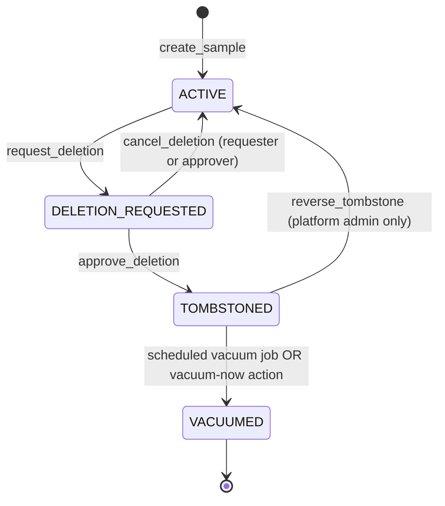

# Sovereignty-compliant deletion — Architecture & Design Lockdown

**Status:** First draft, open for collaborator review · 2026-05-04
**Phase:** 24.5 — Architectural Design Lockdown Before P0b Schema Work
**Authors:** Glen Otero (decisions), Claude (synthesis)
**Implementation phases:** Schema in P0b · Behavior in P0c (`B-CARE-3*`) · Federation propagation in P0c federation phase (`B-CARE-4`)
**Sister document:** `docs/jackpot_byop_and_eukaryotic_design.md`

---

## 1. Why this exists

JACKPOT is the **single entry point for genomic data into a public-health agency** (`spec.md` §1.1). Every sample touched by JACKPOT carries a chain of derivative state: pipeline results, dataset memberships, audit log entries, cached intermediates, federation copies, and — if the sample reached publication — accession numbers at NCBI, GISAID, or Pathoplexus. When a data submitter or a Tribal authority withdraws consent for a sample, the agency cannot honor that withdrawal by setting `is_active = false` and walking away. Soft-deletion preserves data so it can come back; sovereignty-compliant deletion treats withdrawn consent as **legally and ethically binding**, with the irreversibility that implies.

This is the design that reconciles three competing constraints:

1. **Honor the deletion request.** Withdrawn-consent data must actually leave the system. Disk content, JSONB blobs, cached artifacts, and storage objects all go.
2. **Preserve audit integrity.** A future review must be able to answer "did the agency honor the deletion request?" without the deletion itself being undetectable. The fact of deletion survives; the deleted content does not.
3. **Give operators a reversal window.** Real systems make accidents. A sample tombstoned by mistake — wrong sample ID typed, wrong consent form referenced — must be recoverable for some configurable window before content is irrevocably destroyed.

JACKPOT's two-stage approach (TOMBSTONE then VACUUM) reconciles these. Tombstone makes the sample non-queryable and seals derivative rows but leaves content on disk. Vacuum physically destroys content. The window between them is the operator's reversal window, configurable per scenario.

This design is **informed by but not the same as** GDPR Article 17 (right to erasure), HIPAA de-identification rules, and Indigenous Data Sovereignty frameworks (CARE Principles for Indigenous Data Governance — Carroll et al. 2020 — and the broader Indigenous Data Sovereignty Movement). The doc cites those frameworks where they map cleanly, but it does not try to be GDPR-compliance documentation, HIPAA paperwork, or a substitute for the Tribal-authority data-governance agreements that Scenario T deployments will negotiate per pilot. Those are different artifacts for different audiences. The design here is the **technical contract** the platform offers; the legal and ethical contract is layered on top of it by operator policy.

The CARE Principle most directly served is **Authority to Control**: Indigenous communities (and, by analogous extension in JACKPOT's design, all data submitters) retain the right to govern data derived from their members or jurisdictions, including the right to withdraw it. JACKPOT's job is to make that right operationally meaningful — not just procedural language in a consent form, but a button in the system that, when pressed by an authorized actor, leads to data actually leaving.

---

## 2. The four-state lifecycle

Every sample in JACKPOT lives in exactly one of four states, recorded in a new column `samples.deletion_status`:

```
ACTIVE → DELETION_REQUESTED → TOMBSTONED → VACUUMED
```

The values are mutually exclusive. A sample never returns to a prior state without explicit reversal (and reversal is only possible from `DELETION_REQUESTED` or `TOMBSTONED`, never from `VACUUMED`).

### `ACTIVE`

The default state for every newly-ingested sample. The sample is queryable through every API surface (search, dataset membership, pipeline launch, export). Files referenced by the sample are readable; pipeline_results JSONB is intact. No deletion-related metadata is set.

Audit events on entry: `create_sample` (existing event, unchanged).

### `DELETION_REQUESTED`

A request to delete the sample has been recorded but not approved. The sample remains queryable through normal API paths — operators can still see it in lists, run pipelines, etc. — but the UI surfaces a banner stating that a deletion request is pending, and any new submission to external repositories (NCBI, GISAID, federation peers) is blocked. The columns `deletion_requested_at`, `deletion_requested_by_user_id`, and `deletion_reason` are populated.

The state is intentionally non-blocking for ongoing analytical work. A sample in active outbreak investigation should not have all its analyses stop the moment a deletion request lands; the request goes through approval first. What it *does* block is publication and any new derivative work that would extend the sample's footprint.

Audit events on entry: `sample_deletion_requested` (new event).

### `TOMBSTONED`

The deletion request has been approved. The sample is no longer queryable through normal API paths — search, dataset listing, pipeline launch, export endpoints all return as if the sample doesn't exist. Derivative rows (pipeline_results, sample_files, dataset memberships) are sealed: the rows persist, but `pipeline_results.tombstoned = true` flags any join that would surface them, and dataset queries filter them out. File content is **still on disk**; this state is reversible. The columns `tombstoned_at` and the existing fields persist.

Tombstone is the operator's reversal window. A platform admin who realizes the wrong sample was tombstoned can reverse the transition (TOMBSTONED → ACTIVE) any time before vacuum runs. After vacuum, reversal is impossible.

Audit events on entry: `sample_tombstoned` (new event).

### `VACUUMED`

The retention window has elapsed (or an authorized actor invoked vacuum-now). File content is physically destroyed: storage objects deleted from GCS/MinIO, file URIs cleared from the samples row, `pipeline_results.result_data` JSONB replaced with a vacuumed sentinel, cached intermediate artifacts in pipeline working directories purged. The samples row itself **persists** as a tombstone — letting the system recognize the sample ID if it appears in federation events, audit queries, or stale references — but contains no recoverable content. The column `vacuumed_at` is populated.

This state is terminal and irreversible. Audit log records of *what happened* (sample existed, was tombstoned at T1, vacuumed at T2 by user U on behalf of authorization context X) survive; the deleted content does not.

Audit events on entry: `sample_vacuumed` (new event).

---

## 3. State machine — transitions and authorization



Each transition has an authorization model and a set of preconditions:

### `ACTIVE → DELETION_REQUESTED`

- **Who can request:** sample submitter (their own samples), lab member with access to the sample (per `sample_access`), lab director (lab's samples), platform admin (any sample), Tribal authority designee (Scenario T deployments only).
- **Preconditions:** sample is `ACTIVE`. Reason text is required (free-text; surfaces in audit log and approval UI).
- **Effect:** populates `deletion_requested_at`, `deletion_requested_by_user_id`, `deletion_reason`. Notifies the approval pathway (lab director for own-lab; platform admin for cross-lab; Tribal authority designee for Scenario T).
- **Edge cases:** if the sample is in an active outbreak investigation, the request is recorded but flagged with `OUTBREAK_INVESTIGATION_HOLD` and the approver is informed; see §11.

### `DELETION_REQUESTED → ACTIVE` (cancel)

- **Who can cancel:** the original requester, or any actor with approval authority for this sample.
- **Preconditions:** sample is `DELETION_REQUESTED`.
- **Effect:** clears the deletion_requested_* columns. No tombstone or vacuum is performed.

### `DELETION_REQUESTED → TOMBSTONED` (approve)

- **Who can approve:** lab director (own-lab samples), platform admin (cross-lab or override), Tribal authority designee (Scenario T). The approver must be a different actor than the requester unless the requester is also a platform admin and explicitly self-approves with `--platform-admin-self-approve` flag (audited).
- **Preconditions:** sample is `DELETION_REQUESTED`. No pending submission to external repositories (or the submission is concurrently transitioned to `WITHDRAWN` — see §11).
- **Effect:** sets `deletion_status = TOMBSTONED`, populates `tombstoned_at`, seals derivative rows (`pipeline_results.tombstoned = true` for all rows where `sample_id = $1`; sample removed from dataset memberships; `sample_access` rows deactivated). Federation peers are notified (see §9).

### `TOMBSTONED → ACTIVE` (reversal)

- **Who can reverse:** platform admin only. Other roles' "undo" requests must be escalated to a platform admin.
- **Preconditions:** sample is `TOMBSTONED` and `vacuumed_at IS NULL`. Once vacuum has fired, reversal is impossible by design.
- **Effect:** clears `tombstoned_at`, restores derivative rows (`pipeline_results.tombstoned = false`), restores dataset memberships if the dataset still exists. Federation peers are notified of reversal.

### `TOMBSTONED → VACUUMED` (scheduled or manual)

- **Who can trigger:** the scheduled `vacuum_tombstoned_samples` APScheduler job (default daily); a platform admin via `POST /api/v1/samples/{id}/vacuum-now` for an immediate vacuum.
- **Preconditions:** sample is `TOMBSTONED`; for the scheduled path, `tombstoned_at < NOW() - retention_period` (per-scenario default; see §6); for vacuum-now, no time precondition.
- **Effect:** physically deletes file content (see §5), populates `vacuumed_at`, federation peers are notified of vacuum (see §9), audit log records the actor and authorization context.

---

## 4. Tombstone vs vacuum — why two stages

A single-stage "delete now and forever" model is simpler. The reason JACKPOT does not adopt it is that **operators make mistakes**, and irreversible mistakes against pathogen-genomics data are particularly painful: a sample that takes hours to sequence, days to validate, and weeks to be the subject of analyses cannot be recreated by clicking undo.

The two-stage model gives a configurable reversal window between "this sample is no longer queryable" (tombstone) and "this sample's content no longer exists on disk" (vacuum):

- **Tombstone** seals the sample from the live system. Search returns no rows; pipeline launches refuse the sample; the dashboard shows it as deleted; federation peers are notified that the sample has been withdrawn. Content is still on disk, but no API surface will read it. Reversal is possible by a platform admin and restores the sample to `ACTIVE`.
- **Vacuum** physically destroys content. Storage objects are deleted; JSONB result blobs are replaced with sentinels; cached intermediates are purged. Reversal is impossible because there is no longer anything to restore.

The window between tombstone and vacuum is the operator's grace period for catching accidental deletions. It is also the period during which a sample submitter who changes their mind has time to ask the operator to reverse the request before it becomes irreversible. The window's length is per-scenario operator policy (§6), and it is the single most important number in this design.

After vacuum, only audit-log records of *what happened* survive. The `samples` row itself persists with `deletion_status = VACUUMED` so that future federation events, stale references in published reports, or audit queries that name the sample ID can be answered with "yes, this sample existed; it was deleted on D2 by user U" rather than "404 not found, no idea what you're talking about."

---

## 5. What gets vacuumed, what survives

Vacuum is the irreversible step. Its scope is defined exhaustively here so the P0c implementer knows what to delete and what to keep.

### Vacuumed (physically removed)

- **File URIs in the `samples` row.** The columns `fastq_r1_uri`, `fastq_r2_uri`, `long_read_uri`, `assembly_uri` are cleared (set to `NULL`). The string itself is also a piece of data — a file path can leak operator-side directory structure or institutional naming conventions — and is destroyed.
- **GCS/MinIO objects referenced by the URIs.** The vacuum job calls `storage.delete()` on every URI that was registered against this sample via `sample_files` joined to `file_references`. Where a `file_reference` is referenced by other (still-active) samples (per Critical Rule 58: content_hash is the dedup primitive), the storage object is **not** deleted because it is still in use; only the *link* from this sample's `sample_files` rows to that `file_reference` is cleared. A `file_reference` whose last `sample_files` link is removed is itself vacuumed.
- **`pipeline_results.result_data` JSONB content.** Replaced with `{"vacuumed": true, "vacuumed_at": "<ISO timestamp>", "sample_id": <id>}`. The row itself stays so derivative analyses know the input existed; only the content is replaced.
- **Cached intermediate artifacts** in pipeline execution working directories. The `pipeline_runs.work_dir` GCS prefix is enumerated and any artifacts associated with the vacuumed sample's run scope are deleted. Cross-run artifacts (shared reference data, scrubber output reused across runs) are out of scope — they belong to no single sample and are governed by the storage retention policy, not sample vacuum.
- **Dataset memberships.** Any `dataset_samples` rows linking this sample to a dataset are deleted. The dataset itself persists.
- **Cached search results, recent-samples lists, dashboard widgets.** Cleared via the existing cache-invalidation hook.

### Survives (audit residue)

- **Audit log records.** Every event in `audit_log` referencing the sample is preserved verbatim. A future audit reads: sample existed at T0, was created by user U0, had pipelines launched against it at T1 by user U1, was the subject of a deletion request at T2 by user U2 with reason R, was approved for deletion at T3 by user U3, was tombstoned at T3, was vacuumed at T4 by user U4 (or the scheduler). The deleted *content* does not appear; the *fact* of its existence and lifecycle does.
- **The `samples` row itself.** With `deletion_status = VACUUMED`, the row is a permanent tombstone marker. It contains no recoverable content (URIs, JSONB, identifying metadata are cleared per the vacuumed list). What remains: the sample ID, the deletion timestamps, and a reference to the lab and submitter for audit-trail purposes. This lets the system respond coherently to stale references — "yes, that ID existed; here is when it was deleted."
- **`pipeline_results` rows with `tombstoned = true` and cleared `result_data`.** The rows stay so derivative cluster analyses, reports, or downstream queries that reference them know the input was vacuumed rather than failing with a foreign-key error.
- **"Previously published" markers.** If the sample was submitted to NCBI, GISAID, Pathoplexus, or a federation peer before deletion, the audit log permanently records which repositories received the data and which accessions were issued. JACKPOT cannot retract from those repositories (see §8), but it remains honest about what is still in the wild.

---

## 6. Vacuum cadence

The retention window between tombstone and vacuum is operator policy, configurable per scenario. Defaults shipped in `jackpot init`'s scenario presets:

| Scenario | Default retention window | Rationale |
|---|---|---|
| **T** (Tribal-sovereignty) | **24 hours** | Indigenous Data Sovereignty principles require consent withdrawal to be honored quickly. The reversal window exists for accidents, not for second-guessing the withdrawing authority. |
| **A, B, C, D, E** (all others) | **30 days** | Operators in these scenarios prioritize the reversal window for accidental requests by submitters or sample-management errors. 30 days is long enough to surface a mistake but short enough that storage costs and ethical exposure don't accumulate. |
| **F** (CI test) | **0 seconds** | CI deterministically vacuums on every test run so test fixtures don't accumulate. |

The retention window is stored per-instance in operator config (`config/operator.yaml`), not per-sample. A sample can be vacuumed earlier than the retention window via the manual `POST /api/v1/samples/{id}/vacuum-now` endpoint (platform admin or Tribal authority designee, with a justification recorded in the audit log).

The vacuum job is implemented as an APScheduler daily job in P0c (`backend/jobs.py:vacuum_tombstoned_samples_job`). It queries:

```sql
SELECT id FROM samples
WHERE deletion_status = 'TOMBSTONED'
  AND tombstoned_at < NOW() - INTERVAL :retention_period
ORDER BY tombstoned_at;
```

For each row, it executes the vacuum sequence in a single transaction (storage deletes are not transactional with the database, so the implementation must order them carefully — see §13). The job is idempotent: a sample already in `VACUUMED` state is silently skipped, so re-running the job after a partial failure is safe.

The 24-hour Scenario T default is a **placeholder for collaborator review**; see §14. NPAIHB outreach and Tribal-authority pilot collaborators may push it shorter (e.g. 4 hours) or set it to zero (vacuum-on-approval) per their data-governance norms.

---

## 7. Derivative-analysis policy

When a sample is tombstoned or vacuumed, what happens to derivative analyses (clusterings, phylogenies, cluster-distance reports, outbreak investigations) it was part of?

JACKPOT supports three policies, selected per scenario at install time:

### Cluster recompute (Scenario T default)

Downstream analyses are **immediately re-run without the deleted sample** at the moment of tombstone. This is the strictest interpretation of consent withdrawal: for analytical purposes, the tombstoned sample never existed. A cluster computed from N samples that included the withdrawn one is recomputed from N-1 samples, and the old cluster is replaced.

This policy aligns with the strongest reading of CARE Principle "Authority to Control" — the data should not continue to influence outputs after consent is withdrawn. It is also the most expensive: cluster recomputation on large datasets can be hours of compute per recompute, and a sovereignty-aware deployment may receive batch withdrawals (an entire study cohort, an entire jurisdiction) that trigger many recomputes at once.

The policy also surfaces a privacy concern of its own: recomputed clusters can sometimes re-derive deleted information from neighbors (a phylogeny missing a leaf still encodes its position via topological constraints). Operators choose this policy with eyes open, and the doc explicitly flags it for collaborator review (§14).

### Cluster-with-asterisk (Scenarios D, E, F default)

Downstream analyses retain the historical result with a metadata flag noting "this analysis included data that has since been withdrawn; results may not represent current authorized data." UI surfaces the asterisk on every report, dashboard widget, and exported file that includes the affected analysis.

This is honest about historical state: the cluster was computed when the sample was authorized, the result reflects that state, and viewers know that the underlying data has since changed. It does not retroactively rewrite history — which is itself an audit-friendly property.

### Mark-stale-and-recompute-on-schedule (Scenarios A, B default)

Downstream analyses are flagged as `stale = true`; the next regularly-scheduled pipeline run for the dataset re-computes them naturally. Between deletion and the next scheduled run, the dashboard surfaces a "stale" indicator on the analysis.

This is the lightest-weight policy: no immediate recompute, no permanent asterisk. It assumes the operator runs pipelines on a regular cadence and that stale-window exposure is acceptable. It is the wrong choice for any deployment with a strict consent-withdrawal SLA; it is the right choice for academic-lab deployments where compute is constrained and the cadence is naturally regular.

The policy is per-instance, settable in `operator.yaml` and surfaced in `jackpot init` prompts. Scenario T defaults to cluster recompute; the others default per the table above; the operator can override.

---

## 8. Already-published handling

If sample data was submitted to NCBI BioSample/SRA, GISAID, Pathoplexus, or a federation peer **before** the deletion request, JACKPOT cannot retract the data — it is in the wild, in someone else's repository, under someone else's lifecycle. The system handles this honestly via three mechanisms:

### Pre-publish CARE confirmation checklist

At submission time, a sample with `deletion_status != ACTIVE` cannot be submitted to external repositories. The submission endpoint blocks with a 422 and a sovereignty-aware error message. The Streamlit UI surfaces the constraint clearly: the "Submit to NCBI" button is disabled and tooltipped with the reason. This prevents the failure mode where a sample is published moments before a pending deletion request is approved.

For Scenario T, the checklist is more involved: in addition to the deletion-status check, the UI requires the submitter to affirm that the consent form on file authorizes external publication. The affirmation is recorded in the audit log alongside the submission event.

### "Previously published" tag persists past tombstone/vacuum

The audit log permanently records which external repositories received the data and with which accessions. After vacuum, the operator and (where applicable) the original submitter can still answer "what's still in the wild?" by querying the audit log: `SELECT external_repo, accession, submitted_at FROM audit_log WHERE sample_id = $1 AND action = 'submit_to_external_repo'`.

The samples row itself, even in `VACUUMED` state, retains a `previously_published` boolean computed from this query and surfaced in the dashboard's deletion view. Operators reviewing a deletion request see at a glance whether the sample has external footprint they cannot retract.

### External-retraction request workflow (deferred to v2)

Future work — out of scope for P0c — can add a workflow that issues retraction requests to external repositories that support them. NCBI provides a `RETRACT` mechanism for SRA submissions; some federation protocols may support tombstone propagation across instances; GISAID's withdrawal procedure is manual but documented. The placeholder in this design is a method-stub: `B-CARE-3g` in the implementation handoff (§13). Implementing it requires per-repository protocol work that is best done after at least one Scenario T pilot has surfaced the operational requirements.

The honest truth, encoded in the design: JACKPOT cannot guarantee data leaves third-party repositories. It can guarantee it leaves JACKPOT, and it can be honest with operators about which third parties retain copies.

---

## 9. Federation propagation

When a sample is tombstoned or vacuumed in JACKPOT instance A, what happens at federation peer B that previously received a copy of the data?

This is a forward-reference. The actual federation propagation logic is **deferred to B-CARE-4 implementation in P0c (federation phase, post-B-FED-1)**. Phase 24.5 only locks in the requirements that B-FED-1 and B-CARE-4 must satisfy:

### Tombstone events MUST be pushed to all federation peers

Within a configurable SLA, every peer that previously received a copy of the sample must receive a tombstone event. Default SLAs:

- **Scenario T:** 1 hour from tombstone-on-source
- **All others:** 24 hours from tombstone-on-source

The push mechanism uses the federation peer-authentication design from B-FED-1 (designed separately; not re-litigated here). The tombstone event format is a signed JSON document containing the sample ID, the tombstone timestamp, the deletion reason class (without the free-text reason — that is internal), and a propagation token tying it to the federation peer agreement.

### Peers MUST acknowledge receipt with signed receipts

A peer receiving a tombstone event responds with a signed acknowledgment within the SLA. Un-acknowledged peers are flagged as **non-compliant** in the source instance's federation dashboard. The exact signature format depends on B-FED-1 — likely an Ed25519 detached signature over the tombstone-event payload — but the requirement is locked here.

Vacuum events follow the same pattern: source vacuums, peers receive a vacuum-now directive within the configured SLA, peers acknowledge, source records compliance. A peer that fails to acknowledge a vacuum event within twice the SLA is auto-flagged for operator intervention.

### Non-compliance triggers operator alert and (if configured) federation suspension

The federation dashboard surfaces non-compliant peers with a count of un-acknowledged tombstone/vacuum events. Operator policy (`operator.yaml`) can configure: alert-only (notify and continue), suspend-on-N-failures (auto-suspend the federation link after N un-acknowledged events), or hard-fail (suspend on first failure — Scenario T default). Suspended peers no longer receive new sample shares and are surfaced prominently in the operator dashboard.

The signed-receipt format and the federation peer-authentication mechanism are both being worked out in B-FED-1; this design simply requires that they exist and that they support the propagation contract above. If B-FED-1 lands a peer-auth design that cannot satisfy the SLA-and-acknowledgment requirements, the federation feature is gated behind this design — federation cannot ship without sovereignty-compliant deletion propagation.

---

## 10. Auth model — who can request, who can approve

The authorization matrix:

| Role | Request deletion of own samples | Request deletion of others' samples | Approve deletion |
|---|---|---|---|
| Sample submitter | Yes | No | No (own request still needs approval) |
| Lab member (Lab Reader, Lab Collaborator, Bioinformatics User, Data Analyst) | Own lab's samples (not necessarily their own submission) | No | No |
| Lab Director | Own lab's samples | No | Yes (own-lab samples) |
| Platform Admin | Yes | Yes (any lab) | Yes (cross-lab; can override) |
| Tribal authority designee (Scenario T only) | Yes (samples scoped to their authority) | Yes (samples scoped to their authority) | Yes |

`PermissionGroups` enum values are sacred per Critical Rule 1; this matrix maps the deletion privileges onto the existing roles without renaming any.

### Self-deletion approval pathway

A sample submitter can request deletion of their own samples, but the request still needs approval from a Lab Director (own-lab) or Platform Admin (cross-lab override). This is **intentional friction**. Sovereignty principles require consent withdrawal to be processed through the agency's record-keeping rather than being immediately executable by anyone who can authenticate. The submitter's request enters the queue; the approver verifies consent context, checks for outbreak-investigation conflicts, and approves with an audit trail. The approval is not a gate on the submitter's *right* to withdraw — it is the agency's *record* that the withdrawal was processed.

The exception is Scenario T: a Tribal authority designee can both request and approve on behalf of the affected community. For a Scenario T deployment where the data submitter is a Tribal member, the deletion pathway can be: submitter requests → Tribal authority designee approves, no Lab Director or Platform Admin in the loop. This is the design's recognition that, in Scenario T, the Tribal authority is the consent authority — Lab Director and Platform Admin roles within the JACKPOT instance are operational, not sovereign.

### Co-submitter scenarios

When multiple submitters claim authority over a sample (a sample co-owned by two labs, a sample submitted by one lab on behalf of another), deletion requires either (a) all submitters' agreement OR (b) Platform Admin override with explicit justification recorded. The audit log records which mechanism was used.

### Deceased submitter / lapsed authority

If the original submitter is no longer reachable (deceased, left the institution, account deactivated), the authority defaults to the Lab Director of the originating lab. If the originating lab itself is dissolved, authority escalates to the Platform Admin. Documented escalation path; not commonly hit but operationally important.

---

## 11. Edge cases

The design must handle the cases that real operations produce, not just the happy path.

### Deletion during pipeline run

If a deletion request is approved (TOMBSTONED transition fires) while a pipeline run is in progress against the sample, the pipeline is **cancelled**. The `pipeline_runs` row transitions to `CANCELLED` with reason `SAMPLE_TOMBSTONED`, and the run record is preserved (with `tombstoned = true` propagated). Result-data JSONB for partial outputs is vacuumed alongside the sample's vacuum. Compute attribution (GCP Batch labels, Slurm accounting) for the cancelled portion is preserved in the audit trail; the lab is still billed for the cancelled run's compute.

### Deletion during pending submission to NCBI/GISAID

A sample with a pending external submission cannot proceed to TOMBSTONED until the submission is resolved. The approval endpoint blocks the transition with `PENDING_EXTERNAL_SUBMISSION` and offers two paths: (a) wait for the submission to complete, then re-attempt the deletion (the "previously published" tag will be set, see §8); (b) cancel the submission first — transition the submission to `WITHDRAWN` with reason `SAMPLE_TOMBSTONED`, then approve the deletion. Path (b) is the typical choice; path (a) is for cases where the publication is desired and the deletion is being scheduled for after publication.

### Deletion of sample in active outbreak investigation

Samples flagged as part of an active outbreak investigation (a tag in the `investigations` table, planned for P0c) require **Platform Admin override with explicit justification** to be tombstoned. The default behavior is to deny the request with `OUTBREAK_INVESTIGATION_HOLD` and surface to the requester that the sample is held; the requester can escalate to Platform Admin. Platform Admin override produces an extra audit-log event (`outbreak_investigation_override`) recording the justification. This protects against the accidental case (a routine deletion request during an active investigation interrupting the investigation) while preserving the explicit case (consent has been clearly withdrawn and the public-health authority decides the sovereignty obligation overrides the investigation continuity — typical Scenario T).

The "who has the override authority" question is itself per-scenario and is flagged for collaborator review (§14).

### Deletion of sample referenced in published report or paper

If the sample was the subject of a published JACKPOT report or external paper, the sample is tombstoned/vacuumed normally; the citation in the paper persists (we cannot retract the paper) but the published report's "view sample data" link returns **410 Gone** with a sovereignty-aware message ("this sample's data has been withdrawn at the data submitter's request; the analysis result remains as a historical record but underlying data is no longer available"). The 410 status is deliberate — distinct from 404 — to signal to web crawlers that the resource is intentionally and permanently gone, not merely missing.

### Bulk deletion

A Lab Director can request deletion of an entire lab's samples, or a class of samples by filter (e.g., "all samples with consent_form = withdrawn-2026-04"), via a bulk-request endpoint `POST /api/v1/samples/bulk-deletion-request`. The bulk request is an organizational tool, not an authorization shortcut: each sample still goes through the individual approval workflow. The approver UI surfaces the bulk request as a single approve-N-samples action; the audit log records both the bulk request and the per-sample approvals.

The "should bulk approval be permitted" question (one approve covers N samples, vs N individual approvals) is operator policy and is flagged for collaborator review (§14).

### Sample referenced by federation peer that has gone offline

If a federation peer is offline at the moment of tombstone, the propagation requirement (§9) is satisfied by queueing the event for delivery on the peer's next reconnection. If the peer fails to reconnect within the configured SLA window, the peer is flagged non-compliant. The source instance does not block its own vacuum on peer reachability — vacuum proceeds on the source's schedule, and the peer's non-compliance is logged for operator action.

---

## 12. Schema constraints for P0b

The columns, enums, and constraints below MUST be in the P0b migration. P0b's planner should treat this list as exhaustive for the sovereignty design — anything not listed here is implementation detail that P0c can add later via its own migration.

| Table | Column | Type | Notes |
|---|---|---|---|
| `samples` | `deletion_status` | enum `DeletionStatusEnum` | `ACTIVE` (default) ` | DELETION_REQUESTED | TOMBSTONED | VACUUMED` |
| `samples` | `deletion_requested_at` | `timestamptz NULL` | NULL when `deletion_status = ACTIVE` |
| `samples` | `deletion_requested_by_user_id` | `int NULL REFERENCES users(id)` | NULL when `deletion_status = ACTIVE` |
| `samples` | `deletion_reason` | `text NULL` | Free-text reason; NULL when `deletion_status = ACTIVE` |
| `samples` | `tombstoned_at` | `timestamptz NULL` | NULL until `TOMBSTONED` |
| `samples` | `vacuumed_at` | `timestamptz NULL` | NULL until `VACUUMED` |
| `pipeline_results` | `tombstoned` | `boolean NOT NULL DEFAULT FALSE` | Cheaper than chasing `result_data` JSONB content; queries filter on it |
| `audit_log.event_type` | enum extension | new values | `sample_deletion_requested`, `sample_tombstoned`, `sample_vacuumed`, `outbreak_investigation_override` |

### New enum

```sql
CREATE TYPE deletion_status_enum AS ENUM (
  'ACTIVE',
  'DELETION_REQUESTED',
  'TOMBSTONED',
  'VACUUMED'
);
```

The enum is added to `schema/schema/jackpot_schema.yaml` as `DeletionStatusEnum` and re-emitted via `gen-pydantic` per Critical Rules 3 and 20 (boolean keyword patch + trailing newline).

### Constraints

- **FK from `pipeline_results.sample_id` to `samples.sample_id` MUST NOT cascade-delete on sample deletion.** We retain the row to mark it `tombstoned`; the actual JSONB content is what gets vacuumed. Cascade-delete would destroy the audit residue.
- **New index** `samples_deletion_status_tombstoned_at_idx` on `samples (deletion_status, tombstoned_at)` for efficient vacuum-job queries.
- **Check constraint** on `samples`: `(deletion_status = 'ACTIVE') = (deletion_requested_at IS NULL)` — DELETION_REQUESTED, TOMBSTONED, and VACUUMED rows must have a `deletion_requested_at`; ACTIVE rows must not.

The columns are nullable rather than `NOT NULL DEFAULT ...` because the semantic for an active sample is "this didn't happen"; using a sentinel timestamp would muddy the audit story.

---

## 13. Implementation handoff to P0c

P0c implements the behavior defined here. Each item below is a discrete chunk that P0c's planner can break into one or more PRs. Items are tagged for cross-referencing in the todo list.

### `B-CARE-3a` — Deletion-request endpoint + state machine + authorization

Implement `POST /api/v1/samples/{id}/request-deletion`, `POST /api/v1/samples/{id}/cancel-deletion`, `POST /api/v1/samples/{id}/approve-deletion`, `POST /api/v1/samples/{id}/reverse-tombstone`. Each endpoint enforces the authorization model from §10 via `auth/guards.py` and validates state-machine preconditions from §3. All endpoints write `audit_log` entries via `log_audit()` per Critical Rule 4.

### `B-CARE-3b` — Tombstone implementation

When `approve-deletion` fires, seal derivative rows in a single transaction: set `pipeline_results.tombstoned = true` for all rows referencing the sample, deactivate `sample_access` rows, remove from `dataset_samples`, cancel any in-progress `pipeline_runs` (transition to `CANCELLED` with reason `SAMPLE_TOMBSTONED`). Publish federation tombstone events via the federation peer-notification queue (handled by `B-CARE-4`).

### `B-CARE-3c` — Vacuum APScheduler job

`backend/jobs.py:vacuum_tombstoned_samples_job` runs daily, queries tombstoned samples past their retention window, and executes the vacuum sequence per §5. The retention period is read from `operator.yaml` per scenario. Storage deletes are not transactional — the implementation must order them carefully: (1) clear the JSONB and database fields in a single DB transaction; (2) issue storage deletes; (3) record success in audit log; (4) on storage-delete failure, set `vacuum_retry_at` and surface to operator alerts. The job is idempotent (skips already-VACUUMED rows).

### `B-CARE-3d` — Manual `vacuum-now` endpoint

`POST /api/v1/samples/{id}/vacuum-now` — Platform Admin or Tribal authority designee only. Requires a justification text recorded in audit log. Bypasses retention window; otherwise identical to the scheduled path.

### `B-CARE-3e` — Pre-publish CARE confirmation in submission workflow

Update `POST /api/v1/submissions/external` (NCBI, GISAID, Pathoplexus paths) to refuse submission for samples with `deletion_status != ACTIVE`. For Scenario T, also enforce a consent-form affirmation step. Surface the constraint in the Streamlit UI's submit button.

### `B-CARE-3f` — Audit-log integration

Add the four new event types to `audit_log.event_type` and the corresponding `AuditActions` constants in `backend/audit.py`. Every state transition writes an audit event; every external-repo submission failure due to deletion status writes an audit event. No new module — extension of existing `backend/audit.py` per Critical Rule 4.

### `B-CARE-3g` — External-retraction request workflow (deferred to v2)

Method-stub in P0c; full implementation deferred. The stub records intent (which repository, which accession, what retraction protocol) in a new `external_retraction_requests` table that future work fills out. P0c does not attempt actual retraction protocols.

### `B-CARE-4` — Federation propagation

Deferred until B-FED-1 (federation peer-authentication design) lands and P0c federation phase ships. Implements the requirements in §9: signed tombstone/vacuum events pushed to peers within SLA, signed acknowledgments collected, non-compliance flagged, operator policy applied (alert-only, suspend-on-N, hard-fail).

---

## 14. Open questions for collaborator review

The decisions below are placeholders in the first draft. They should be reviewed with NPAIHB outreach contacts and other Tribal-authority pilot collaborators (per `todo.md` B-CARE-6) before the design is locked. Glen iterates with collaborators in chat, GitHub issues, or follow-up PRs; once these are answered, the doc is locked and P0b can land the schema with confidence.

1. **Is 24-hour vacuum cadence right for Scenario T, or should it be shorter (e.g., 4 hours, or vacuum-on-approval with no window)?** Trade-off: shorter windows honor sovereignty principles more directly but eliminate the operator's ability to catch accidental-deletion mistakes. Some Tribal-authority partners may prefer zero-window vacuum-on-approval, treating the deletion request itself as the deliberation window. NPAIHB outreach feedback is the primary input here.
2. **Is "cluster-with-asterisk" acceptable for Scenarios D, E, F, or should those also default to cluster-recompute?** Trade-off: cost (compute and operational complexity) versus honesty (not letting deleted data continue to influence outputs). The current default reflects a pragmatic stance; a more sovereignty-aligned default would be cluster-recompute everywhere.
3. **Is the lab-director-approval-for-own-lab pattern compatible with smaller community labs where the submitter and the lab director are often the same person?** May need a single-person-lab override that allows self-approval with extra audit-trail friction, or explicit Platform Admin involvement for those deployments.
4. **For bulk deletion, is per-sample approval the right friction, or is bulk approval (one approval covering N samples) acceptable for known cases like "consent withdrawn for entire study cohort"?** Per-sample is safer; bulk approval is more operationally realistic at scale. Likely answer is "configurable per scenario," but the default needs collaborator input.
5. **Active outbreak investigation override — who has the authority to grant it?** Public-health director? CDC liaison? Platform Admin acting under operator policy? This needs a clear answer per scenario, particularly for Scenarios C (state agency) and T (Tribal-sovereignty), where the override authority maps onto distinct external roles.
6. **Federation propagation SLA — 1-hour and 24-hour are placeholders.** What numbers are operationally realistic for a typical federation member, and what numbers are ethically sufficient for sovereignty-compliant propagation? Likely an answer informed by federation partner agreements; the design just needs the SLAs to be explicit and configurable.
7. **"Previously published" is currently honest-but-passive — JACKPOT records what was published but does not actively retract.** Should v1 of the design include a notification step to the original submitter when a deletion happens for a previously-published sample? This is a small UX addition that may matter to Tribal-authority pilots where the data submitter is also the consent authority.
8. **Tombstone reversibility window vs vacuum SLA — should there be a second configurable knob "minimum tombstone duration before vacuum is allowed" separate from the retention window?** A vacuum-now endpoint that bypasses retention entirely may be too permissive in some scenarios; a "vacuum-now allowed only after tombstone has been in place ≥ X minutes" check could be added.

These are explicitly marked as **open** and not as decisions made in this draft. The agent's job here is to surface the questions; the answers come from collaborator review before P0b lands the schema.

---

## 15. Cross-references

- `docs/jackpot_byop_and_eukaryotic_design.md` — sister architectural lockdown also feeding P0b (BYOP infrastructure, eukaryotic pathogen schema additions). Phase 24.5 shipped both lockdowns together so P0b can land all the schema in one migration cycle.
- `spec.md` §1.1 — JACKPOT's positioning as the single entry point for genomic data into a public-health agency. The deletion design is downstream of this positioning: a single entry point also means a single, accountable exit point.
- `spec.md` §3 — Architecture Constraints. A cross-reference paragraph there names this doc and the BYOP/eukaryotic doc as the architectural lockdowns gating P0b.
- `spec.md` Phase P0b — Schema v5.0 migration. The schema constraints in §12 of this doc are the build spec for P0b's deletion-related migration items.
- `todo.md` Phase 24.5 — the operational task list this doc fulfills (`B-CARE-3-DESIGN`, plus the schema-constraint bullets that P0b must honor).
- `todo.md` Phase P0c — the implementation phase that will consume §13 of this doc as its build spec. Items `B-CARE-3a` through `B-CARE-3g` map onto P0c PRs.
- `todo.md` Phase 28 — Tribal-authority pilot deployments (Scenario T) where this design is most consequential. The pilot operators are the primary audience for the §14 open questions.
- `docs/CLAUDE.md` Critical Rule 1 — `PermissionGroups` enum values are sacred. The auth model in §10 maps onto these without renaming.
- `docs/CLAUDE.md` Critical Rule 4 — All state-changing endpoints call `log_audit()`. The implementation handoff in §13 explicitly relies on this.
- `docs/CLAUDE.md` Critical Rule 22 — Background jobs use APScheduler. The vacuum job in §13 follows this pattern.
- `docs/CLAUDE.md` Critical Rule 55 — Production code is operator-agnostic. The retention windows, SLAs, and policy defaults in this design are operator-config, not source constants.
- `docs/CLAUDE.md` Critical Rule 58 — `file_references.content_hash` is the dedup primitive. The vacuum logic in §5 must respect this: a `file_reference` shared across multiple still-active samples is not deleted from storage, only the link from the vacuumed sample's `sample_files` rows.
- **External:** Carroll et al. 2020 — *The CARE Principles for Indigenous Data Governance*. Data Science Journal 19:43. The "Authority to Control" principle is the primary normative input to this design.
- **External:** GDPR Article 17 (Right to Erasure). Cited for comparison only; this design is not GDPR-compliance documentation.
- **External:** HIPAA de-identification rules (45 CFR 164.514). Cited for comparison only; PII in JACKPOT is handled by the DLP scanner per Critical Rule 43, separately from this deletion design.
