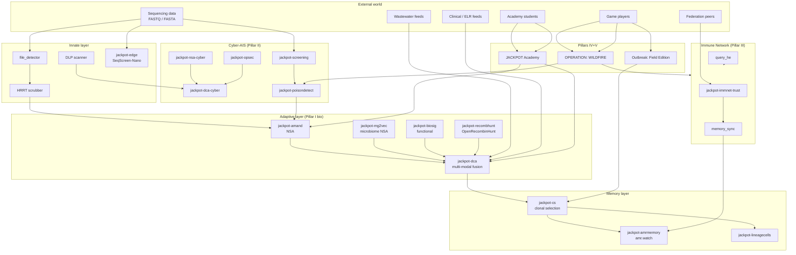
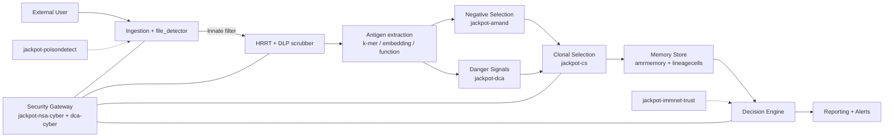

> **Status:** Superseded — archived (directory convention). Historical; do not cite as current.

# JACKPOT Immune Platform — Strategic Vision and Implementation Plan

**Document type:** Vision + comprehensive implementation plan
**Version:** 1.0 (initial)
**Last updated:** 2026-05-07
**Author:** Glen Otero (gotero@linuxprophet.com), with Claude as co-author
**Audience:** Glen, contributors, future operators, grant reviewers, partner labs
**Status:** Forward-looking — captures the future state of JACKPOT (post-P0–P5 roadmap) AND maps to concrete Phase 26+ items
**License of this document:** AGPL-3.0 (same as JACKPOT)

---

## Table of Contents

1. [Executive Summary](#1-executive-summary)
2. [Why an Immune-System Architecture?](#2-why-an-immune-system-architecture)
3. [Foundations: Artificial Immune System (AIS) Theory](#3-foundations-artificial-immune-system-ais-theory)
4. [Pillar I — Bio-Anomaly Detection Stack (`jackpot-immune-bio`)](#4-pillar-i--bio-anomaly-detection-stack-jackpot-immune-bio)
5. [Pillar II — Platform Self-Defense AIS (`jackpot-immune-sec`)](#5-pillar-ii--platform-self-defense-ais-jackpot-immune-sec)
6. [Pillar III — Federation as Immune Network (`jackpot-immune-net`)](#6-pillar-iii--federation-as-immune-network-jackpot-immune-net)
7. [Pillar IV — Training as First-Class Citizen (JACKPOT Academy)](#7-pillar-iv--training-as-first-class-citizen-jackpot-academy)
8. [Pillar V — Gaming as First-Class Citizen (Outbreak + WILDFIRE)](#8-pillar-v--gaming-as-first-class-citizen-outbreak--wildfire)
9. [Architecture: The Complete Picture](#9-architecture-the-complete-picture)
10. [Module Specifications (Detailed)](#10-module-specifications-detailed)
11. [Schema Extensions](#11-schema-extensions)
12. [Threat Model Integration (STRIDE for Cyberbiosecurity)](#12-threat-model-integration-stride-for-cyberbiosecurity)
13. [Open-Source Software Integration Strategy](#13-open-source-software-integration-strategy)
14. [Implementation Roadmap](#14-implementation-roadmap)
15. [Research, Partnership, and Publication Pipeline](#15-research-partnership-and-publication-pipeline)
16. [Quick-Reference Tables](#16-quick-reference-tables)
17. [References](#17-references)
18. [Open critiques and collaboration scaffolding](#18-open-critiques-and-collaboration-scaffolding)

---

## 1. Executive Summary

JACKPOT is already a credible operator-agnostic pathogen genomics platform. This document lays out how it becomes the **most complete public health biosurveillance platform on the planet** by adopting an **artificial immune system (AIS) architecture** as its organizing principle, with **public health workforce capacity** as a co-equal first principle.

Two theses, in equal balance:

### Thesis 1 — The dual-AIS thesis (technical novelty)

> The same family of bio-inspired algorithms that detect anomalous pathogen genomes can also detect anomalous platform behavior. JACKPOT runs both simultaneously, sharing a single algorithmic substrate.

### Thesis 2 — The workforce-as-platform-infrastructure thesis (workforce novelty)

> Public-health workforce capacity is the rate-limiting factor in pandemic preparedness, not tooling. JACKPOT Academy and the Outbreak/WILDFIRE games are not deliverables on top of a platform — they are platform infrastructure that produces the operators, contributors, and adversarial training data that the rest of the system needs.

No platform in the comparative landscape (Pathoplexus/Loculus, GenSpectrum/LAPIS, Pathogenwatch, EnteroBase, NCBI Pathogen Detection, BV-BRC, Solu, RT-MetA, GISAID, IDseq, IRIDA-ARIES, amr.watch, SeqScreen-Nano, HPD-Kit) combines either thesis with the other. Most do neither.

The platform stands on **five pillars**, all built in parallel:

| Pillar | Subsystem | What it does |
| --- | --- | --- |
| I | `jackpot-immune-bio` | Bio-anomaly detection — finds unknown pathogens, novel variants, recombinants, engineered sequences |
| II | `jackpot-immune-sec` | Platform self-defense — detects intrusions, poisoned inputs, malicious queries, insider threats |
| III | `jackpot-immune-net` | Federation as immune network — distributed memory, trust calibration, cross-cell signaling |
| IV | JACKPOT Academy | Workforce-as-platform-infrastructure — curriculum that teaches AIS by being it |
| V | Outbreak + WILDFIRE | Gaming-as-platform-infrastructure — adversarial co-training and platform stress-testing |

**Pillars IV and V are platform infrastructure, not decoration.** They appear last in the section ordering only because their value depends on the technical substrate of the first three. Game players generate adversarial training data for both bio-AIS and cyber-AIS detectors. Academy students extend the detector zoo as part of their coursework. Training and gaming are tightly coupled with the production immune system.

**Why JACKPOT specifically?** Three structural advantages we already have:

1. **Operator-agnostic, multi-tenant, federated by design** — six deployment targets (laptop, single-org cloud, multi-lab agency, hosted SaaS, federation member, CI test) means we already think in "cells" of an immune network.
2. **Two PII gates already enforce immune-like self/non-self at ingest** — HRRT/Scrubber removes host genomic "self," Cloud DLP removes metadata "self." Those are conceptually thymus-style negative selection. We're already partway there.
3. **`course/` tree and game-able structure already in the monorepo plan (P0d)** — Academy and Outbreak both fit naturally into the existing tree without architectural surgery.

**Where this lives in the roadmap:** Strategic future state, with **Phase 26+** items that begin landing concrete work *now*, **interleaved within** the current P0d–P5 roadmap. (Glen is a solo developer; "parallel" here means interleaved within phases, not literally concurrent.) We do not pause monorepo migration, `jackpot init`, schema v5.0, or multi-tenancy middleware to chase this. We tee up early-cost low-risk groundwork (negative-selection MVP in the academy track, OSS wrapper integrations, schema additions) that compounds on top of the existing roadmap.

**Differentiator paper targets** (two, in balance):

1. *JACKPOT: a federated artificial immune system for pathogen genomic surveillance and cyberbiosecurity.* (Methods venue: *Nature Methods* / *Genome Biology* / *PLOS Computational Biology*)
2. *JACKPOT Academy: workforce-as-platform-infrastructure for public health bioinformatics.* (Workforce venue: *Frontiers in Public Health* / *PLOS Comp Bio Education*)

This document is the seed of both papers.

**Companion document:** `jackpot_immune_collaboration_scaffolding.md` lays out working-MVP software scaffolding for every gap a senior reviewer would identify in this vision. Read both together; this doc is the strategic frame, the companion is the engineering scaffolding that makes the frame credible.

---

## 2. Why an Immune-System Architecture?

### 2.1 The detection problem nobody is solving well

Existing platforms track *known* pathogens. Pathoplexus/Loculus stores sequences; GenSpectrum queries them; Pathogenwatch types them; EnteroBase phylotypes them; amr.watch monitors AMR. **All of them assume the threat space is annotated.**

Real public health surveillance has three additional needs that none address well:

1. **Unknown unknowns** — pathogens that aren't in any reference database. mNGS platforms like IDseq partially address this, but treat anomaly detection as a side-effect of taxonomic assignment failure rather than a first-class capability.
2. **Engineered pathogens** — synthetic biology threats whose signatures don't match natural evolution. Wittmann et al. (2025) showed AI-generated proteins evade existing biosecurity screening; SecureDNA-style screening is necessary but not sufficient.
3. **Multi-modal context** — a genome anomaly without epidemiological context is noise. With wastewater concentration, clinical case counts, and host immune-response signals, it becomes a signal. Existing platforms don't fuse these.

These three needs map exactly onto three AIS concepts: **negative selection** (self/non-self), **recognition diversity** (multi-site detection of unfamiliar patterns), and **danger theory / dendritic cell algorithms** (context-aware anomaly scoring).

### 2.2 The security problem nobody is solving well either

Pathogen genomic platforms are also under-defended as cyber assets. The literature catalogs concrete threats:

- **Adversarial lineage attack** — Meiseles et al. (2023) showed Pangolin SARS-CoV-2 lineage assignment is vulnerable to adversarial input.
- **Malicious DNA** — Tavella et al. (2022) demonstrated machine-learning detection of threats in bio-cyber DNA storage; the converse (DNA payloads triggering RCE on sequence) is documented.
- **Insider threats** — Anjum et al. (2025) and Burrell et al. (2023) catalog cyberbiosecurity insider risk.
- **AI-evading synthesis** — Wittmann et al. (2025) on generative protein design that evades screening.
- **Cloud LIMS escalation** — Sheldon et al. (2024) document privilege escalation paths.

Negative selection algorithms invented for cyber intrusion detection (Forrest et al. 1994; Hosseini & Seilani 2021; Bejoy et al. 2020/2022) transfer cleanly to genomic-platform self-defense. Same algorithm, different "self" set: instead of "normal network packets," it's "normal API call patterns / federation queries / submission metadata."

### 2.3 The Forrest insight: AIS started as cybersecurity

Stephanie Forrest's seminal 1994 paper *Self-nonself discrimination in a computer* invented the negative selection algorithm for **computer security**. It was *later* adapted for biological problems. JACKPOT closes the loop: NSA was inspired by biology, used for cyber, and we use it again for both biology AND the cyber defense of a biology platform.

That symmetry is the technical thesis. It's also a beautiful story that grant reviewers will love.

---

## 3. Foundations: Artificial Immune System (AIS) Theory

Before we name modules, we need to align on the AIS algorithm vocabulary. Each algorithm below maps to one or more JACKPOT modules; the mapping is in Section 16.

### 3.1 Negative Selection Algorithm (NSA)

**Origin:** Forrest, Allen, Perelson, Cherukuri (1994); theoretical basis in Perelson & Oster (1979).

**Mechanism:** Generate random detectors, expose them to "self," delete any that bind self. Survivors only bind non-self. At runtime, any data point activating any surviving detector is anomalous.

**JACKPOT applications:**
- Bio-AIS: Detectors are k-mer profiles, sequence embeddings, or compositional vectors. "Self" is the union of all known reference pathogen genomes for the operator's scope. Anomalous samples activate non-self detectors.
- Cyber-AIS: Detectors are patterns over API call sequences, federation query metadata, or submission patterns. "Self" is normal operator behavior. Anomalous traffic activates detectors.

**Reference implementation guidance:** Hosseini & Seilani (2021) NSA + classification hybrid; Widulinski (2023) NSA in network cybersecurity.

### 3.2 Clonal Selection Algorithm

**Origin:** de Castro & Von Zuben (2002); Kelsey & Timmis (2003) for hypermutation.

**Mechanism:** Detectors that match anomalies are cloned with mutation; high-affinity clones replace lower-affinity ones. Detector population evolves to track moving anomaly distributions — the AIS equivalent of online learning under concept drift.

**JACKPOT applications:**
- Bio-AIS: Variant evolution. A SARS-CoV-2 lineage detector that matched Alpha clones with mutations as Beta/Delta/Omicron emerge.
- Cyber-AIS: Attack-pattern drift. A detector that fires on a known prompt-injection pattern clones with mutations as attackers paraphrase.

**Reference implementation guidance:** Liu et al. (2023) continual learning AIS with human-in-the-loop; Imam et al. (2023) on AIS+ML hybridization.

### 3.3 Immune Network Theory

**Origin:** Jerne (1974); de Castro & Timmis (2002).

**Mechanism:** Detectors recognize each other as well as antigens, forming a network where stimulation/suppression dynamics maintain diversity and memory.

**JACKPOT applications:**
- Federation-level memory: each tenant's detector pool is a "node" in the network; cross-tenant signaling propagates novel detectors and suppresses redundant ones.
- This is how we build **federated immune memory** without copying raw data.

### 3.4 Danger Theory and Dendritic Cell Algorithms (DCA)

**Origin:** Matzinger (1994) danger theory; Greensmith DCA (2007); Pinto et al. (2022) cursory DCA.

**Mechanism:** Anomaly is not just non-self — it's non-self plus a "danger signal" (cellular damage, inflammation). DCAs aggregate multiple context signals to upgrade or downgrade an anomaly's significance.

**JACKPOT applications:**
- Multi-modal fusion: a non-self genome signature paired with rising wastewater concentration, clinical case clusters, or host immune response markers becomes high-priority. Without context, it's a watch-list entry.
- This is the key differentiator from every existing platform.

**Reference implementation guidance:** Pinto et al. (2022) cursory DCA; Wang et al. (2022) innate immune memory + DCA.

### 3.5 Natural Killer (NK) Cell Algorithms

**Origin:** Wang et al. (2022) NKA; Deng et al. (2025) NK-DCHS hybrid.

**Mechanism:** NK cells use phenotype-based recognition (missing-self) — they kill cells that have *lost* normal markers. Algorithmically: anomaly-by-absence rather than anomaly-by-presence.

**JACKPOT applications:**
- Microbiome surveillance: a sample missing expected commensals (rather than containing unexpected pathogens) signals dysbiosis or immunosuppression — useful for clinical settings and certain bioweapon scenarios.
- Imbalanced dataset handling: NK-DCHS specifically addresses class imbalance, which is the default in pathogen surveillance (you have orders of magnitude more "normal" than "anomalous" samples).

### 3.6 Innate Immune Memory / Trained Immunity

**Origin:** Wang, Liang, Dong et al. (2022).

**Mechanism:** Innate immune cells "remember" prior exposures via epigenetic reprogramming, reacting faster on second encounter. AIS analog: maintain a fast-lookup index of previously confirmed anomalies that bypasses full scanning.

**JACKPOT applications:**
- Variant memory: confirmed lineages get a short-circuit detection path.
- Attack memory: confirmed injection patterns get fast-path blocking.

### 3.7 Continual Learning AIS with Human-in-the-Loop

**Origin:** Liu et al. (2023).

**Mechanism:** Combine clonal selection with active learning — human analysts review uncertain detections; their labels train new detectors; the system bootstraps itself with minimal labeled data.

**JACKPOT applications:**
- Analyst workflow: Streamlit "review queue" page where uncertain anomalies are surfaced for expert classification, feeding the clonal selection loop.
- Game integration: WILDFIRE players' decisions become labeled training data.

### 3.8 Drift-Aware Anomaly Detection

**Origin:** Li, Nair & Wang (2025) unsupervised drift-aware framework.

**Mechanism:** Combine concept-drift detection with anomaly detection so the model knows when its "self" model has aged out and needs refresh.

**JACKPOT applications:**
- Reference-database freshness: detect when the operator's "self" reference set has drifted enough (new dominant lineage, new commensal microbiome composition) that NSA detectors need regeneration.

### 3.9 The Two Self/Non-Self Boundaries

The dual-AIS thesis in one diagram:

```
                  ┌──────────────────────────────────────────────────┐
                  │                JACKPOT Immune Substrate           │
                  │                                                   │
                  │   ┌─────────────────┐      ┌─────────────────┐    │
                  │   │  Bio-AIS        │      │  Cyber-AIS      │    │
                  │   │  (Pillar I)     │      │  (Pillar II)    │    │
                  │   │                 │      │                 │    │
                  │   │  "self" = known │      │  "self" = normal│    │
                  │   │  pathogen ref   │      │  platform call  │    │
                  │   │  genomes,       │      │  patterns, fed  │    │
                  │   │  microbiomes    │      │  query metadata │    │
                  │   │                 │      │                 │    │
                  │   │  NSA, CSA,      │      │  NSA, CSA,      │    │
                  │   │  DCA, NKA,      │      │  DCA, NKA,      │    │
                  │   │  Memory         │      │  Memory         │    │
                  │   └────────┬────────┘      └────────┬────────┘    │
                  │            │                        │             │
                  │            └──────────┬─────────────┘             │
                  │                       │                           │
                  │              ┌────────▼────────┐                  │
                  │              │ Shared algorithm│                  │
                  │              │   substrate     │                  │
                  │              │  (jackpot-ais)  │                  │
                  │              └─────────────────┘                  │
                  └──────────────────────────────────────────────────┘
```

The same NSA implementation runs both. The same DCA aggregator fuses both kinds of danger signals. The same memory consolidation logic services both. **One immune substrate, two threat surfaces.**

---

## 4. Pillar I — Bio-Anomaly Detection Stack (`jackpot-immune-bio`)

### 4.1 The detection layers

Borrowing biological vocabulary, the bio-AIS has three layers, each with concrete JACKPOT modules:

| Layer | Biological analog | JACKPOT module(s) | What it catches |
| --- | --- | --- | --- |
| **Innate** | Skin, mucus, PAMP recognition, complement | `file_detector.py` (already exists), `jackpot-edge`, `jackpot-scrubber` (HRRT, exists) | Obvious wrong-type files, host-DNA leakage, gross contamination |
| **Adaptive** | T cells, B cells, antibodies | `jackpot-amand`, `jackpot-mg2vec`, `jackpot-biosig`, `jackpot-recombhunt`, `jackpot-dca` | Novel pathogens, drifted variants, recombinants, engineered sequences |
| **Memory** | Memory B/T cells, plasma cells | `jackpot-amrmemory`, `jackpot-lineagecells`, `jackpot-cs` | Confirmed lineages, AMR signatures, attack patterns — fast recall path |

### 4.2 Module catalog with OSS integration

Each bio-AIS module either **wraps** an existing OSS project, **forks** one, or is **new code inspired by** the literature. Integration mode is in the table.

| Module | AIS concept | OSS basis | Mode | What it does |
| --- | --- | --- | --- | --- |
| `jackpot-amand` | Negative Selection over k-mer/embedding space | inspired by Hosseini & Seilani 2021, ANDES (Kanjilal 2025), STREAM (Bae 2026) | **new** | k-mer compositional + sequence-embedding NSA; flags samples whose distance to all known references exceeds threshold |
| `jackpot-mg2vec` | NSA + density-based anomaly (LOF) over metagenomic communities | inspired by Wang, Wang, Liu (2026 *Cell Systems* AI for microbiome) | **new** | Embedding model trained on normal microbiomes; flags compositional outliers |
| `jackpot-biosig` | Multi-site recognition (Perelson & Oster 1979) over functional features | wraps ESMFold; adds codon-bias, restriction-site, ORF anomaly checks | **new + wraps** | "What does this sequence *do*?" — toxin-fold detection, immune-evasion epitope shifts, engineering scars |
| `jackpot-recombhunt` | NSA over recombination breakpoint patterns | wraps **OpenRecombinHunt** (Alfonsi et al. 2026) | **wraps** | Automatic detection of viral recombinants; SARS-CoV-2, RSV, Mpox, Zika, YF, H5N1 |
| `jackpot-amrmemory` | Memory cells (innate immune memory) | wraps **amr.watch** (David et al. 2025), **AMRFinderPlus**, **CARD**, **abricate** | **wraps** | Fast-path AMR signature recall; >600k genome reference base |
| `jackpot-dca` | Dendritic Cell Algorithm — multi-modal context fusion | inspired by Pinto et al. 2022, Wang 2022 innate immune memory | **new** | Combines genomic anomaly score with wastewater, clinical, mobility, host-response signals → priority score |
| `jackpot-cs` | Clonal Selection / online learning | inspired by Liu et al. 2023, de Castro & Von Zuben 2002 | **new** | Detector evolution under variant drift; analyst-in-the-loop labeling |
| `jackpot-nka` | NK Cell Algorithm — anomaly by absence + imbalanced data | inspired by Wang 2022 NKA, Deng 2025 NK-DCHS | **new** | Missing-commensal detection; handles class imbalance natively |
| `jackpot-edge` | Innate immunity at the edge | wraps **SeqScreen-Nano** (Balaji et al. 2023) | **wraps** | Streaming, in-field pathogen characterization on ONT/MinION; <32GB RAM |
| `jackpot-mngs` | Cloud mNGS pipeline | wraps **CZ-ID/IDseq** (Kalantar et al. 2021) | **wraps** | Established mNGS pipeline as the "go-to" mode for clinical metagenomics |
| `jackpot-amand-fda` | Functional data analysis | wraps **ANDES** (Kanjilal et al. 2025) | **wraps** | Genomic windows as functional curves; complementary to k-mer/embedding NSA |
| `jackpot-stream` | Streaming time-series anomaly | wraps **STREAM** (Bae et al. 2026), **Coniferest** (Kornilov et al. 2025) | **wraps** | Generic time-series anomaly engine for wastewater, case counts, etc. |
| `jackpot-immune-evasion` | AI-driven immune evasion analysis | inspired by Ibrahim 2026 | **new** | Detects mutations consistent with immune-evasion strategies (epitope shifts, glycosylation site changes, antigenic variation patterns) |

### 4.3 Multi-modal danger signals (the differentiator)

The DCA module (`jackpot-dca`) is what separates JACKPOT from every other genomic surveillance platform. It fuses six classes of signal into a single context-aware anomaly priority score:

| Signal class | Source | Example feature |
| --- | --- | --- |
| **Genomic anomaly** | `jackpot-amand`, `jackpot-mg2vec`, `jackpot-biosig` | NSA detector activations, embedding distance |
| **Wastewater** | external feed → `jackpot-stream` | Freyja lineage abundance over time, raw signal concentration |
| **Clinical** | LIMS / ELR feeds | Case clusters by ZIP/county, ICU admission rate, syndromic surveillance |
| **Mobility / travel** | external feeds (CDC traveler genomic surveillance, transit data) | Air-traffic anomalies, border-crossing surveillance |
| **Host immune response** | clinical samples with paired host RNA-seq | Cytokine signatures, T/B-cell repertoire shifts |
| **Environmental / One Health** | animal samples, environmental swabs | Cross-species jumps, shared AMR signatures |

The DCA scoring is **explicit and explainable** (per Patel 2021 on explainable AIS) — every priority score breaks down into per-signal contributions visible in the UI. No black-box scoring.

### 4.4 Integration with existing JACKPOT modules

Critical: the bio-AIS does not replace existing modules; it **layers on top of and reuses** them.

| Existing module | AIS role | Integration |
| --- | --- | --- |
| `file_detector.py` | Innate immunity — PAMP recognition | First line of defense; rejects malformed files before they reach detectors |
| HRRT (`ingest_scrubber.nf`) | Self filtration — host removal | Removes "self" host genomic content before NSA scanning |
| Cloud DLP (`dlp_scanner.py`) | Metadata immune scan | Catches PII leakage; maps to "tolerance" boundary |
| `pipeline_results_loader.py` | Memory consolidation | Pipeline results land in immutable append-only `pipeline_results` rows; this is our "memory cell" persistence |
| Validator (Tier 1/2/3) | Negative selection threshold | Tier-1 PRELIMINARY samples are pre-NSA; Tier-2 ANALYZABLE pass innate filters; Tier-3 SUBMITTABLE have full DCA scores |
| Audit (`log_audit`) | Forensic record / repudiation defense | Each AIS event creates an audit record; participates in caller transactions (fixes existing P0 bug) |

### 4.5 Forward-looking research integration

Specific 2025–2026 work we can integrate as it lands:

- **ANDES (Kanjilal et al. 2025)** — functional data analysis for genomic windows. Wrap as `jackpot-amand-fda` complementary detector class.
- **GAMA (Guan et al. 2024)** — multi-graph anomaly detection via GNN. Use for outbreak transmission graph anomaly detection (sample → metadata → location graph).
- **NK-DCHS (Deng et al. 2025)** — hybrid NK-cell + dendritic-cell for imbalanced data. Use as core algorithm for `jackpot-nka`.
- **AI-powered viral metagenomics (Chisompola et al. 2025)** — direct alignment with `jackpot-mngs` integration target.
- **AI for immune evasion (Ibrahim 2026)** — basis for `jackpot-immune-evasion`.
- **Wastewater AMR surveillance (Balcázar 2025)** — drives the wastewater signal feed for DCA.
- **AI for microbiology and microbiome (Wang, Wang & Liu 2026 *Cell Systems*)** — comprehensive review; track for new method adoption.
- **Continual learning AIS (Liu et al. 2023)** — direct basis for `jackpot-cs`.

### 4.6 What runs where (deployment target alignment)

The bio-AIS modules are designed to fit JACKPOT's existing six deployment targets without bifurcation:

| Target | Bio-AIS modules available |
| --- | --- |
| A — laptop | `jackpot-amand` (lightweight NSA), `jackpot-edge` (ONT), `jackpot-recombhunt` (lightweight wrapper), Academy synthetic data; **no DCA fusion** (not enough signal sources) |
| B — single-org cloud | A + `jackpot-dca`, `jackpot-mg2vec`, `jackpot-biosig`, `jackpot-cs` (full bio-AIS stack) |
| C — multi-lab agency | B + cross-lab DCA fusion, `jackpot-amrmemory` shared across labs |
| D — hosted SaaS | Same as B/C with multi-tenant isolation; DCA fusion within tenant only |
| E — federation member | Full stack + `jackpot-immune-net` participation (see Pillar III) |
| F — CI test | Synthetic pathogens + ground-truth answer keys; full deterministic stack |

---

## 5. Pillar II — Platform Self-Defense AIS (`jackpot-immune-sec`)

### 5.1 The cyberbiosecurity threat surface

The Leapspace research synthesizes a STRIDE threat model specifically for biosecurity systems (full mitigation framework in Section 12). The threat catalog:

| STRIDE | Specific to JACKPOT |
| --- | --- |
| **Spoofing** | Forged Google OAuth tokens, impersonated lab devices submitting samples, fake federation member identities |
| **Tampering** | Adversarial sample submissions designed to poison detectors, malicious DNA payloads in fastq, lineage-assignment adversarial attack (Meiseles 2023), AI-evading synthetic DNA (Wittmann 2025) |
| **Repudiation** | Pipeline runs without auditable provenance, sample modifications without lineage |
| **Information Disclosure** | Re-identification attacks on metadata, federation query intent leakage, cloud misconfig leaks |
| **Denial of Service** | Pipeline overload, sequencer-disrupt attacks, federation flooding |
| **Elevation of Privilege** | Insider abuse (Anjum 2025), misconfigured LIMS permissions, container escape, JWT scope expansion |

### 5.2 AIS for platform security — module catalog

| Module | AIS concept | What it does |
| --- | --- | --- |
| `jackpot-nsa-cyber` | Negative Selection over API call patterns | Detectors trained on normal API call sequences per role; fires on anomalous patterns (e.g., a researcher account suddenly enumerating all samples) |
| `jackpot-dca-cyber` | Dendritic Cell — context-aware threat fusion | Combines auth events, IP, geolocation, time-of-day, query intent into per-event danger score |
| `jackpot-cs-cyber` | Clonal Selection — adapts to attack drift | Online learning over confirmed attacks; mutates detectors as attackers paraphrase |
| `jackpot-immnet-trust` | Immune Network — federation trust scoring | Reputation per federation member; suppresses signals from low-trust nodes |
| `jackpot-poisondetect` | NK + DCA hybrid | Detects poisoned training samples in the bio-AIS pipeline (Tavella 2022 inspired) |
| `jackpot-opsec` | Query metadata analysis | Monitors query patterns for intent leakage in federated mode |
| `jackpot-screening` | Synthetic DNA screening | Wraps SecureDNA + Wittmann 2025 adversarial-resistant screening; integrates with sample ingest |

### 5.3 Specific defenses

#### 5.3.1 Adversarial input detection

Every sample submission goes through a poison-detect pass before NSA training data is updated. Inspired by Meiseles et al. (2023) on Pangolin adversarial attack:

```python
# backend/immune/cyber/poisondetect.py (planned)
async def assess_submission_for_poisoning(
    sample_id: UUID,
    embedding: np.ndarray,
    submitter_trust_score: float,
    db: AsyncSession,
) -> PoisonAssessment:
    """
    Returns a poison-likelihood score 0..1.
    Combines:
      - Embedding distance from submitter's prior submissions (sudden distributional shift)
      - Adversarial perturbation detection (high-frequency / unnatural gradient signature)
      - Submitter trust score from jackpot-immnet-trust
      - Whether the submission shifts NSA detector boundary disproportionately
    """
```

#### 5.3.2 Query OPSEC monitoring (federated mode)

In federated mode, the *pattern* of queries leaks intent even if individual queries are encrypted. `jackpot-opsec` runs NSA over query sequences per member, detecting reconnaissance behavior.

#### 5.3.3 Insider threat detection

Per Anjum et al. (2025) and Burrell et al. (2023): the highest-impact attacks come from inside. Approach:

- NSA over per-user normal behavior windows (last 30 days).
- DCA fusion with HR signals where available (recent termination, performance review timing).
- Privileged-action logging and lineage with cryptographic chain.

#### 5.3.4 Synthetic DNA screening at ingest

Wittmann et al. (2025) demonstrated AI-generated proteins evading existing screening. `jackpot-screening` integrates the Wittmann mitigation approach: structure-based screening complementary to sequence-based, run *as part of* the ingest pipeline before sequences are added to the operator's reference database.

### 5.4 Audit and telemetry

The cyber-AIS depends on rich telemetry:

- **Tamper-proof audit log** — every AIS event (detector activation, danger signal, clonal selection round, memory consolidation) creates an audit row. Audit rows are append-only, hash-chained. Already enforced architecturally; needs the existing P0 bug fix (audit must participate in caller transaction).
- **Pipeline integrity** — Nextflow workflows are signed; integrity verified at launch. We extend the existing pipelines router with signature verification.
- **Provenance graph** — every result is reproducible: sample → scrubbed sample → pipeline version → result. This is the AIS "lineage of memory cells."

### 5.5 Where this lives in the codebase

```
backend/immune/
├── __init__.py
├── algorithms/                 # shared AIS substrate (Section 9.4)
│   ├── nsa.py                  # Negative Selection
│   ├── csa.py                  # Clonal Selection
│   ├── dca.py                  # Dendritic Cell Algorithm
│   ├── nka.py                  # NK Cell Algorithm
│   └── memory.py               # Memory cell management
├── bio/                        # Pillar I
│   ├── amand.py
│   ├── mg2vec.py
│   ├── biosig.py
│   ├── recombhunt.py
│   ├── amrmemory.py
│   ├── dca_bio.py
│   ├── cs_bio.py
│   └── nka_bio.py
├── sec/                        # Pillar II
│   ├── nsa_cyber.py
│   ├── dca_cyber.py
│   ├── cs_cyber.py
│   ├── poisondetect.py
│   ├── opsec.py
│   └── screening.py
└── net/                        # Pillar III
    ├── trust.py
    ├── memory_sync.py
    └── query_he.py
```


---

## 6. Pillar III — Federation as Immune Network (`jackpot-immune-net`)

### 6.1 The federation as an immune system

Each federation member is a "cell" in the immune network. Memory cells (confirmed lineages, AMR signatures, attack patterns) circulate. Trust between members is dynamic, calibrated by signal quality and shared confirmation.

The biological metaphor is precise:

| Federation concept | Biological analog |
| --- | --- |
| Federation member tenant | Immune cell (B-cell, T-cell, dendritic cell, depending on role) |
| Detector pool per member | Antibody repertoire |
| Cross-member memory sync | Lymphatic circulation |
| Trust score | Co-stimulation requirement |
| Adversarial submission | Pathogen mimicry / molecular mimicry |
| Anomaly broadcast | Cytokine signaling |

### 6.2 Federation mechanics

#### 6.2.1 Trust calibration

Each member starts with a baseline trust score. Trust adjusts based on:

- **Signal quality** — submissions confirmed by other members raise trust.
- **False positive rate** — submissions other members reject lower trust.
- **OPSEC behavior** — query patterns consistent with reconnaissance lower trust.
- **Time** — trust decays toward neutral without recent activity.

Implementation: `trust_scores` table (Section 11), `jackpot-immnet-trust` module.

#### 6.2.2 Cryptographic primitives for sensitive queries (placeholder, needs Trieu collaboration)

For high-sensitivity federated queries, JACKPOT will use cryptographic primitives chosen **per query class**, not a single generic wrapping:

- **Set-membership queries** (e.g., "do you have a sample matching this k-mer profile?") — **Private Set Intersection - Cardinality (PSI-CA)** per Trieu et al. PoPETs 2024. Faster and tighter guarantees than HE for this query class; designed for semi-honest adversaries without expensive public-key operations.
- **Aggregate counting queries** (e.g., "how many members have seen lineage X this week?") — **secure aggregation with differential privacy** at the aggregator (see §6.2.3).
- **Distance / similarity queries** (e.g., "what's the closest-match distance for this embedding?") — **secure k-NN / approximate nearest-neighbor** protocols.
- **General secure outsourcing** when none of the above fit — **homomorphic encryption** per Kim et al. (2021).

The actual primitive choice per query class is **open** and subject to Trieu collaboration. The placeholder implementation in `backend/immune/net/query_he.py` ships with `TODO(trieu-collab): protocol selection` documenting this. Companion doc §8.6 has the full Trieu-specific hooks.

#### 6.2.3 Differential privacy on shared signals

For aggregate signals (e.g., "how many members have seen lineage X this week?"), differential-privacy noise is added at aggregation time so individual member contributions can't be inferred. Privacy-budget composition across query types is itself a `TODO(trieu-collab): formal privacy budget` open question.

#### 6.2.4 Adversarial submission resistance

The federation can be attacked via poisoned submissions. Defense:

- Per-member trust scoring (Section 6.2.1)
- Cross-member confirmation required before a submission affects shared memory cells
- Quarantine queue for submissions from low-trust members
- The `jackpot-poisondetect` module from Pillar II runs on every submission

### 6.3 The "antibody repertoire" as code

Each member maintains a versioned detector pool:

```python
# backend/immune/net/repertoire.py (planned)
from datetime import datetime
from uuid import UUID
from pydantic import BaseModel, Field, field_validator, model_validator
from typing_extensions import Self


class Detector(BaseModel):
    detector_id: UUID
    detector_type: str            # "nsa_kmer", "dca_context", "biosig_protein", etc.
    target_pathogen: str | None = None
    affinity_threshold: float = Field(ge=0.0, le=1.0)
    feature_vector: list[float]
    created_at: datetime
    last_activated_at: datetime | None = None
    activation_count: int = Field(default=0, ge=0)


class MemoryCell(BaseModel):
    memory_id: UUID
    confirmed_lineage: str
    detector_ids: list[UUID] = Field(min_length=1)
    confirmed_by_members: list[UUID] = Field(
        min_length=2,
        description="Cross-member confirmation requires at least 2 members",
    )
    promoted_at: datetime


class AntibodyRepertoire(BaseModel):
    """A member's full detector pool. Versioned, signed, shareable."""
    member_id: UUID
    version: int = Field(ge=0)
    detectors: list[Detector] = Field(
        default_factory=list,
        max_length=10000,
        description="Bounded to prevent denial-of-service via repertoire size",
    )
    memory_cells: list[MemoryCell] = Field(default_factory=list, max_length=1000)
    signed_at: datetime
    signature: bytes = Field(
        min_length=64,
        description="Ed25519 signature is 64 bytes; RSA-2048 is 256 bytes",
    )
    trust_score_at_publish: float = Field(ge=0.0, le=1.0)

    @field_validator("signature")
    @classmethod
    def signature_length_must_match_known_alg(cls, v: bytes) -> bytes:
        if len(v) not in (64, 256, 384, 512):
            raise ValueError(
                f"signature length {len(v)} bytes does not match any known "
                "signature algorithm (Ed25519=64, RSA-2048=256, "
                "RSA-3072=384, RSA-4096=512)"
            )
        return v

    @model_validator(mode="after")
    def signed_at_after_detectors_created(self) -> Self:
        for d in self.detectors:
            if d.created_at > self.signed_at:
                raise ValueError(
                    f"detector {d.detector_id} was created at {d.created_at} "
                    f"which is after the repertoire was signed at {self.signed_at}"
                )
        return self
```

When member A confirms a novel pathogen, their detector for it becomes a candidate for shared memory. After cross-member confirmation thresholds are met, the detector is promoted to federation-wide memory.

### 6.4 Integration with existing federation work

The current Phase 26+ Loculus/Pathoplexus adoption items include federated search and submission. The immune-network pillar slots on top:

- Existing federation **transport** (REST/gRPC, OAuth flows) is unchanged.
- Existing federation **schema** (federated sample IDs, cross-tenant references) is unchanged.
- New: trust scoring, encrypted query layer, antibody repertoire publishing.

This means we land Phase 26 federation items first, then layer immune-network capabilities incrementally without rework.

---

## 7. Pillar IV — Training as First-Class Citizen (JACKPOT Academy)

### 7.1 Why training is platform infrastructure

Conventional view: training is a help-desk activity, separate from the platform. Public-health workforce capacity (per WHO Global Genomic Surveillance Strategy, attribute 6) is treated as nice-to-have.

JACKPOT view: training **is the platform** in three concrete ways:

1. **The curriculum teaches AIS by being it.** Students don't read about negative selection; they implement a tiny NSA detector against synthetic data, then watch their detector get promoted into the production `jackpot-amand` module.
2. **Student work generates labeled data.** Module exercises produce labeled anomalies that train the production clonal-selection loop.
3. **Module completions are immune memory.** The Academy itself runs on a tenant; student detector contributions are versioned, attributable, and reusable.

### 7.2 Curriculum mapped to AIS concepts (16 modules, three tracks)

#### Track A — Innate Immunity (modules 1–5)

| # | Title | AIS analog | Hands-on |
| --- | --- | --- | --- |
| 1 | Sequencing 101 | The "PAMPs" we're built to recognize | fastq inspection, quality scores |
| 2 | Linux & Python for genomics | Tooling | bash, pandas, biopython |
| 3 | Pi cluster build | Local immune surveillance | k3s + Slurm + Nextflow on Pi |
| 4 | QC, host scrubbing & file detection | Skin and mucus — PAMP recognition + self-filtration | fastp, NanoPlot, HRRT, `file_detector.py` walkthrough |
| 5 | Taxonomic ID | First-pass recognition | PanGIA, Kraken2, mash screen |

#### Track B — Adaptive Immunity (modules 6–10)

| # | Title | AIS analog | Hands-on |
| --- | --- | --- | --- |
| 6 | Assembly & variant calling | Antibody affinity maturation | SPAdes, Flye, Snippy, BCFtools, DeepVariant |
| 7 | AMR & virulence | Memory cells | CARD, AMRFinderPlus, abricate, VFDB; hands-on with `jackpot-amrmemory` |
| 8 | Phylogenetics & clusters | Clonal selection in action | IQ-TREE, Nextstrain, transmission cluster detection |
| 9 | **Negative selection in practice** | NSA core | Implement a tiny NSA over k-mer space; ship a PR to `jackpot-amand` |
| 10 | **Dendritic Cell Algorithm in practice** | DCA core | Implement multi-modal danger fusion; ship a PR to `jackpot-dca` |

#### Track C — Memory & Federation (modules 11–16)

| # | Title | AIS analog | Hands-on |
| --- | --- | --- | --- |
| 11 | Metagenomics & microbiome | NK cell anomaly-by-absence | Host filtering, microbiome embeddings, `jackpot-mg2vec` |
| 12 | One Health perspective | Shared memory across hosts | Clinical/animal/environmental schema; cross-species AMR |
| 13 | PII, biosecurity & cyberbiosecurity | The OTHER NSA — platform self-defense | HRRT, DLP, STRIDE walkthrough, build a tiny `jackpot-nsa-cyber` detector |
| 14 | Pipeline & platform engineering | Anatomy of the immune system | Nextflow, JACKPOT internals, schema-driven UI |
| 15 | Edge deployment | Innate immunity in the field | Jetson, Coral TPU, MinION, `jackpot-edge` |
| 16 | ML/DL for genomics & continual learning | Clonal selection at scale | Janggu, ESMFold, `jackpot-cs` walkthrough; ship a PR to a detector module |

### 7.3 Audience tiers

| Tier | Audience | Time | Outcome |
| --- | --- | --- | --- |
| Foundations | CS folks who don't know biology, biologists who don't know CS | 4–6 weeks | Comfortable with fastq, bash, Docker, Nextflow basics |
| Practitioner | Public-health / state-lab staff, grad students | 8–12 weeks | Can run end-to-end outbreak analysis on JACKPOT |
| Operator | Engineers deploying JACKPOT for an agency or LMIC partner | 4 weeks | Can stand up Targets A–E and onboard tenants |
| Contributor | OSS devs who want to extend JACKPOT | self-paced | Can ship a PR to backend, schema, or a pipeline |
| **Analyst** (new) | Public-health analysts working with JACKPOT day-to-day | 6 weeks | Can run DCA-priority triage, manage clonal-selection labeling, federate with peer tenants |

### 7.4 Delivery infrastructure

- **JupyterHub** — already on the Month 3 roadmap. Hosts notebooks under `course/notebooks/`.
- **Synthetic datasets** — `course/data/`, generated by `wgsim`/`badread` from public refs. Includes synthetic engineered sequences for safe biosecurity training.
- **Academy tenant** — a public read-only/sandbox JACKPOT instance where every student gets a real platform login.
- **Badges & micro-credentials** — `course_completions` table (Section 11), signed JWT credentials issued by JACKPOT itself.
- **Workshop-in-a-box** — `jackpot init --profile academy` spins up the whole thing on a laptop in <10 minutes.

### 7.5 Direct integration with the platform (the differentiator)

```
course/
├── modules/
│   ├── 01-sequencing-101/
│   ├── ...
│   ├── 09-negative-selection-in-practice/
│   │   ├── README.md
│   │   ├── notebook.ipynb
│   │   ├── starter_code/
│   │   │   └── tiny_nsa.py            # student implements
│   │   ├── tests/
│   │   │   └── test_tiny_nsa.py       # auto-grader
│   │   └── upstream_target.md         # pointer to backend/immune/bio/amand.py
│   └── 10-dca-in-practice/
│       └── (similar; targets backend/immune/bio/dca_bio.py)
├── data/
│   └── synthetic/                      # wgsim/badread-generated, reproducible
└── tenant/
    └── academy_seed.sql                # academy tenant fixtures
```

A student who completes module 9 has, by definition, written code that can be PR'd into `jackpot-amand`. The auto-grader confirms correctness; a maintainer review confirms quality; merged code carries the student's attribution into the production system. This is **adversarial co-evolution between the curriculum and the platform**.

### 7.6 Partnership angles

- **Software Carpentry / Data Carpentry** — host as official lessons.
- **nf-core training** — cross-link as "applied to public health."
- **EMBL-EBI Train Online / WHO IPSN training pillar** — international reach.
- **Galaxy Training Network** — port a few modules.
- **State public-health lab consortium** — paid cohort tier underwrites the free tier.
- **ASM, IDSA, APHL** — immune-system framing speaks to clinical microbiology audiences.


---

## 8. Pillar V — Gaming as First-Class Citizen (Outbreak + WILDFIRE)

### 8.1 Why gaming is platform infrastructure (not decoration)

1. **Game players generate adversarial training data** for both bio-AIS and cyber-AIS. Every "wrong answer" submitted in a game is a labeled near-miss that strengthens detectors.
2. **Game mechanics stress-test federation trust dynamics** under conditions no QA suite can replicate. Real adversarial behavior, real OPSEC mistakes, real coordination failures.
3. **Games are the most efficient training delivery mechanism for crisis-mode skill** — playing 8 missions of WILDFIRE teaches federation OPSEC better than reading 8 chapters about it.

### 8.2 Outbreak: Field Edition (single-player narrative puzzle)

A local, offline-playable narrative puzzle game built on top of JACKPOT. No accounts, no servers, no leaderboards. Just a laptop, a series of escalating mysteries, and your own JACKPOT instance.

#### 8.2.1 Premise

You play a contract analyst. Each "case" arrives as a zip file with a briefing letter, metadata CSV, fastq files, and sometimes a red herring (corrupted PDF, fake tar that's actually a fastq — your `file_detector.py` is literally a game mechanic). You have a local JACKPOT instance and a fixed compute budget. Solve the case, file your report, get scored.

#### 8.2.2 Mechanics, AIS-mapped

| Mechanic | What it teaches | AIS concept |
| --- | --- | --- |
| Compute budget | Cost of cloud / Pi cluster scarcity | Resource constraint on detector population size |
| Time pressure | Live-outbreak feel | Concept drift in real time |
| File-type detection | "PDF" is gzipped fastq | Innate immunity / PAMP recognition |
| PII gates | Forget to scrub before sharing → penalty | Self-filtration |
| Federation choice | Some cases unsolvable solo | Immune network signaling |
| Red herrings | Contamination, low coverage, sample swap | Distinguishing damage from antigens |
| Wrong-answer cost | Wrong AMR call → "patient harmed" letter next case | False positive cost in detection |

#### 8.2.3 Case progression (curriculum-aligned)

| Case | Skill | Production module exercised |
| --- | --- | --- |
| 1. The First Patient | Single-fastq pathogen ID | `jackpot-amand` baseline scan |
| 2. The Variant | Reference comparison | `jackpot-amand` + variant calling |
| 3. The Cluster | Phylogeny, transmission cluster | `jackpot-cs` clonal selection |
| 4. The Resistor | AMR puzzle | `jackpot-amrmemory` |
| 5. The Spike | Protein-binding shift | `jackpot-biosig` (ESMFold) |
| 6. The Microbiome Stowaway | Pathogen hidden in microbiome | `jackpot-mg2vec` + host filter |
| 7. The Synthesis | Engineered or natural? | `jackpot-biosig` + `jackpot-screening` |
| 8. The Capstone | Multi-region outbreak; federation required | Full bio-AIS + `jackpot-immune-net` |

### 8.3 OPERATION: WILDFIRE (multiplayer espionage / federated co-training)

WILDFIRE is the multiplayer espionage scenario from the original "Stop the Plague" notes, fully realized as a federated game where the federation IS the immune system in action.

#### 8.3.1 Premise (in-fiction)

A coordinated synthetic-biology threat is unfolding. Players belong to "cells" (federation tenants). Each cell receives partial intelligence: some sequences, some metadata, some context. No cell can solve the case alone. They must coordinate via the federation — but the federation itself is partially compromised, with adversarial cells submitting poisoned data.

#### 8.3.2 The "antibody / lymph node" analogy in gameplay

| Game role | Federation role | AIS analog |
| --- | --- | --- |
| Player cell | Federation tenant | B-cell colony |
| Cell submission | Sample upload | Antigen presentation |
| Cross-cell confirmation | Federation memory promotion | Co-stimulation |
| Mole / adversarial cell | Compromised tenant | Autoimmune / pathogen mimicry |
| Press attribution mission | Public health communication | Immune memory consolidation |

#### 8.3.3 Mechanics, AIS edition

| Mechanic | Bio-anomaly version | What it teaches |
| --- | --- | --- |
| **Dead drops** | Files of fastq+metadata; sometimes obfuscated, sometimes intentionally noisy, sometimes synthesized adversarially | File-type defense, NSA detector calibration |
| **The mole** | A compromised cell submits subtly poisoned samples designed to defeat the detection layer; the team must figure out which samples and how | Trust calibration, poison-detect, NK-cell algorithm |
| **OPSEC scoring** | Your queries to federation reveal information about your samples even if you use HE; bad query design leaks intel | Federation OPSEC literacy |
| **Speed vs accuracy** | Faster classifiers give worse ensembles; full bio-anomaly stack costs time; outbreak clock ticks | DCA priority calibration |
| **Trust calibration** | Your LLM analyst-agent confidently identifies a pathogen — but the ensemble disagrees; who's right? | Detector affinity vs context |
| **Adversarial submissions** | Other cells can submit data to your federation; some real, some decoys, some hostile | Adversarial training data |
| **Attribution puzzles** | You found something — engineered or evolved? You'll need to defend your call publicly; the "press" will grill your evidence chain | Explainable AIS, biosecurity attribution |
| **The Engineered Pandemic Arc** | Multi-week story where players gradually accumulate evidence of a coordinated synthetic-biology threat; real DURC review processes form the gameplay loop | Real biosecurity literacy |

#### 8.3.4 The original "Stop the Plague" missions, AIS-mapped

From Glen's original notes, now grounded in real bio-anomaly tools:

**Mission 1 — "Files from a Dead Agent"** — You receive what claims to be sequencing data. First step: validate the file. (`file_detector.py`. The fastq might be a tar of fastqs. Or a zip with a malicious payload.) Real-world skills in innate immunity and PAMP recognition.

**Mission 2 — "The Microbiome Says Otherwise"** — The agent's body samples should look like normal human microbiome. They don't. `jackpot-mg2vec` baseline + AMAnD anomaly score show divergence. Find out what.

**Mission 3 — "The Pathogen Wears a Disguise"** — The pathogen's surface proteins were engineered to look like something benign. ESMFold structural comparison via `jackpot-biosig` reveals the deception. Functional-equivalence search confirms.

**Mission 4 — "The Vaccine Trap"** — Design countermeasures against a pathogen engineered to evade existing vaccines. Surface antigens look normal to B-cell epitope predictors, but structural modeling reveals the binding pocket has shifted just enough to escape neutralization. Identify the escape mutations and design updated immunogens.

**Mission 5 — "The Attribution Game"** — Multiple cells submit evidence about whether a sequence is engineered vs. evolved. Each team gets partial data. Federated analysis reveals contradictory phylogenetic signals. Someone's data is compromised — or someone's lying. Mission succeeds only if teams identify the bad actor *and* reach consensus on attribution.

**Mission 6 — "The False Flag"** — Bio-anomaly detectors are triggering on sequences that look engineered, but further analysis suggests they're natural recombinants that just happen to hit multiple engineering signatures. Do you call it natural or synthetic? Wrong call triggers either international incident (cry bioweapon) or pandemic (miss the real threat).

### 8.4 The training/gaming/platform feedback loop

```
        ┌──────────────────┐
        │  Academy module  │
        │  (e.g., NSA)     │
        └────────┬─────────┘
                 │ student PR
                 ▼
        ┌──────────────────┐
        │ jackpot-amand    │◄──────┐
        │ (production)     │       │
        └────────┬─────────┘       │
                 │ scans            │
                 ▼                  │
        ┌──────────────────┐       │ feedback:
        │ Outbreak case OR │       │ - labeled anomalies
        │ WILDFIRE mission │       │ - adversarial poison samples
        └────────┬─────────┘       │ - confirmed false positives
                 │ player decisions │
                 ▼                  │
        ┌──────────────────┐       │
        │ jackpot-cs       │───────┘
        │ (clonal sel)     │
        └──────────────────┘
```

This is **closed-loop platform engineering with built-in adversarial training**. No other surveillance platform has anything like it.


---

## 9. Architecture: The Complete Picture

### 9.1 High-level system diagram



### 9.2 STRIDE-aligned data flow diagram



### 9.3 Microservice breakdown

The Leapspace research identified 10 microservices. Here we map them to JACKPOT modules and existing services:

| Microservice (Leapspace) | JACKPOT mapping | Status |
| --- | --- | --- |
| 1. Ingestion & Preprocessing | `ingest` router + `file_detector` + HRRT | **exists** |
| 2. Antigen (Feature) Extraction | new `backend/immune/algorithms/features.py` | **new** |
| 3. Negative Selection Detector Service | `jackpot-amand`, `jackpot-nsa-cyber` | **new** |
| 4. Dendritic Cell / Danger Signal Service | `jackpot-dca`, `jackpot-dca-cyber` | **new** |
| 5. Clonal Selection & Online Learning | `jackpot-cs`, `jackpot-cs-cyber` | **new** |
| 6. Immune Memory Store | `jackpot-amrmemory`, `jackpot-lineagecells`, new `memory_cells` table | **new + wraps amr.watch** |
| 7. Decision Fusion Engine | `jackpot-dca` (this is the fusion engine) | **new** |
| 8. Reporting & Visualization | Streamlit pages (extend existing) | **extend** |
| 9. Security, Authorization & API Gateway | `auth` router + `jackpot-nsa-cyber` overlay | **extend** |
| 10. Workflow Orchestrator & Scheduler | Nextflow + `pipelines` router | **exists** |

### 9.4 The shared algorithm substrate

The crux of the dual-AIS thesis is **one algorithm implementation, two threat surfaces**. The substrate lives in `backend/immune/algorithms/`:

```python
# backend/immune/algorithms/nsa.py
from dataclasses import dataclass
from typing import Generic, TypeVar, Callable
import numpy as np

T = TypeVar("T")    # antigen type — bytes, np.ndarray, dict, anything

@dataclass
class Detector(Generic[T]):
    feature_vector: np.ndarray
    affinity_threshold: float
    detector_id: str

class NegativeSelectionAlgorithm(Generic[T]):
    """
    Domain-agnostic negative selection.
    Works for genomic k-mers (Pillar I) AND API call patterns (Pillar II).
    """

    def __init__(
        self,
        featurize: Callable[[T], np.ndarray],
        self_set: list[T],
        n_detectors: int = 1000,
        affinity_metric: str = "euclidean",
    ):
        self.featurize = featurize
        self.self_features = np.array([featurize(x) for x in self_set])
        self.n_detectors = n_detectors
        self.affinity_metric = affinity_metric
        self.detectors: list[Detector[T]] = []

    def train(self, dim: int, threshold: float) -> None:
        """Generate detectors that don't match self set."""
        survivors: list[Detector[T]] = []
        attempts = 0
        max_attempts = self.n_detectors * 100

        while len(survivors) < self.n_detectors and attempts < max_attempts:
            candidate = np.random.randn(dim)
            distances = np.linalg.norm(self.self_features - candidate, axis=1)
            if distances.min() > threshold:
                survivors.append(
                    Detector(
                        feature_vector=candidate,
                        affinity_threshold=threshold,
                        detector_id=f"d{len(survivors):06d}",
                    )
                )
            attempts += 1

        self.detectors = survivors

    def classify(self, antigen: T) -> tuple[bool, list[str]]:
        """Returns (is_anomalous, list_of_activated_detector_ids)."""
        features = self.featurize(antigen)
        activated: list[str] = []
        for d in self.detectors:
            if np.linalg.norm(d.feature_vector - features) < d.affinity_threshold:
                activated.append(d.detector_id)
        return (len(activated) > 0, activated)
```

The bio-AIS instantiates this with a k-mer featurizer; the cyber-AIS instantiates it with an API-call-sequence featurizer. Same code, two threat models.


---

## 10. Module Specifications (Detailed)

This section gives implementation-level detail for the most important new modules. The shared algorithm substrate from §9.4 is reused.

### 10.1 `jackpot-amand` (Anomaly Mining and Novelty Detection)

The flagship bio-AIS module. Negative selection over a multi-feature space.

#### 10.1.1 API surface (FastAPI)

```python
# backend/routers/immune_bio.py
from fastapi import APIRouter, Depends, BackgroundTasks
from uuid import UUID

router = APIRouter(prefix="/api/v1/immune/bio", tags=["immune-bio"])

@router.post("/amand/scan/{sample_id}")
async def scan_sample_for_anomaly(
    sample_id: UUID,
    background: BackgroundTasks,
    detectors_version: int | None = None,
    current_user: User = Depends(current_user),
    db: AsyncSession = Depends(get_db),
) -> AmandScanResponse:
    """
    Scan a sample with the AMAnD NSA detectors.
    Returns immediate response with scan_id; full results land in pipeline_results.
    """

@router.get("/amand/results/{sample_id}")
async def get_amand_results(
    sample_id: UUID,
    current_user: User = Depends(current_user),
    db: AsyncSession = Depends(get_db),
) -> list[AmandResult]:
    """All AMAnD results for a sample, including detector activations."""

@router.post("/amand/detectors/regenerate")
async def regenerate_detector_pool(
    background: BackgroundTasks,
    current_user: User = Depends(require_role("platform_admin")),
    db: AsyncSession = Depends(get_db),
) -> RegenerationJob:
    """
    Trigger detector pool regeneration.
    Run when reference set has drifted or after a bulk training data update.
    """

@router.get("/amand/detectors")
async def list_detectors(
    detector_type: str | None = None,
    current_user: User = Depends(current_user),
    db: AsyncSession = Depends(get_db),
) -> list[DetectorSummary]:
    """List active detectors in the current pool, with activation stats."""
```

#### 10.1.2 Pydantic models

```python
# backend/schemas/immune_bio.py
from datetime import datetime
from uuid import UUID
from pydantic import BaseModel, Field

class AmandScanResponse(BaseModel):
    scan_id: UUID
    sample_id: UUID
    status: str = Field(description="queued | running | complete | failed")
    detectors_version: int
    queued_at: datetime

class DetectorActivation(BaseModel):
    detector_id: UUID
    affinity_score: float
    feature_class: str = Field(description="kmer | embedding | functional")

class AmandResult(BaseModel):
    scan_id: UUID
    sample_id: UUID
    detectors_version: int
    is_anomalous: bool
    anomaly_score: float = Field(ge=0.0, le=1.0)
    activated_detectors: list[DetectorActivation]
    nearest_known_match: str | None = Field(description="Lineage/species if any close match")
    nearest_match_distance: float | None
    explainable_summary: str = Field(description="Human-readable why-anomalous summary")
    completed_at: datetime
```

#### 10.1.3 Nextflow integration

`jackpot-amand` runs as a Nextflow process for reproducibility. It plugs into the existing pipelines router and emits `workflow.complete` events the same way other pipelines do.

```groovy
// pipelines/immune/amand.nf
process AMAND_SCAN {
    container 'jackpot/amand:latest'
    publishDir "${params.outdir}/amand", mode: 'copy'

    input:
    tuple val(sample_id), path(reads)
    path detector_pool

    output:
    tuple val(sample_id), path("${sample_id}.amand.json"), emit: report

    script:
    """
    jackpot-amand scan \\
        --sample-id ${sample_id} \\
        --reads ${reads} \\
        --detectors ${detector_pool} \\
        --output ${sample_id}.amand.json
    """
}
```

### 10.2 `jackpot-dca` (Dendritic Cell / Danger Fusion)

Multi-modal context fusion. The differentiator.

#### 10.2.1 Pydantic models

```python
# backend/schemas/immune_bio.py (continued)

class DangerSignal(BaseModel):
    signal_class: str = Field(description="genomic | wastewater | clinical | mobility | host_immune | one_health")
    source: str
    timestamp: datetime
    location_geohash: str | None
    raw_value: float
    normalized_value: float = Field(ge=0.0, le=1.0)
    confidence: float = Field(ge=0.0, le=1.0)

class DcaPriorityScore(BaseModel):
    sample_id: UUID
    overall_priority: float = Field(ge=0.0, le=1.0)
    contributions: dict[str, float] = Field(
        description="Per-signal-class contribution; sums to overall_priority"
    )
    explanation: str
    computed_at: datetime
```

#### 10.2.2 The fusion logic (sketched)

```python
# backend/immune/bio/dca_bio.py
from typing import Iterable
import numpy as np

class BioDendriticCell:
    """
    Multi-modal danger fusion based on Greensmith DCA + Pinto et al. 2022.
    Each 'cell' aggregates signals over a time window and a geographic
    neighborhood, emitting a priority score with explainable contributions.
    """

    SIGNAL_WEIGHTS = {
        "genomic":     0.35,    # primary
        "wastewater":  0.20,
        "clinical":    0.20,
        "mobility":    0.10,
        "host_immune": 0.10,
        "one_health":  0.05,
    }

    def fuse(
        self,
        signals: Iterable[DangerSignal],
        sample_id: UUID,
    ) -> DcaPriorityScore:
        contributions: dict[str, float] = {k: 0.0 for k in self.SIGNAL_WEIGHTS}

        for sig in signals:
            w = self.SIGNAL_WEIGHTS.get(sig.signal_class, 0.0)
            contributions[sig.signal_class] += w * sig.normalized_value * sig.confidence

        overall = sum(contributions.values())
        explanation = self._explain(contributions, signals)

        return DcaPriorityScore(
            sample_id=sample_id,
            overall_priority=min(overall, 1.0),
            contributions=contributions,
            explanation=explanation,
            computed_at=datetime.utcnow(),
        )

    def _explain(
        self,
        contributions: dict[str, float],
        signals: Iterable[DangerSignal],
    ) -> str:
        """Human-readable explanation per Patel 2021 explainable-AIS."""
        top = sorted(contributions.items(), key=lambda kv: -kv[1])[:3]
        parts = [f"{k}: {v:.2f}" for k, v in top]
        return "Top drivers: " + ", ".join(parts)
```

### 10.3 `jackpot-cs` (Clonal Selection / Online Learning)

#### 10.3.1 Mechanics

```python
# backend/immune/bio/cs_bio.py (sketch)
class ClonalSelectionEngine:
    """
    Per Liu et al. 2023 — continual learning AIS with human-in-the-loop.
    Detectors that activate on confirmed-true anomalies are cloned with
    mutation; clones replace lower-affinity siblings.
    """

    def evolve(
        self,
        confirmed_anomalies: list[ConfirmedAnomaly],
        current_pool: list[Detector],
        clone_factor: int = 5,
        mutation_rate: float = 0.05,
    ) -> list[Detector]:
        ...

    def consolidate_to_memory(
        self,
        high_affinity_detectors: list[Detector],
        memory_cells: list[MemoryCell],
    ) -> list[MemoryCell]:
        """Promote stable, high-affinity detectors to memory cells."""
        ...
```

### 10.4 `jackpot-nsa-cyber` (Platform Self-Defense NSA)

Same NSA algorithm, different featurizer.

```python
# backend/immune/sec/nsa_cyber.py
from backend.immune.algorithms.nsa import NegativeSelectionAlgorithm

class ApiCallSequenceFeaturizer:
    """Convert a window of API calls per user into a feature vector."""
    def __call__(self, calls: list[ApiCall]) -> np.ndarray:
        # Encodes: endpoint distribution, time-of-day, request rate,
        # error rate, geographic origin, role-appropriate-ness, etc.
        ...

class CyberNSA:
    def __init__(self, normal_user_calls: list[list[ApiCall]]):
        self.nsa = NegativeSelectionAlgorithm(
            featurize=ApiCallSequenceFeaturizer(),
            self_set=normal_user_calls,
            n_detectors=2000,
        )
        self.nsa.train(dim=64, threshold=0.4)

    def assess(self, recent_calls: list[ApiCall]) -> CyberAssessment:
        is_anom, activated = self.nsa.classify(recent_calls)
        return CyberAssessment(
            is_anomalous=is_anom,
            activated_detectors=activated,
            recommended_action=self._recommend(is_anom, activated),
        )
```

### 10.5 `jackpot-immune-net` (Federation Trust + Memory Sync)

```python
# backend/immune/net/trust.py (sketch)
class TrustEngine:
    def update_score(
        self,
        member_id: UUID,
        event: TrustEvent,
        db: AsyncSession,
    ) -> float:
        """
        Trust delta calculation.
        - confirmed_submission: +0.05
        - rejected_submission: -0.10
        - opsec_violation: -0.20
        - time_decay (per day): -0.01 toward neutral 0.5
        Score is clamped [0.0, 1.0]; new members start at 0.5.
        """
        ...

    def trust_score(self, member_id: UUID, db: AsyncSession) -> float:
        ...
```


---

## 11. Schema Extensions

New tables (SQLAlchemy 2 declarative, Alembic-migrated). All slot in alongside the existing 27 tables; none replace existing tables.

### 11.1 Bio-AIS tables

```python
# backend/models/immune.py (new)
from datetime import datetime
from uuid import UUID, uuid4
from sqlalchemy import String, Float, Integer, ForeignKey, JSON, Boolean
from sqlalchemy.orm import Mapped, mapped_column, relationship
from sqlalchemy.dialects.postgresql import UUID as PgUUID, JSONB
from backend.database import Base

class Detector(Base):
    """Generic detector — bio or cyber, distinguished by detector_type."""
    __tablename__ = "detectors"

    id: Mapped[UUID] = mapped_column(PgUUID(as_uuid=True), primary_key=True, default=uuid4)
    detector_type: Mapped[str] = mapped_column(String(32), index=True)
    # values: "bio_nsa_kmer", "bio_nsa_embed", "bio_dca_context",
    #         "bio_biosig_protein", "cyber_nsa_apiseq", "cyber_dca_context"
    feature_vector: Mapped[list] = mapped_column(JSONB)
    affinity_threshold: Mapped[float] = mapped_column(Float)
    pool_version: Mapped[int] = mapped_column(Integer, index=True)
    target_class: Mapped[str | None] = mapped_column(String(128), nullable=True)
    created_at: Mapped[datetime] = mapped_column(default=datetime.utcnow)
    last_activated_at: Mapped[datetime | None] = mapped_column(nullable=True)
    activation_count: Mapped[int] = mapped_column(Integer, default=0)

class DetectorActivation(Base):
    """Append-only log of every detector firing — for audit + clonal selection."""
    __tablename__ = "detector_activations"

    id: Mapped[UUID] = mapped_column(PgUUID(as_uuid=True), primary_key=True, default=uuid4)
    detector_id: Mapped[UUID] = mapped_column(ForeignKey("detectors.id"), index=True)
    sample_id: Mapped[UUID | None] = mapped_column(ForeignKey("samples.id"), nullable=True, index=True)
    api_event_id: Mapped[UUID | None] = mapped_column(nullable=True, index=True)
    activated_at: Mapped[datetime] = mapped_column(default=datetime.utcnow, index=True)
    affinity_score: Mapped[float] = mapped_column(Float)
    confirmed_status: Mapped[str] = mapped_column(String(16), default="pending")
    # values: pending | confirmed_true | confirmed_false | dismissed
    confirmed_by_user_id: Mapped[UUID | None] = mapped_column(nullable=True)
    confirmed_at: Mapped[datetime | None] = mapped_column(nullable=True)

class DangerSignalLog(Base):
    """All danger signals fed into DCA fusion — multi-modal."""
    __tablename__ = "danger_signals"

    id: Mapped[UUID] = mapped_column(PgUUID(as_uuid=True), primary_key=True, default=uuid4)
    signal_class: Mapped[str] = mapped_column(String(32), index=True)
    source: Mapped[str] = mapped_column(String(128))
    timestamp: Mapped[datetime] = mapped_column(index=True)
    location_geohash: Mapped[str | None] = mapped_column(String(12), nullable=True, index=True)
    raw_value: Mapped[float] = mapped_column(Float)
    normalized_value: Mapped[float] = mapped_column(Float)
    confidence: Mapped[float] = mapped_column(Float)
    extra: Mapped[dict] = mapped_column(JSONB, default=dict)

class DcaPriorityScore(Base):
    """Per-sample priority output of dendritic-cell fusion."""
    __tablename__ = "dca_priority_scores"

    id: Mapped[UUID] = mapped_column(PgUUID(as_uuid=True), primary_key=True, default=uuid4)
    sample_id: Mapped[UUID] = mapped_column(ForeignKey("samples.id"), index=True)
    overall_priority: Mapped[float] = mapped_column(Float, index=True)
    contributions: Mapped[dict] = mapped_column(JSONB)
    explanation: Mapped[str] = mapped_column(String(2048))
    computed_at: Mapped[datetime] = mapped_column(default=datetime.utcnow)
    detectors_version: Mapped[int] = mapped_column(Integer)

class MemoryCell(Base):
    """Promoted, confirmed detectors — fast-path recognition."""
    __tablename__ = "memory_cells"

    id: Mapped[UUID] = mapped_column(PgUUID(as_uuid=True), primary_key=True, default=uuid4)
    cell_type: Mapped[str] = mapped_column(String(32), index=True)
    # bio_lineage | bio_amr | bio_microbiome | cyber_attack_pattern
    confirmed_class: Mapped[str] = mapped_column(String(128))
    detector_ids: Mapped[list] = mapped_column(JSONB)
    confirming_member_ids: Mapped[list] = mapped_column(JSONB)
    promoted_at: Mapped[datetime] = mapped_column(default=datetime.utcnow)
    last_recalled_at: Mapped[datetime | None] = mapped_column(nullable=True)
    recall_count: Mapped[int] = mapped_column(Integer, default=0)
```

### 11.2 Federation tables

```python
class FederationMember(Base):
    """One row per federation peer."""
    __tablename__ = "federation_members"

    id: Mapped[UUID] = mapped_column(PgUUID(as_uuid=True), primary_key=True, default=uuid4)
    name: Mapped[str] = mapped_column(String(255), unique=True)
    public_key_pem: Mapped[str] = mapped_column(String(4096))
    base_url: Mapped[str] = mapped_column(String(512))
    status: Mapped[str] = mapped_column(String(16), default="active")
    joined_at: Mapped[datetime] = mapped_column(default=datetime.utcnow)

class TrustScore(Base):
    """Time-series of trust-score updates per federation member."""
    __tablename__ = "trust_scores"

    id: Mapped[UUID] = mapped_column(PgUUID(as_uuid=True), primary_key=True, default=uuid4)
    member_id: Mapped[UUID] = mapped_column(ForeignKey("federation_members.id"), index=True)
    score: Mapped[float] = mapped_column(Float)
    delta: Mapped[float] = mapped_column(Float)
    event_kind: Mapped[str] = mapped_column(String(32))
    event_ref: Mapped[str | None] = mapped_column(String(255), nullable=True)
    recorded_at: Mapped[datetime] = mapped_column(default=datetime.utcnow, index=True)
```

### 11.3 Cyber-AIS tables

```python
class ApiCallEvent(Base):
    """Telemetry feeding the cyber-AIS NSA detectors."""
    __tablename__ = "api_call_events"

    id: Mapped[UUID] = mapped_column(PgUUID(as_uuid=True), primary_key=True, default=uuid4)
    user_id: Mapped[UUID | None] = mapped_column(nullable=True, index=True)
    role: Mapped[str | None] = mapped_column(String(32), nullable=True)
    endpoint: Mapped[str] = mapped_column(String(255), index=True)
    method: Mapped[str] = mapped_column(String(8))
    status_code: Mapped[int] = mapped_column(Integer)
    latency_ms: Mapped[int] = mapped_column(Integer)
    ip_geohash: Mapped[str | None] = mapped_column(String(12), nullable=True)
    occurred_at: Mapped[datetime] = mapped_column(default=datetime.utcnow, index=True)

class CyberAssessment(Base):
    """Output of cyber-AIS — every assessed user-window or event."""
    __tablename__ = "cyber_assessments"

    id: Mapped[UUID] = mapped_column(PgUUID(as_uuid=True), primary_key=True, default=uuid4)
    user_id: Mapped[UUID | None] = mapped_column(nullable=True, index=True)
    member_id: Mapped[UUID | None] = mapped_column(nullable=True, index=True)
    assessment_kind: Mapped[str] = mapped_column(String(32))
    is_anomalous: Mapped[bool] = mapped_column(Boolean, index=True)
    danger_score: Mapped[float] = mapped_column(Float)
    activated_detectors: Mapped[list] = mapped_column(JSONB)
    recommended_action: Mapped[str] = mapped_column(String(32))
    assessed_at: Mapped[datetime] = mapped_column(default=datetime.utcnow, index=True)
```

### 11.4 Academy + Game tables

```python
class CourseModule(Base):
    __tablename__ = "course_modules"
    id: Mapped[UUID] = mapped_column(PgUUID(as_uuid=True), primary_key=True, default=uuid4)
    slug: Mapped[str] = mapped_column(String(128), unique=True)
    title: Mapped[str] = mapped_column(String(255))
    track: Mapped[str] = mapped_column(String(16))   # innate | adaptive | memory
    order: Mapped[int] = mapped_column(Integer)
    upstream_target: Mapped[str | None] = mapped_column(String(255), nullable=True)

class CourseCompletion(Base):
    __tablename__ = "course_completions"
    id: Mapped[UUID] = mapped_column(PgUUID(as_uuid=True), primary_key=True, default=uuid4)
    user_id: Mapped[UUID] = mapped_column(index=True)
    module_id: Mapped[UUID] = mapped_column(ForeignKey("course_modules.id"))
    completed_at: Mapped[datetime] = mapped_column(default=datetime.utcnow)
    auto_grader_score: Mapped[float] = mapped_column(Float)
    pr_url: Mapped[str | None] = mapped_column(String(512), nullable=True)
    badge_jwt: Mapped[str] = mapped_column(String(2048))

class GameCase(Base):
    """A WILDFIRE or Outbreak case definition."""
    __tablename__ = "game_cases"
    id: Mapped[UUID] = mapped_column(PgUUID(as_uuid=True), primary_key=True, default=uuid4)
    game_kind: Mapped[str] = mapped_column(String(16))   # outbreak | wildfire
    case_number: Mapped[int] = mapped_column(Integer)
    title: Mapped[str] = mapped_column(String(255))
    recipe_yaml_path: Mapped[str] = mapped_column(String(512))
    answer_key: Mapped[dict] = mapped_column(JSONB)
    exercises_modules: Mapped[list] = mapped_column(JSONB)

class GameSubmission(Base):
    """Player submissions; feeds adversarial training data."""
    __tablename__ = "game_submissions"
    id: Mapped[UUID] = mapped_column(PgUUID(as_uuid=True), primary_key=True, default=uuid4)
    user_id: Mapped[UUID] = mapped_column(index=True)
    case_id: Mapped[UUID] = mapped_column(ForeignKey("game_cases.id"))
    submitted_at: Mapped[datetime] = mapped_column(default=datetime.utcnow)
    answer: Mapped[dict] = mapped_column(JSONB)
    score: Mapped[float] = mapped_column(Float)
    feeds_clonal_selection: Mapped[bool] = mapped_column(Boolean, default=True)
```

### 11.5 Schema migration strategy

Add new tables in **schema v6.0** (after the planned v5.0 multi-tenancy work). All new tables include `tenant_id` column where appropriate to integrate with the v5.0 multi-tenancy middleware. Single Alembic migration covers all immune-platform tables; rollback is non-destructive (the new tables can be dropped without affecting existing data).


---

## 12. Threat Model Integration (STRIDE for Cyberbiosecurity)

The Leapspace research produced a comprehensive STRIDE-DFD threat model with mitigation framework. We adopt it wholesale and map every mitigation to a specific JACKPOT module.

### 12.1 STRIDE matrix with JACKPOT module mappings

| STRIDE | Specific threat | Mitigation module(s) |
| --- | --- | --- |
| **Spoofing** — Identity impersonation | Forged JWT tokens; impersonated lab devices; fake federation members | `auth` router (existing OAuth+JWT), hardware-backed identity for lab devices, `jackpot-immnet-trust` for federation, MFA enforcement |
| **Tampering** — Data manipulation | Adversarial samples, malicious DNA payloads, lineage attack, AI-evading synthesis | `jackpot-poisondetect`, `jackpot-screening` (Wittmann 2025), signed Nextflow workflows, immutable `pipeline_results` rows, audit hash chain |
| **Repudiation** — Lack of audit | Untraceable modifications, forged provenance | Audit table participating in caller transactions (existing P0 bug fix), hash-chained audit, signed detector pool versions |
| **Information Disclosure** — Data leakage | Re-identification, query intent leakage, cloud misconfig, family inference | HRRT (existing), DLP (existing), `jackpot-opsec`, homomorphic encryption layer (`jackpot-immune-net/query_he.py`), differential privacy on aggregates |
| **Denial of Service** — Operational disruption | Pipeline overload, sequencer disruption, federation flooding | Rate limiting (existing slowapi planned), autoscaling (existing GKE), federation member-level quotas, `jackpot-cs-cyber` for attack-pattern detection |
| **Elevation of Privilege** — Unauthorized escalation | Insider abuse, container escape, JWT scope expansion | Insider-threat module via `jackpot-nsa-cyber` per-user-baseline, RBAC (existing), container hardening, SCA scanning in CI |

### 12.2 Risk prioritization (from Leapspace)

| Threat | Priority | Why |
| --- | --- | --- |
| Tampering | **Critical** | Low detectability + massive biosecurity consequences |
| Elevation of Privilege | **Critical** | Insider threats are highest-impact; low detectability |
| Spoofing | High | Identity misuse opens many doors |
| Information Disclosure | High | Re-identification is permanent harm |
| Denial of Service | High | Time-sensitive in outbreaks |
| Repudiation | Medium | Improvements in governance/traceability suffice |

### 12.3 The cyber-AIS as defense-in-depth

The cyber-AIS modules are not a replacement for traditional security controls (RBAC, MFA, rate limits, container hardening). They are an additional **anomaly-detection layer** that catches what rule-based defenses miss — novel attacks, drift, insider behavior, federated reconnaissance.

This dual-layer approach matches modern cybersecurity best practice: deterministic policies *plus* anomaly detection.

---

## 13. Open-Source Software Integration Strategy

The Leapspace research ranked 16 open-source projects most relevant to AIS-style genomic anomaly detection. We integrate them in three modes:

| Project | Integration mode | Target JACKPOT module | License | License compatibility (AGPL-3.0) |
| --- | --- | --- | --- | --- |
| **IDseq / CZ-ID** | wraps | `jackpot-mngs` | MIT | OK |
| **nf-core pipelines** | uses | `jackpot-nf` (existing) | MIT | OK |
| **OpenRecombinHunt** | wraps | `jackpot-recombhunt` | (verify) | needs check |
| **amr.watch** | wraps (via API) | `jackpot-amrmemory` | (verify) | needs check |
| **Solu** | inspires (architecture) | n/a — observe only | proprietary cloud | n/a |
| **SeqScreen-Nano** | wraps | `jackpot-edge` | (verify, GPL likely) | OK if GPL/MIT |
| **HPD-Kit** | wraps (CLI + DB) | reference DB layer | (verify) | needs check |
| **Bactopia** | wraps as a pipeline | new pipeline parser | MIT | OK |
| **Bioconductor** | uses (R packages) | downstream stats | mostly Artistic | OK |
| **Galaxy** | inspires + interop | optional Galaxy bridge | AFL-3.0 | OK |
| **GenePattern** | inspires | n/a | (verify) | n/a |
| **SequelTools** | uses for QC | innate-layer QC | MIT | OK |
| **GffRead/GffCompare** | uses for annotation | annotation step | MIT | OK |
| **HaplotypeTools** | wraps | `jackpot-recombhunt` companion | MIT | OK |
| **STREAM** | inspires | `jackpot-stream` | (verify) | needs check |
| **Coniferest** | wraps | `jackpot-stream` engine | (verify) | needs check |

### 13.1 Integration patterns

**Mode 1 — wraps:** Call the OSS tool as a CLI process inside a Nextflow process. Capture output JSON. Translate to JACKPOT canonical types. This is how existing pipelines work; it scales.

**Mode 2 — uses (via API):** Call the OSS tool's REST API (e.g., amr.watch). Cache responses. This avoids re-implementing curated databases.

**Mode 3 — inspires:** Read the code, learn the algorithm, write a fresh implementation in `backend/immune/`. Cite the inspiration in source comments. Used when license is incompatible OR when we need tighter integration.

### 13.2 License hygiene

JACKPOT is AGPL-3.0. AGPL is compatible with itself, GPL-3.0, MIT, BSD, Apache-2.0, MPL-2.0, with careful attention to network use. Every "wraps" or "uses" integration must:

1. Document the wrapped tool's license in `THIRD_PARTY_LICENSES.md`.
2. Verify license compatibility (script in `scripts/verify_licenses.py` — a Phase 26 task).
3. Pin the wrapped tool's version for reproducibility.


---

## 14. Implementation Roadmap

### 14.1 Hybrid positioning vs. existing P0–P5 roadmap

The current roadmap (per `todo.md` and `spec.md` baseline 2026-04-19, 477 tests / 86.99% coverage) is:

- **P0d** — Monorepo migration (active)
- **P0e** — `jackpot init` CLI
- **P0b** — Schema v5.0
- **P0c** — Multi-tenancy middleware
- **P1–P5** — Subsequent roadmap phases (admin Streamlit, JupyterHub, GCP production, etc.)
- **Phase 21** — UI page triage (active sprint)
- **Phase 22–25** — Periodic review, Nextflow test pipeline, E2E staging test, Month 3 stretch goals

**This plan does NOT pause any of those.** It runs in parallel and lands as the **Phase IM-1..IM-6** (Immune Platform) tracks.

### 14.2 Phase IM-1..IM-6 — Immune Platform phases (overview)

The immune platform is delivered across six sub-phases. Each has a coherent goal and definition-of-done; phases run in series, items within a phase parallelize.

> **Source-of-truth note:** The active backlog items for each phase live in `todo.md` under canonical mnemonic IDs (e.g., `B-IMMUNE-NSA-1`, `B-AMAND-1`, `B-COLLAB-DIVERSITY-1`). This document defines the *why* (architecture, theory, scope); `todo.md` defines the *what to do* (per-item descriptions, effort, dependencies, phase placement). To find the active work, see `todo.md` Phase IM-1..IM-6.
>
> **Phase numbering note:** This plan originally referred to the immune-platform phases as "Phase 26-31" (sequential after the existing P0–P5 roadmap). Those numbers all collide with existing `todo.md` phases (Phase 26 = Pathoplexus comparative, Phase 27 = CDC DMI / STLT, Phase 28 = Eukaryotic pipelines), so the canonical names are now `Phase IM-1` through `Phase IM-6`. The IM-N nomenclature is used throughout the rest of this document.

#### Phase IM-1 — Bio-AIS MVP + Academy module 9 (~6 weeks)

**Goal:** First end-to-end NSA detector firing on real samples, plus the corresponding Academy module 9.

**Definition of done:** A submitted sample runs through `jackpot-amand`, lands a row in `dca_priority_scores`, surfaces in the Triage UI, and is auditable end-to-end. A student completing module 9 has working starter code that compiles and runs.

**Active work items:** see `todo.md` Phase IM-1.

#### Phase IM-2 — Multi-modal danger fusion + DCA in practice (~5 weeks)

**Goal:** The differentiator. Multi-modal context fusion lights up.

**Definition of done:** A high-priority sample with confirmed wastewater+clinical concordance shows top of triage queue with explainable contributions.

**Active work items:** see `todo.md` Phase IM-2.

#### Phase IM-3 — Memory + Clonal Selection (~5 weeks)

**Goal:** The platform learns from confirmed anomalies.

**Definition of done:** Analyst-confirmed anomaly creates new high-affinity detector; subsequent matching sample short-circuits via memory cell with sub-second recall.

**Active work items:** see `todo.md` Phase IM-3.

#### Phase IM-4 — Federation as Immune Network (~6 weeks)

**Goal:** Cross-tenant immune-network with trust scoring and encrypted queries.

**Definition of done:** Two JACKPOT instances on one network can share a confirmed memory cell after cross-instance confirmation, and run a homomorphic-encrypted query without raw data leaving either side.

**Active work items:** see `todo.md` Phase IM-4.

#### Phase IM-5 — Cyber-AIS for Platform Self-Defense (~5 weeks)

**Goal:** Pillar II live. Same NSA, different threat surface.

**Definition of done:** A simulated insider-threat scenario (a researcher account suddenly enumerating all samples) raises a high-priority `cyber_assessments` row within 60 seconds. Sample submission with adversarial perturbation gets flagged by `poisondetect`.

**Active work items:** see `todo.md` Phase IM-5.

#### Phase IM-6 — Game/Academy full integration (~4 weeks)

**Goal:** All five pillars operational; training/gaming feedback loop closed.

**Definition of done:** A new contributor can clone the repo, run `jackpot init --profile academy`, complete module 9, ship a PR to `jackpot-amand`, get it merged, and see their detector activate on a real sample.

**Active work items:** see `todo.md` Phase IM-6.

### 14.3 OSS integration plan (Section 13 → schedule)

Tied to phases above. The full per-tool adoption details (effort, dependencies, output-schema mapping) live in `todo.md` under the canonical IDs in the right-most column.

| Wrap | Phase | Why this phase | Canonical ID |
| --- | --- | --- | --- |
| amr.watch | IM-3 | Drives memory-cell content for AMR signatures | `B-AMR-MEMORY-1` |
| OpenRecombinHunt | IM-3 | Recombination signal feeds clonal selection | `B-RECOMB-1` |
| CZ-ID/IDseq | IM-2 | mNGS pipeline complementary to bio-AIS | (reference platform; no separate adoption — see detection-landscape §2.a.1) |
| TaxTriage | IM-1 | Drop-in untargeted novel-pathogen detection | `B-TAXTRIAGE-1` |
| AMAnD | IM-1 | Bio-AIS core anomaly detector | `B-AMAND-1` |
| SeqScreen-Nano | IM-5 | Synthetic-DNA screening at ingest | `B-SOC-1` (combined SeqScreen+BLiSS) |
| Coniferest / STREAM | IM-2 | Generic streaming anomaly engine for non-genomic signals | (folded into `B-IMMUNE-DCA-1`) |
| ANDES (Kanjilal 2025) | IM-3 | Functional-data complement to k-mer NSA | (study; not yet a backlog item) |
| HPD-Kit | IM-2 | Reference DB layer | (deferred — see detection-landscape §2.a) |
| Bactopia | IM-3 | Bacterial pipeline coverage | (already in pipeline zoo) |
| MARTi | IM-1 | Real-time nanopore arm | `B-MARTI-1` (already in todo.md) |
| INSaFLU-TELEVIR | IM-1 (Year 2) | Viral mNGS surveillance suite | `B-INSAFLU-1` |
| nf-UnO | IM-1 | Cohort co-assembly novel-pathogen detection | `B-NFUNO-1` |
| DeePaC | IM-1 | Pathogenicity prediction | `B-DEEPAC-1` |
| MLM | IM-1 | Unmapped-read threat characterization | `B-MLM-1` |
| cgMSI | IM-1 | Strain-level nanopore detection | `B-CGMSI-1` |
| KOMB/KombOver | IM-1 | Community-shift detection | `B-KOMB-1` |

### 14.4 Quick wins for the next 90 days (within current P0d–P5 sprint)

These are landings that move us toward Phase IM-1 without competing with the current roadmap. All have canonical IDs in `todo.md` marked `[quick-win]`:

1. **Land the schema v6.0 stub now** — empty migration with table definitions but no business logic, behind a feature flag. Forces schema design conversation early. → `B-IMMUNE-SCHEMA-1` (with `[quick-win]` annotation).
2. **Add `jackpot-immune-bio.md` to `course/`** — the module 9 starter code, even if production `jackpot-amand` doesn't exist yet. Students can learn NSA against a stub. → `B-ACADEMY-STUB-1`.
3. **License compliance script** (`scripts/verify_licenses.py`) — needed regardless; un-blocks all wraps later. → `B-LICENSE-1`.
4. **Audit transaction-participation bug fix** — already a known P0 bug; immune platform needs it; just fix it now. → tracked as a Phase IM-1 prerequisite (existing P0; not a new backlog item).
5. **Synthetic data corpus** — `course/data/synthetic/` generated from public refs via reproducible recipes. Useful for tests, Outbreak cases, and module exercises. → `B-SYNTH-DATA-1`.
6. **Federation-trust schema sketch** — alembic stub for `federation_members` and `trust_scores`. Forces the data-model conversation early. → `B-IMMUNE-FED-SCHEMA-1` (subsumes the quick-win; the schema lands in IM-4 but the stub can land now).

These are 1–2 day items that compound massively when Phase IM-1+ lands.

---

## 15. Research, Partnership, and Publication Pipeline

### 15.0 Biodesign collaboration target (primary)

The Forrest/Trieu/Lee/Halden group at the ASU Biodesign Center for Biocomputing, Security and Society is the **primary collaboration target**. They published a JACKPOT-shaped paper in 2024 (Driver et al., *Science of the Total Environment* — *Encrypted data-sharing for preserving privacy in wastewater-based epidemiology*, NSF CICI 2021–2024, $499,592). JACKPOT extends that work from wastewater to full federated pathogen genomic surveillance.

This is an **external pitch** (Glen is independent under Linux Prophet / Midnight-Oil-Innovation) with a warm hook (the Driver et al. 2024 paper) — not an internal ASU collaboration.

| Researcher | Lane | JACKPOT collaboration hook |
| --- | --- | --- |
| **Stephanie Forrest** | NSA originator (1994); diversity-as-defense (n-variant, ISR, Crispy); automated software repair (2019 ICSE Most Influential); cyberpolicy (Jefferson Science Fellow 2013–2014) | Dual-AIS thesis closure; monoculture, SBOM, static-defense, governance gaps in companion doc |
| **Ni Trieu** | Applied crypto; PSI-CA (PoPETs 2024); Amazon Research Award 2026; CCS / CRYPTO PCs 2026; postdoc under Dawn Song | Federation crypto, PSI-CA query layer, formal protocol proofs, re-identification attack defense |
| **Heewook Lee** | TCR-epitope binding prediction; iterative attack-and-defend ML frameworks; Lane Fellow alum (CMU) | `jackpot-immune-evasion`, `jackpot-biosig`, redteam track |
| **Rolf Halden** | Wastewater-based epidemiology, National Sewage Sludge Repository (200+ sites) | DCA wastewater signal feed, wet-side advisory |

Companion doc `jackpot_immune_collaboration_scaffolding.md` ships working-MVP scaffolding for every gap this group would identify on first read of this vision.

### 15.1 Other forward-looking researchers (secondary)

| Researcher / group | Why | Engagement angle |
| --- | --- | --- |
| **Alan Perelson (LANL)** | Theoretical foundation for clonal selection; minimal antibody repertoire | Federated repertoire size theory could inform our member-onboarding |
| **Alexander Sundermann (Pittsburgh)** | AI-enabled hospital-outbreak surveillance | Concrete healthcare deployment partner |
| **Yuqi Liu (Chinese CDC)** | WGS surveillance + ML | International federation member for IPSN-style scenario |
| **Jieshi Chen (CMU)** | AI-enhanced outbreak surveillance | Methods collaboration |
| **Cui Pinto / Pinto et al. (cursory DCA)** | Modern DCA implementations | Direct method import for `jackpot-dca` |
| **Wang/Liang/Dong group (innate immune memory AIS)** | Trained-immunity AIS | Method import for memory-cell consolidation |
| **Liu/Li/Shan/Liu (continual-learning AIS)** | Human-in-the-loop AIS | Direct method for `jackpot-cs` analyst loop |
| **Wittmann et al. (2025)** | Generative-protein-design biosecurity | `jackpot-screening` integration |
| **Kim/Harmanci/Bossuat (homomorphic encryption for genomics)** | HE for genomic queries | One of several primitives in `jackpot-immune-net/query_he.py` |

### 15.2 Stakeholder mapping (B2G, B2B, NGO)

#### B2G — Public Health & Government

- **State public health labs (US)** — APHL members; bring JACKPOT as the federation "lymph node" for state-level surveillance.
- **CDC** — Traveler genomic surveillance + wastewater + the new National Surveillance for Microbial Threats. JACKPOT as the AI-enabled layer.
- **WHO IPSN (International Pathogen Surveillance Network)** — JACKPOT as a reference open-source platform; aligned with attribute 6 (workforce).
- **National public health agencies (LMIC)** — Workshop-in-a-box deployment via Operator-tier training.
- **FDA/USDA food safety** — Foodborne outbreak surveillance; tie to `jackpot-amand` for recall events.
- **Wastewater authorities (state/municipal)** — DCA wastewater feed integration as a service.

#### B2B — Biotech, Clinical, Pharmaceutical

- **Clinical genomics labs** — `jackpot-amand` as anomaly QA layer for clinical mNGS pipelines.
- **Biotech contract sequencing** — Self-defense AIS (Pillar II) as a platform-security premium feature.
- **Pharma early pathogen discovery** — `jackpot-biosig` + `jackpot-immune-evasion` for anti-microbial development.
- **Cloud bioinformatics providers** — JACKPOT modules as drop-in microservices.

#### NGO, Foundation, Global Health

- **Open-source biosurveillance networks** (e.g., Broad MicrobiomeDB, Global.health) — JACKPOT as federated tooling.
- **AMR consortia** — `jackpot-amrmemory` as the federated AMR signature memory.
- **Pandemic preparedness foundations** (CEPI, Wellcome, Schmidt Futures) — Funding angle for the federated immune-network research.
- **Software Carpentry / Galaxy / EMBL-EBI** — Academy partnership.

### 15.3 Publication pipeline

| Paper | Venue target | Phase | Audience |
| --- | --- | --- | --- |
| **JACKPOT: a federated artificial immune system for pathogen genomic surveillance and cyberbiosecurity** (the thesis paper) | *Nature Methods* / *Genome Biology* / *PLOS Computational Biology* | After Phase 28 | Methods + platform community |
| Multi-modal danger-theory fusion for genomic anomaly detection | *Bioinformatics* / *PNAS* | After Phase 27 | Methods folks |
| Federated immune memory: cross-institutional pathogen surveillance via AIS | *Nature Communications* | After Phase 29 | Public health + ML |
| Cyber-AIS for biosurveillance platforms: dual-use of negative selection | *Nature Biotechnology* (perspective) / *npj Digital Medicine* | After Phase 30 | Cyberbiosecurity audience |
| **JACKPOT Academy: workforce-as-platform-infrastructure for public health bioinformatics** (sibling differentiator) | *Frontiers in Public Health* / *PLOS Comp Bio Education* | After Phase 31 | WHO IPSN, APHL, training community |

**Two differentiator papers in balance**, per §1: the federated-AIS paper (methods venue) and the workforce-as-infrastructure paper (workforce venue). They cite each other and tell the same story from different angles.

### 15.4 Grant pipeline

JACKPOT is an independent project (Linux Prophet / Midnight-Oil-Innovation). For collaborative grants with the Biodesign group, the natural structure is **ASU-as-lead with Linux Prophet as subaward** — Forrest/Trieu/Lee/Halden are the academic PIs, JACKPOT is the deployment platform.

| Funder | Mechanism | Focus | Timing | Lead |
| --- | --- | --- | --- | --- |
| **NSF CICI (successor)** | Continuation of Driver et al. 2021–2024 | Federated wastewater + genomic surveillance privacy | After Phase 28 | ASU (Forrest/Trieu/Lee/Halden) with JACKPOT subaward |
| **NIH/NIAID** | R01 / U01 | AI for infectious disease surveillance | After Phase 27 | TBD; possible ASU lead |
| **CDC** | Core capability funding | National/state public health labs | After Phase 28 | Direct (state lab consortia) |
| **DARPA / IARPA** | Direct contracts | Cyberbiosecurity / dual-use | After Phase 30 | TBD |
| **NSF CSBR / OAC** | Open-source bioinformatics infrastructure | Platform sustainment | Now (P0d–P5 baseline) | Direct |
| **Wellcome / Schmidt Futures** | Direct funding | Pandemic preparedness, federated platforms | After Phase 29 | Direct |
| **CEPI** | Direct partnership | Federated genomic surveillance | After Phase 29 | Direct |
| **State public health departments** | Service contracts | Operator-tier deployments | Continuous | Direct |


---

## 16. Quick-Reference Tables

### 16.1 AIS algorithm → JACKPOT module mapping

| AIS algorithm | Origin | Bio-AIS module | Cyber-AIS module |
| --- | --- | --- | --- |
| Negative Selection | Forrest et al. 1994 | `jackpot-amand` | `jackpot-nsa-cyber` |
| Clonal Selection | de Castro & Von Zuben 2002 | `jackpot-cs` | `jackpot-cs-cyber` |
| Immune Network | de Castro & Timmis 2002 | (federation memory) | `jackpot-immnet-trust` |
| Danger Theory / DCA | Pinto et al. 2022 | `jackpot-dca` | `jackpot-dca-cyber` |
| NK Cell Algorithm | Wang et al. 2022 | `jackpot-nka` | (composes with poisondetect) |
| Innate Immune Memory | Wang et al. 2022 | `jackpot-amrmemory`, `jackpot-lineagecells` | (memory cells in cyber assessments) |
| Continual Learning AIS | Liu et al. 2023 | `jackpot-cs` (analyst loop) | `jackpot-cs-cyber` |
| Drift-Aware AD | Li et al. 2025 | (in `jackpot-cs` periodic regeneration) | (in `jackpot-cs-cyber` adaptive baseline) |
| Functional Data Analysis | Kanjilal et al. 2025 (ANDES) | `jackpot-amand-fda` | n/a |
| Graph-based Anomaly | Guan et al. 2024 (GAMA) | (transmission cluster anomaly) | n/a |
| Homomorphic Encryption | Kim et al. 2021 | n/a | `jackpot-immune-net/query_he` |
| Synthetic-DNA screening | Wittmann et al. 2025 | `jackpot-screening` | n/a |

### 16.2 OSS project → integration mode

| Project | Mode | JACKPOT module | Phase |
| --- | --- | --- | --- |
| IDseq / CZ-ID | wraps | `jackpot-mngs` | 27 |
| nf-core | uses | `jackpot-nf` (existing) | continuous |
| OpenRecombinHunt | wraps | `jackpot-recombhunt` | 28 |
| amr.watch | wraps (API) | `jackpot-amrmemory` | 28 |
| Solu | inspires | n/a | observation only |
| SeqScreen-Nano | wraps | `jackpot-edge` | 31 |
| HPD-Kit | wraps | reference DB layer | 27 |
| Bactopia | wraps | new pipeline parser | 28 |
| Bioconductor | uses | downstream stats | continuous |
| Galaxy | inspires + interop | optional bridge | post-31 |
| GffRead/GffCompare | uses | annotation step | continuous |
| HaplotypeTools | wraps | `jackpot-recombhunt` companion | 28 |
| STREAM | inspires | `jackpot-stream` | 27 |
| Coniferest | wraps | `jackpot-stream` engine | 27 |
| ANDES | wraps | `jackpot-amand-fda` | 28 |
| GAMA | inspires | transmission graph anomaly | 28 |
| AMRFinderPlus | wraps | `jackpot-amrmemory` companion | 28 |

### 16.3 STRIDE threat → mitigation module

| STRIDE | JACKPOT mitigation |
| --- | --- |
| Spoofing | `auth` + MFA + hardware-backed device identity + `jackpot-immnet-trust` |
| Tampering | `jackpot-poisondetect` + `jackpot-screening` + signed Nextflow + immutable `pipeline_results` + audit hash chain |
| Repudiation | Audit transaction-participation fix + hash-chained audit + signed detector pool versions |
| Information Disclosure | HRRT + DLP + `jackpot-opsec` + `jackpot-immune-net/query_he` + DP aggregator |
| DoS | rate limit + autoscale + member quotas + `jackpot-cs-cyber` |
| EoP | RBAC + container hardening + insider-threat detection via `jackpot-nsa-cyber` |

### 16.4 Five Pillars summary

| Pillar | Subsystem | Built in phase | First-class in roadmap? |
| --- | --- | --- | --- |
| I — Bio-anomaly | `jackpot-immune-bio` | 26–28 | Yes |
| II — Self-defense | `jackpot-immune-sec` | 30 | Yes |
| III — Federation immune-network | `jackpot-immune-net` | 29 | Yes |
| IV — Training | JACKPOT Academy | 26, 27, 30, 31 (parallel with each phase) | Yes |
| V — Gaming | Outbreak + WILDFIRE | 27, 28, 29, 31 (parallel) | Yes |

### 16.5 Six Deployment Targets — module availability

| Target | Bio-AIS | Cyber-AIS | Federation | Academy | Outbreak | WILDFIRE |
| --- | --- | --- | --- | --- | --- | --- |
| A — laptop | core | local-only | none | full (offline) | full | none (multiplayer) |
| B — single-org cloud | full | full | optional | full | full | host as referee only |
| C — multi-lab agency | full | full | within-agency | full | full | host as referee |
| D — hosted SaaS | full | full | per-tenant | full | full | full |
| E — federation member | full | full | full | full | full | full |
| F — CI test | deterministic stack | mocked threat surface | mocked peers | tested per-module | E2E test suite | E2E test suite |

(7th profile, `--profile game`, layers Outbreak on top of A; `--profile academy` layers Academy on top of A or B.)

---

## 17. References

This document draws on 127 references compiled from your 2026-05-07 literature review (`references_combined.csv`) and the LeapSpace research synthesis. Key citations grouped by topic:

### 17.1 AIS foundations

- Forrest, S., Allen, L., Perelson, A.S., Cherukuri, R. (1994). *Self-nonself discrimination in a computer.* IEEE Computer Society Symposium on Research in Security and Privacy.
- Perelson, A.S., Oster, G.F. (1979). *Theoretical studies of clonal selection: Minimal antibody repertoire size and reliability of self-non-self discrimination.* Journal of Theoretical Biology. https://doi.org/10.1016/0022-5193(79)90275-3
- de Castro, L.N., Von Zuben, F.J. (2002). *Learning and optimization using the clonal selection principle.* IEEE Trans. Evolutionary Computation. https://doi.org/10.1109/TEVC.2002.1011539
- de Castro, L.N., Timmis, J. (2002). *An artificial immune network for multimodal function optimization.* CEC 2002. https://doi.org/10.1109/CEC.2002.1007011
- Kelsey, J., Timmis, J. (2003). *Immune inspired somatic contiguous hypermutation for function optimisation.* LNCS. https://doi.org/10.1007/3-540-45105-6_26
- Zheng, J., Chen, Y., Zhang, W. (2010). *A survey of artificial immune applications.* Artificial Intelligence Review. https://doi.org/10.1007/s10462-010-9159-9
- Hosseini, S., Seilani, H. (2021). *Anomaly process detection using negative selection algorithm and classification techniques.* Evolving Systems. https://doi.org/10.1007/s12530-019-09317-1
- Pinto, C., Pinto, R., Gonçalves, G. (2022). *Towards bio-inspired anomaly detection using the cursory dendritic cell algorithm.* Algorithms. https://doi.org/10.3390/a15010001
- Wang, D., Liang, Y., Dong, H., et al. (2022). *Innate immune memory and its application to artificial immune systems.* Journal of Supercomputing. https://doi.org/10.1007/s11227-021-04295-1
- Wang, D., Liang, Y., Yang, X. (2022). *NKA: a pathogen dose-based natural killer cell algorithm and its application to classification.* Journal of Supercomputing. https://doi.org/10.1007/s11227-021-04133-4
- Liu, J., Li, D., Shan, W., Liu, S. (2023). *Continual learning classification method with human-in-the-loop based on the artificial immune system.* Engineering Applications of AI. https://doi.org/10.1016/j.engappai.2023.106803
- Hasib, N., Rizvi, S.W.A., Katiyar, V. (2023). *Artificial Immune System: A Systematic Literature Review.* JATIT.
- Imam, F.A., et al. (2023). *Hybridization of Artificial Immune System Algorithms with Other AI Algorithms: A Review.* ICMEAS.
- Patel, R.R. (2021). *Use of explainable AI to refine artificial immune system algorithms.* CEUR.
- Iqbal, I. (2020). *A systematic literature review of unknown virus detection and artificial immune system (AIS).* IJSTR.
- Mahmood, A.T., Ibrahim, Q.R. (2025). *Bio-inspired adaptive anomaly detection in IoT using AIS and dynamic detector selection.* Archives for Technical Sciences.
- Deng, J., Wang, D., Gu, J., et al. (2025). *NK-DCHS: An adaptive hybrid immune model for imbalanced anomaly detection.* Expert Systems with Applications. https://doi.org/10.1016/j.eswa.2025.128704
- Li, D., Nair, N.-K.C., Wang, K.I.-K. (2025). *An unsupervised framework for drift-aware anomaly detection in streaming time series.* Applied Soft Computing. https://doi.org/10.1016/j.asoc.2025.113903
- Bejoy, B.J., Bijeesh, T.V., Subbiah, S. (2020). *Artificial immune system based frameworks and its application in cyber immune system: A comprehensive review.* J. Critical Reviews.
- Bejoy, B.J., Raju, G., Swain, D., et al. (2022). *A generic cyber immune framework for anomaly detection using artificial immune systems.* Applied Soft Computing. https://doi.org/10.1016/j.asoc.2022.109680
- Widulinski, P. (2023). *AIS in Local and Network Cybersecurity: An Overview of Intrusion Detection Strategies.* ACIG.
- Baddula, M., et al. (2025). *AIS-Based Framework to Root Out Black Hole Attacks in Internet of Health Things.* Cybersecurity for IoHT.

### 17.2 Genomic anomaly detection and pathogen surveillance

- Kalantar, K.L., et al. (2021). *IDseq — An open source cloud-based pipeline and analysis service for metagenomic pathogen detection and monitoring.* GigaScience. https://doi.org/10.1093/GIGASCIENCE/GIAA111
- Alfonsi, T., Topcuoglu, Y.S., Chiara, M., Bernasconi, A. (2026). *OpenRecombinHunt: Automatic detection of recombination in publicly available viral sequences.* JMB. https://doi.org/10.1016/j.jmb.2026.169811
- David, S., et al. (2025). *Monitoring antimicrobial resistance trends from global genomics data: amr.watch.* PLOS Global Public Health. https://doi.org/10.1371/journal.pgph.0005256
- Saratto, T., et al. (2025). *Solu: a cloud platform for real-time genomic pathogen surveillance.* BMC Bioinformatics. https://doi.org/10.1186/s12859-024-06005-z
- Balaji, A., et al. (2023). *SeqScreen-Nano: a computational platform for streaming, in-field characterization of microbial pathogens.* ACM-BCB. https://doi.org/10.1145/3584371.3612960
- Que, T., et al. (2025). *HPD-Kit: a comprehensive toolkit for pathogen detection and analysis.* Frontiers in Cellular and Infection Microbiology. https://doi.org/10.3389/fcimb.2025.1580165
- Knijn, A., et al. (2023). *IRIDA-ARIES Genomics, a key player in the One Health surveillance of diseases caused by infectious agents in Italy.* Frontiers in Public Health. https://doi.org/10.3389/fpubh.2023.1151568
- Chisompola, D., et al. (2025). *AI-powered analysis of viral metagenomic sequencing data for rapid outbreak investigation and novel pathogen discovery.* Frontiers in Microbiology. https://doi.org/10.3389/fmicb.2025.1717859
- Kanjilal, R., Campelo Dos Santos, A.L., Arnab, S.P., et al. (2025). *Genomic Anomaly Detection with Functional Data Analysis.* Genes. https://doi.org/10.3390/genes16060710
- Guan, W., Cao, J., Gu, Y., Qian, S. (2024). *GAMA: A multi-graph-based anomaly detection framework for business processes via graph neural networks.* Information Systems. https://doi.org/10.1016/j.is.2024.102405
- Bae, W.D., Alkobaisi, S., Kaur, P. (2026). *STREAM: A Framework for Sequence Data Analysis, Modeling, and Anomaly Alerts.* LNCS. https://doi.org/10.1007/978-981-95-4158-4_39
- Kornilov, M.V., et al. (2025). *Coniferest: A complete active anomaly detection framework.* Astronomy and Computing. https://doi.org/10.1016/j.ascom.2025.100960
- Farrer, R.A. (2021). *HaplotypeTools: a toolkit for accurately identifying recombination and recombinant genotypes.* BMC Bioinformatics. https://doi.org/10.1186/s12859-021-04473-1
- Pertea, M., Pertea, G. (2020). *GFF Utilities: GffRead and GffCompare.* F1000Research.
- Zafar, I., et al. (2025). *Molecular biology in the exabyte era: Taming the data deluge for biological revelation and clinical transformation.* CBC. https://doi.org/10.1016/j.compbiolchem.2025.108535
- Wang, X.-W., Wang, T., Liu, Y.-Y. (2026). *Artificial intelligence for microbiology and microbiome research.* Cell Systems. https://doi.org/10.1016/j.cels.2026.101531
- Koehler, A.V., et al. (2026). *Advancing genomics for waterborne pathogen surveillance in Australia.* The Lancet Regional Health - Western Pacific. https://doi.org/10.1016/j.lanwpc.2026.101828
- Lee, A.J., et al. (2024). *Wastewater monitoring of human and avian influenza A viruses in Northern Ireland: a genomic surveillance study.* The Lancet Microbe. https://doi.org/10.1016/S2666-5247(24)00175-7
- Balcázar, J.L. (2025). *Could wastewater-based surveillance be key to combating antimicrobial resistance?* mBio. https://doi.org/10.1128/mbio.02778-25
- Muloi, D.M., et al. (2023). *Exploiting genomics for antimicrobial resistance surveillance at One Health interfaces.* The Lancet Microbe. https://doi.org/10.1016/S2666-5247(23)00284-7
- Ibrahim, M.N. (2026). *Harnessing Artificial Intelligence to Counter Microbial Immune Evasion Strategies.* Clinical Laboratory. https://doi.org/10.7754/Clin.Lab.2025.250613

### 17.3 Cyberbiosecurity and threat modeling

- Schumacher, G.J., Sawaya, S., Nelson, D., Hansen, A.J. (2020). *Genetic Information Insecurity as State of the Art.* Frontiers in Bioengineering and Biotechnology. https://doi.org/10.3389/fbioe.2020.591980
- Tavella, F., Giaretta, A., Conti, M., Balasubramaniam, S. (2022). *A machine learning-based approach to detect threats in bio-cyber DNA storage systems.* Computer Communications. https://doi.org/10.1016/j.comcom.2022.01.023
- Meiseles, A., Motro, Y., Rokach, L., Moran-Gilad, J. (2023). *Vulnerability of pangolin SARS-CoV-2 lineage assignment to adversarial attack.* Artificial Intelligence in Medicine. https://doi.org/10.1016/j.artmed.2023.102722
- Wittmann, B.J., Alexanian, T., Bartling, C., et al. (2025). *Strengthening nucleic acid biosecurity screening against generative protein design tools.* Science. https://doi.org/10.1126/science.adu8578
- Anjum, N., et al. (2025). *Next generation sequencing under attack: investigating insider threats and organizational behaviour.* PeerJ Computer Science. https://doi.org/10.7717/peerj-cs.3008
- Burrell, D.N., Nobles, C., Cusak, A., et al. (2023). *Cybersecurity and cyberbiosecurity insider threat risk management.*
- Sheldon, J., Ross, S., Morris, T., et al. (2024). *Genomics Cybersecurity Concerns, Challenges, and a Modular Test Lab.* ACMSE.
- Kim, M., Harmanci, A.O., Bossuat, J.-P., et al. (2021). *Ultrafast homomorphic encryption models enable secure outsourcing of genotype imputation.* Cell Systems. https://doi.org/10.1016/j.cels.2021.07.010
- Hoffmann, S.A., Diggans, J., Densmore, D., et al. (2023). *Safety by design: Biosafety and biosecurity in the age of synthetic genomics.* iScience. https://doi.org/10.1016/j.isci.2023.106165
- Elgabry, M., Johnson, S. (2024). *Cyber-biological convergence: a systematic review and future outlook.* Frontiers in Bioengineering and Biotechnology. https://doi.org/10.3389/fbioe.2024.1456354
- Okon, M.B., et al. (2025). *From pandemics to preparedness: harnessing AI, CRISPR, and synthetic biology to counter biosecurity threats.* Frontiers in Public Health. https://doi.org/10.3389/fpubh.2025.1711344
- Sion, L., Yskout, K., Van Landuyt, D., et al. (2020). *Security Threat Modeling: Are Data Flow Diagrams Enough?* ICSEW. https://doi.org/10.1145/3387940.3392221
- Khalil, S.M., Bahşi, H., Korõtko, T. (2024). *Threat modeling of industrial control systems: A systematic literature review.* Computers and Security.
- Kambouris, M.E. (2022). *Genomics in Biosecurity: Principles and Applications of Genomic Technologies.*
- Galloway, S.E., Petzing, S.R., Young, C.G. (2015). *Reassessing Biological Threats: Implications for Cooperative Mitigation Strategies.* Frontiers in Public Health.

### 17.4 Microservices, distributed systems, and bioinformatics pipelines

- Kaloudis, M. (2024). *Evolving Software Architectures from Monolithic Systems to Resilient Microservices.* IJACSA.
- Söylemez, M., Tekinerdogan, B., Tarhan, A.K. (2022). *Challenges and Solution Directions of Microservice Architectures: A Systematic Literature Review.* Applied Sciences.
- Mateus-Coelho, N., Cruz-Cunha, M., Ferreira, L.G. (2021). *Security in microservices architectures.* Procedia CS.
- de Almeida, F.M., de Campos, T.A., Pappas, G.J. (2023). *Scalable and versatile container-based pipelines for de novo genome assembly and bacterial annotation.* F1000Research.
- Glen, W.B., Schandl, C.A. (2023). *Next-Generation Sequencing Informatic Architecture Considerations.* Methods in Molecular Biology.
- Naik, N. (2021). *Demystifying Properties of Distributed Systems.* ISSE.
- Di Leo, D., et al. (2025). *The Nextflow nf-core/metatdenovo pipeline for reproducible annotation of metatranscriptomes, and more.* PeerJ.
- Houmenou, C.T., et al. (2025). *Advancements and challenges in bioinformatics tools for microbial genomics in the last decade.* IGE.

**Full reference list (all 127 entries) is in `references_combined.csv` accompanying this document.**

---

## 18. Open critiques and collaboration scaffolding

This section names the gaps a senior reviewer (specifically Forrest's Biodesign group: Forrest, Trieu, Lee, Halden) would identify on first read of this document. The full implementation plan for addressing each lives in the companion document `docs/jackpot_immune_collaboration_scaffolding.md`. This section is the index.

### 18.1 The five gaps and their addressing components

| # | Gap | Source | Addressing component | Vision doc cross-ref | Scaffolding doc |
| --- | --- | --- | --- | --- | --- |
| 1 | Monoculture | Forrest | `jackpot-diversity` family + featurizer registry + per-member detector profiles | §6 (federation) | §3 |
| 2 | Software supply chain | Forrest | `scripts/generate_sbom.py`, `parsers_safe.py`, cosign signing, CI gate | §5 (cyber-AIS), §13 (OSS integration) | §4 |
| 3 | Static defense posture | Forrest | `rotation.py`, `cs_cyber_federated.py`, `api_surface_mutation.py` | §5 (cyber-AIS), §10.3 (clonal selection) | §5 |
| 4 | Misuse / governance | Forrest | `GOVERNANCE.md`, `refusal.py`, `asymmetric_trust.py`, `dual_use_review.md` | §15 (partnerships) | §6 |
| 5 | Education-as-foundation | Forrest | `course/modules/_meta/forrest_framing.md` + §1 reframing | §1 (executive summary), §7 (Academy) | §7 |

Plus a cross-cutting `jackpot-redteam/` track addressing Lee critiques (synthetic data representativeness, ML-pipeline self-attack) and Trieu critiques (HE/PSI imprecision, federation needs formal proof, re-identification leaks). See companion doc §8.

### 18.2 The 11 specific critiques, with collaboration markers

Each critique is paired with a `TODO(<researcher>-collab):` marker in the relevant code module:

| # | Critique | Source | Collaboration marker |
| --- | --- | --- | --- |
| 1 | Federation is a monoculture | Forrest | `TODO(forrest-collab): coverage theory` in `diversity.py` |
| 2 | No SBOM / supply chain story | Forrest | `TODO(forrest-collab): auto-repair` in `generate_sbom.py` |
| 3 | Static defense posture | Forrest | `TODO(forrest-collab): mutation cadence theory` in `rotation.py` |
| 4 | No governance framework | Forrest | `TODO(forrest-collab): policy framework` in `GOVERNANCE.md` |
| 5 | Asymmetric power in federation | Forrest | `TODO(forrest-collab): fairness theory` in `asymmetric_trust.py` |
| 6 | Education-as-afterthought | Forrest | (framing change, not code) |
| 7 | HE/PSI claims imprecise | Trieu | `TODO(trieu-collab): protocol selection` in `query_he.py` |
| 8 | Federation needs formal proof | Trieu | `TODO(trieu-collab): formal proofs` in `federation_protocol_v0.md` |
| 9 | Re-identification leaks | Trieu | `TODO(trieu-collab): privacy budget` in `attack_federation.py` |
| 10 | Synthetic data not representative | Lee | `TODO(lee-collab): MIA design` in `attack_amand.py` |
| 11 | ML pipelines vulnerable to own attacks | Lee | `TODO(lee-collab): iterative attack-defend` in `redteam/__init__.py` |

Plus a wet-side advisory item for Halden's "you don't understand the wet-side enough" critique, with structured questions about sampling cadence and preservation in `docs/wetside_advisory.md`.

### 18.3 The 70/30 posture

The collaboration scaffolding is calibrated at roughly 70% engineering shipped, 30% research as deliberate open questions. The reasoning:

- 100% shipped looks like we don't need collaborators.
- 30% shipped looks like we haven't done our homework.
- 70% shipped with named, well-scoped open questions says: *we did the work that was available to do alone, and we know exactly where we need help.*

### 18.4 Phase 26-collab integration

The scaffolding components are **interleaved within** the Phase 26+ phases — Glen is a solo developer, so "parallel" here means interleaved-within-phases, not literally concurrent. Total: roughly 30 person-days. At full-time on this work, that's 6 weeks; at half-time alongside the main Phase 26+ work, that's about 12 weeks.

The first-sprint quick wins are unconditionally good practice and worth landing first regardless of schedule:

- **QW-8 (collab):** Land `parsers_safe.py` + Critical Rule N in `CLAUDE.md` (1 day)
- **QW-9 (collab):** Land `course/modules/_meta/forrest_framing.md` (0.5 day)
- **QW-10 (collab):** Land `GOVERNANCE.md` v0 (1 day)

Plus the Phase 26-collab items that gate other work — featurizer registry (prerequisite for `jackpot-amand`), SBOM + cosign signing (gate Phase 27 wraps), `parsers_safe` (gate any wrapped-tool parsing). These are unblockers, not parallel work. Full schedule in companion doc §9.

### 18.5 What this section is for

This section is the executive summary of `jackpot_immune_collaboration_scaffolding.md`. It is the section a grant reviewer or potential collaborator reads first. It is the section Glen takes into a coffee meeting with Forrest. It is the operational handle that turns "we should think about that" into "we built the scaffolding; here's where you fit."

For full design detail on each component, see the companion document.

---

## Closing note

This document is the seed of the *JACKPOT differentiator paper*. It is also the operational plan for Phase 26+ of the project. It does not pause or replace the current P0d–P5 roadmap; it builds on top of it.

The dual-AIS thesis — that the same algorithms detect both pathogen anomalies and platform intrusions — is the core technical novelty that no other genomic surveillance platform has staked out. Combined with multi-modal danger fusion (the differentiator), federation as immune network (the scale story), and training/gaming as first-class infrastructure (the workforce story), JACKPOT can plausibly become the most complete public-health biosurveillance platform on the planet.

The path is concrete: six phases, ~6 weeks each, ~9 months total of focused work, all parallelizable with the existing roadmap. Quick wins are landable in days, not weeks. Each phase produces a working, testable, paper-able milestone.

Let's build it.

— Glen Otero & Claude, 2026-05-07
