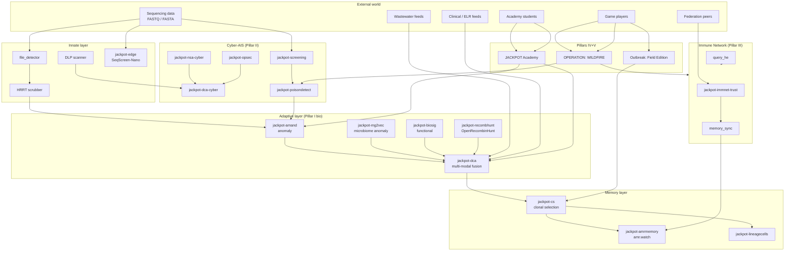
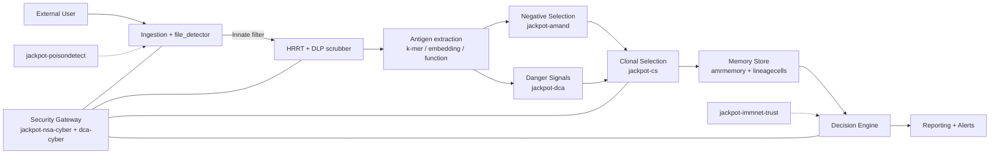

# JACKPOT Immune Platform — Strategic Vision, Implementation Plan, and Collaboration Scaffolding

**Document type:** Strategic vision + comprehensive implementation plan + engineering collaboration scaffolding
**Version:** 2.0 (Cluster B merge, 2026-05-16)
**Last updated:** 2026-05-16
**Author:** Glen Otero (gotero@linuxprophet.com), with Claude as co-author
**Audience:** Glen, contributors, future operators, grant reviewers, partner labs, the ASU Biodesign Center for Biocomputing, Security and Society (Forrest / Trieu / Lee / Halden group)
**Status:** Forward-looking — captures the future state of JACKPOT (post-P0–P5 roadmap) AND maps to concrete Phase 26+ items. Engineering scaffolding ready for the Biodesign coalition pitch.
**License of this document:** AGPL-3.0 (same as JACKPOT)

---

## Document map

This document consolidates three previously-separate working docs (per the May 2026 Cluster B merge):

- **Part 1 — Strategic Vision and Implementation Plan** (was `jackpot_immune_platform_plan.md`). The dual-AIS thesis, the five pillars, the schema extensions, the implementation roadmap, the research/partnership pipeline.
- **Part 2 — Collaboration Scaffolding** (was `jackpot_immune_collaboration_scaffolding_orig.md`). Eleven critiques the Biodesign group would raise on first read, with concrete software scaffolding for each gap and `TODO(<researcher>-collab):` markers for joint work.
- **Part 3 — Bio-AIS Anomaly Detection Reconciliation** (was `bio-ais-anomaly-detection.md`). Reconciles earlier anomaly-detection chat content against the actual JACKPOT plan to clarify what's tracked, what's net-new, and the demo path for Scenario A.

**§§7-8 of the original immune_platform_plan (Pillar IV Training and Pillar V Gaming)** have been extracted to dedicated docs:

- `docs/learning_strategic_vision.md` — the why and what of JACKPOT Learn (Academy + Field Edition + SENTINEL + WILDFIRE)
- `docs/learning_curriculum_design.md` — the how: module specs, case catalogs, season arcs

Brief redirect stubs remain at §§7-8 in this doc to preserve the pillar narrative.

**Companion docs in the Tier 3 reference set:**

- `docs/architecture.md` v6.0 — canonical platform architecture; deployment scenarios A/B/C/D
- `docs/detection_landscape.md` — component-tier survey of ~85 open-source detection tools (this doc's §11 "Component adoption strategy" provides the cross-reference)
- `docs/federation.md` — federation architecture detail
- `docs/federation_operations.md` — operator-facing federation policy
- `docs/wastewater.md` — wastewater surveillance design
- `docs/spec.md` — operational spec / current as-built state
- `docs/learning_strategic_vision.md` and `docs/learning_curriculum_design.md` — Pillar IV / V detail

---

## Table of Contents

### Part 1 — Strategic Vision and Implementation Plan

1. [Executive Summary](#1-executive-summary)
2. [Why an Immune-System Architecture?](#2-why-an-immune-system-architecture)
3. [Foundations: Artificial Immune System (AIS) Theory](#3-foundations-artificial-immune-system-ais-theory)
4. [Pillar I — Bio-Anomaly Detection Stack (`jackpot-immune-bio`)](#4-pillar-i--bio-anomaly-detection-stack-jackpot-immune-bio)
5. [Pillar II — Platform Self-Defense AIS (`jackpot-immune-sec`)](#5-pillar-ii--platform-self-defense-ais-jackpot-immune-sec)
6. [Pillar III — Federation as Immune Network (`jackpot-immune-net`)](#6-pillar-iii--federation-as-immune-network-jackpot-immune-net)
7. [Pillar IV — Training as First-Class Citizen — redirect to JACKPOT Learn docs](#7-pillar-iv--training-as-first-class-citizen--redirect-to-jackpot-learn-docs)
8. [Pillar V — Gaming as First-Class Citizen — redirect to JACKPOT Learn docs](#8-pillar-v--gaming-as-first-class-citizen--redirect-to-jackpot-learn-docs)
9. [Architecture: The Complete Picture](#9-architecture-the-complete-picture)
10. [Module Specifications (Detailed)](#10-module-specifications-detailed)
11. [Component Adoption Strategy — cross-reference to detection_landscape](#11-component-adoption-strategy--cross-reference-to-detection_landscapemd) (NEW in Cluster B merge)
12. [Schema Extensions](#12-schema-extensions)
13. [Threat Model Integration (STRIDE for Cyberbiosecurity)](#13-threat-model-integration-stride-for-cyberbiosecurity)
14. [Open-Source Software Integration Strategy](#14-open-source-software-integration-strategy)
15. [Implementation Roadmap](#15-implementation-roadmap)
16. [Research, Partnership, and Publication Pipeline](#16-research-partnership-and-publication-pipeline)
17. [Quick-Reference Tables](#17-quick-reference-tables)
18. [References](#18-references)
19. [Open critiques and collaboration scaffolding — bridge to Part 2](#19-open-critiques-and-collaboration-scaffolding--bridge-to-part-2)

### Part 2 — Collaboration Scaffolding

20. [Why this companion section exists](#20-why-this-companion-section-exists)
21. [Eleven critiques, mapped to scaffolding](#21-eleven-critiques-mapped-to-scaffolding)
22. [Gap 1 — Monoculture: `jackpot-diversity` family](#22-gap-1--monoculture-jackpot-diversity-family)
23. [Gap 2 — Software supply chain: `jackpot-sbom` and parsers-safe](#23-gap-2--software-supply-chain-jackpot-sbom-and-parsers-safe)
24. [Gap 3 — Static defense posture: `jackpot-mutate`](#24-gap-3--static-defense-posture-jackpot-mutate)
25. [Gap 4 — Misuse and governance: `jackpot-governance` + refusal mechanisms](#25-gap-4--misuse-and-governance-jackpot-governance--refusal-mechanisms)
26. [Gap 5 — Education-as-foundation reframing](#26-gap-5--education-as-foundation-reframing)
27. [Cross-cutting: the `jackpot-redteam` track + Lee/Trieu specifics](#27-cross-cutting-the-jackpot-redteam-track--leetrieu-specifics)
28. [Phase 26-collab: integrating into the existing roadmap](#28-phase-26-collab-integrating-into-the-existing-roadmap)
29. [Open research questions, summarized](#29-open-research-questions-summarized)

### Part 3 — Bio-AIS Anomaly Detection Reconciliation

30. [Reconciliation: chat-derived anomaly-detection design vs the actual JACKPOT plan](#30-reconciliation-chat-derived-anomaly-detection-design-vs-the-actual-jackpot-plan)

---

# Part 1 — Strategic Vision and Implementation Plan

> This part was originally the standalone document `jackpot_immune_platform_plan.md`. Sections 7 and 8 (Pillar IV — Training and Pillar V — Gaming) have been extracted to `docs/learning_strategic_vision.md` and `docs/learning_curriculum_design.md`; redirect stubs remain at those section numbers. Section 11 (Component adoption strategy) is new content added in the Cluster B merge to cross-reference `docs/detection_landscape.md`.

## 1. Executive Summary

This document lays out how Jackpot becomes the **most complete public health biosurveillance platform on the planet** by adopting an **artificial immune system (AIS) architecture** as its organizing principle, with **public health workforce capacity** as a co-equal first principle.

Two theses, in equal balance:

### Thesis 1 — The dual-AIS thesis (technical novelty)

> The same family of bio-inspired algorithms that detect anomalous pathogen genomes can also detect anomalous platform behavior. JACKPOT runs both simultaneously, sharing a single algorithmic substrate.

### Thesis 2 — The workforce-as-platform-infrastructure thesis (workforce novelty)

> Public-health workforce capacity is the rate-limiting factor in pandemic preparedness, not tooling. JACKPOT Academy and the Outbreak/WILDFIRE games are not deliverables on top of a platform — they are platform infrastructure that produces the operators, contributors, and adversarial training data that the rest of the system needs.

No platform in the comparative landscape (Pathoplexus/Loculus, GenSpectrum/LAPIS, Pathogenwatch, EnteroBase, NCBI Pathogen Detection, BV-BRC, Solu, RT-MetA, GISAID, IDseq, IRIDA-ARIES, amr.watch, SeqScreen-Nano, HPD-Kit) combines either thesis with the other. Most do neither.

The platform stands on **five pillars**, all built in parallel:

| Pillar | Subsystem | What it does |
| --- | --- | --- |
| I | `jackpot-immune-bio` | Bio-anomaly detection — finds unknown pathogens, novel variants, recombinants, engineered sequences |
| II | `jackpot-immune-sec` | Platform self-defense — detects intrusions, poisoned inputs, malicious queries, insider threats |
| III | `jackpot-immune-net` | Federation as immune network — distributed memory, trust calibration, cross-cell signaling |
| IV | JACKPOT Academy | Workforce-as-platform-infrastructure — curriculum that teaches AIS by being it |
| V | Outbreak + WILDFIRE | Gaming-as-platform-infrastructure — adversarial co-training and platform stress-testing |

**Pillars IV and V are platform infrastructure, not decoration.** They appear last in the section ordering only because their value depends on the technical substrate of the first three. Game players generate adversarial training data for both bio-AIS and cyber-AIS detectors. Academy students extend the detector zoo as part of their coursework. Training and gaming are tightly coupled with the production immune system.

**Why JACKPOT specifically?** Three structural advantages we already have:

1. **Operator-agnostic, multi-tenant, federated by design** — six deployment targets (laptop, single-org cloud, multi-lab agency, hosted SaaS, federation member, CI test) means we already think in "cells" of an immune network.
2. **Two PII gates already enforce immune-like self/non-self at ingest** — HRRT/Scrubber removes host genomic "self," Cloud DLP removes metadata "self." Those are conceptually thymus-style negative selection. We're already partway there.
3. **`course/` tree and game-able structure already in the monorepo plan (P0d)** — Academy and Outbreak both fit naturally into the existing tree without architectural surgery.

**Where this lives in the roadmap:** Strategic future state, with **Phase 26+** items that begin landing concrete work *now*, **interleaved within** the current P0d–P5 roadmap. (Glen is a solo developer; "parallel" here means interleaved within phases, not literally concurrent.) We do not pause monorepo migration, `jackpot init`, schema v5.0, or multi-tenancy middleware to chase this. We tee up early-cost low-risk groundwork (negative-selection MVP in the academy track, OSS wrapper integrations, schema additions) that compounds on top of the existing roadmap.

**Differentiator paper targets** (two, in balance):

1. *JACKPOT: a federated artificial immune system for pathogen genomic surveillance and cyberbiosecurity.* (Methods venue: *Nature Methods* / *Genome Biology* / *PLOS Computational Biology*)
2. *JACKPOT Academy: workforce-as-platform-infrastructure for public health bioinformatics.* (Workforce venue: *Frontiers in Public Health* / *PLOS Comp Bio Education*)

This document is the seed of both papers.

**Companion document:** `jackpot_immune_collaboration_scaffolding.md` lays out working-MVP software scaffolding for every gap a senior reviewer would identify in this vision. Read both together; this doc is the strategic frame, the companion is the engineering scaffolding that makes the frame credible.

---

## 2. Why an Immune-System Architecture?

### 2.1 The detection problem nobody is solving well

Existing platforms track *known* pathogens. Pathoplexus/Loculus stores sequences; GenSpectrum queries them; Pathogenwatch types them; EnteroBase phylotypes them; amr.watch monitors AMR. **All of them assume the threat space is annotated.**

Real public health surveillance has three additional needs that none address well:

1. **Unknown unknowns** — pathogens that aren't in any reference database. mNGS platforms like IDseq partially address this, but treat anomaly detection as a side-effect of taxonomic assignment failure rather than a first-class capability.
2. **Engineered pathogens** — synthetic biology threats whose signatures don't match natural evolution. Wittmann et al. (2025) showed AI-generated proteins evade existing biosecurity screening; SecureDNA-style screening is necessary but not sufficient.
3. **Multi-modal context** — a genome anomaly without epidemiological context is noise. With wastewater concentration, clinical case counts, and host immune-response signals, it becomes a signal. Existing platforms don't fuse these.

These three needs map exactly onto three AIS concepts: **negative selection** (self/non-self), **recognition diversity** (multi-site detection of unfamiliar patterns), and **danger theory / dendritic cell algorithms** (context-aware anomaly scoring).

### 2.2 The security problem nobody is solving well either

Pathogen genomic platforms are also under-defended as cyber assets. The literature catalogs concrete threats:

- **Adversarial lineage attack** — Meiseles et al. (2023) showed Pangolin SARS-CoV-2 lineage assignment is vulnerable to adversarial input.
- **Malicious DNA** — Tavella et al. (2022) demonstrated machine-learning detection of threats in bio-cyber DNA storage; the converse (DNA payloads triggering RCE on sequence) is documented.
- **Insider threats** — Anjum et al. (2025) and Burrell et al. (2023) catalog cyberbiosecurity insider risk.
- **AI-evading synthesis** — Wittmann et al. (2025) on generative protein design that evades screening.
- **Cloud LIMS escalation** — Sheldon et al. (2024) document privilege escalation paths.

Negative selection algorithms invented for cyber intrusion detection (Forrest et al. 1994; Hosseini & Seilani 2021; Bejoy et al. 2020/2022) transfer cleanly to genomic-platform self-defense. Same algorithm, different "self" set: instead of "normal network packets," it's "normal API call patterns / federation queries / submission metadata."

### 2.3 The Forrest insight: AIS started as cybersecurity

Stephanie Forrest's seminal 1994 paper *Self-nonself discrimination in a computer* invented the negative selection algorithm for **computer security**. It was *later* adapted for biological problems. JACKPOT closes the loop: NSA was inspired by biology, used for cyber, and we use it again for both biology AND the cyber defense of a biology platform.

That symmetry is the technical thesis. It's also a beautiful story that grant reviewers will love.

---

## 3. Foundations: Artificial Immune System (AIS) Theory

Before we name modules, we need to align on the AIS algorithm vocabulary. Each algorithm below maps to one or more JACKPOT modules; the mapping is in Section 16.

### 3.1 Negative Selection Algorithm (NSA)

**Origin:** Forrest, Allen, Perelson, Cherukuri (1994); theoretical basis in Perelson & Oster (1979).

**Mechanism:** Generate random detectors, expose them to "self," delete any that bind self. Survivors only bind non-self. At runtime, any data point activating any surviving detector is anomalous.

**JACKPOT applications:**
- Bio-AIS: Detectors are k-mer profiles, sequence embeddings, or compositional vectors. "Self" is the union of all known reference pathogen genomes for the operator's scope. Anomalous samples activate non-self detectors.
- Cyber-AIS: Detectors are patterns over API call sequences, federation query metadata, or submission patterns. "Self" is normal operator behavior. Anomalous traffic activates detectors.

**Reference implementation guidance:** Hosseini & Seilani (2021) NSA + classification hybrid; Widulinski (2023) NSA in network cybersecurity.

### 3.2 Clonal Selection Algorithm

**Origin:** de Castro & Von Zuben (2002); Kelsey & Timmis (2003) for hypermutation.

**Mechanism:** Detectors that match anomalies are cloned with mutation; high-affinity clones replace lower-affinity ones. Detector population evolves to track moving anomaly distributions — the AIS equivalent of online learning under concept drift.

**JACKPOT applications:**
- Bio-AIS: Variant evolution. A SARS-CoV-2 lineage detector that matched Alpha clones with mutations as Beta/Delta/Omicron emerge.
- Cyber-AIS: Attack-pattern drift. A detector that fires on a known prompt-injection pattern clones with mutations as attackers paraphrase.

**Reference implementation guidance:** Liu et al. (2023) continual learning AIS with human-in-the-loop; Imam et al. (2023) on AIS+ML hybridization.

### 3.3 Immune Network Theory

**Origin:** Jerne (1974); de Castro & Timmis (2002).

**Mechanism:** Detectors recognize each other as well as antigens, forming a network where stimulation/suppression dynamics maintain diversity and memory.

**JACKPOT applications:**
- Federation-level memory: each tenant's detector pool is a "node" in the network; cross-tenant signaling propagates novel detectors and suppresses redundant ones.
- This is how we build **federated immune memory** without copying raw data.

### 3.4 Danger Theory and Dendritic Cell Algorithms (DCA)

**Origin:** Matzinger (1994) danger theory; Greensmith DCA (2007); Pinto et al. (2022) cursory DCA.

**Mechanism:** Anomaly is not just non-self — it's non-self plus a "danger signal" (cellular damage, inflammation). DCAs aggregate multiple context signals to upgrade or downgrade an anomaly's significance.

**JACKPOT applications:**
- Multi-modal fusion: a non-self genome signature paired with rising wastewater concentration, clinical case clusters, or host immune response markers becomes high-priority. Without context, it's a watch-list entry.
- This is the key differentiator from every existing platform.

**Reference implementation guidance:** Pinto et al. (2022) cursory DCA; Wang et al. (2022) innate immune memory + DCA.

### 3.5 Natural Killer (NK) Cell Algorithms

**Origin:** Wang et al. (2022) NKA; Deng et al. (2025) NK-DCHS hybrid.

**Mechanism:** NK cells use phenotype-based recognition (missing-self) — they kill cells that have *lost* normal markers. Algorithmically: anomaly-by-absence rather than anomaly-by-presence.

**JACKPOT applications:**
- Microbiome surveillance: a sample missing expected commensals (rather than containing unexpected pathogens) signals dysbiosis or immunosuppression — useful for clinical settings and certain bioweapon scenarios.
- Imbalanced dataset handling: NK-DCHS specifically addresses class imbalance, which is the default in pathogen surveillance (you have orders of magnitude more "normal" than "anomalous" samples).

### 3.6 Innate Immune Memory / Trained Immunity

**Origin:** Wang, Liang, Dong et al. (2022).

**Mechanism:** Innate immune cells "remember" prior exposures via epigenetic reprogramming, reacting faster on second encounter. AIS analog: maintain a fast-lookup index of previously confirmed anomalies that bypasses full scanning.

**JACKPOT applications:**
- Variant memory: confirmed lineages get a short-circuit detection path.
- Attack memory: confirmed injection patterns get fast-path blocking.

### 3.7 Continual Learning AIS with Human-in-the-Loop

**Origin:** Liu et al. (2023).

**Mechanism:** Combine clonal selection with active learning — human analysts review uncertain detections; their labels train new detectors; the system bootstraps itself with minimal labeled data.

**JACKPOT applications:**
- Analyst workflow: Streamlit "review queue" page where uncertain anomalies are surfaced for expert classification, feeding the clonal selection loop.
- Game integration: WILDFIRE players' decisions become labeled training data.

### 3.8 Drift-Aware Anomaly Detection

**Origin:** Li, Nair & Wang (2025) unsupervised drift-aware framework.

**Mechanism:** Combine concept-drift detection with anomaly detection so the model knows when its "self" model has aged out and needs refresh.

**JACKPOT applications:**
- Reference-database freshness: detect when the operator's "self" reference set has drifted enough (new dominant lineage, new commensal microbiome composition) that the bio detector pool (DeepSVDD baseline) needs regeneration.

### 3.9 The Two Self/Non-Self Boundaries

The dual-AIS thesis in one diagram:

```
                  ┌──────────────────────────────────────────────────┐
                  │                JACKPOT Immune Substrate           │
                  │                                                   │
                  │   ┌─────────────────┐      ┌─────────────────┐    │
                  │   │  Bio-AIS        │      │  Cyber-AIS      │    │
                  │   │  (Pillar I)     │      │  (Pillar II)    │    │
                  │   │                 │      │                 │    │
                  │   │  "self" = known │      │  "self" = normal│    │
                  │   │  pathogen ref   │      │  platform call  │    │
                  │   │  genomes,       │      │  patterns, fed  │    │
                  │   │  microbiomes    │      │  query metadata │    │
                  │   │                 │      │                 │    │
                  │   │  NSA, CSA,      │      │  NSA, CSA,      │    │
                  │   │  DCA, NKA,      │      │  DCA, NKA,      │    │
                  │   │  Memory         │      │  Memory         │    │
                  │   └────────┬────────┘      └────────┬────────┘    │
                  │            │                        │             │
                  │            └──────────┬─────────────┘             │
                  │                       │                           │
                  │              ┌────────▼────────┐                  │
                  │              │ Shared algorithm│                  │
                  │              │   substrate     │                  │
                  │              │  (jackpot-ais)  │                  │
                  │              └─────────────────┘                  │
                  └──────────────────────────────────────────────────┘
```

Bio and cyber use *different* detectors, not one shared algorithm. Bio detection is DeepSVDD over genomic-foundation-model embeddings, bound to an `AnomalyDetector` Protocol; cyber detection is negative selection over API-call features. What they share is the aggregation pattern, not the detector: the same DCA fuses both kinds of danger signals and the same memory-consolidation logic services both. **One aggregation substrate (the `AnomalyDetector` Protocol + DCA), two detectors, two threat surfaces** (per `immune_detection_core_redesign.md` §1).

---

## 4. Pillar I — Bio-Anomaly Detection Stack (`jackpot-immune-bio`)

### 4.1 The detection layers

Borrowing biological vocabulary, the bio-AIS has three layers, each with concrete JACKPOT modules:

| Layer | Biological analog | JACKPOT module(s) | What it catches |
| --- | --- | --- | --- |
| **Innate** | Skin, mucus, PAMP recognition, complement | `file_detector.py` (already exists), `jackpot-edge`, `jackpot-scrubber` (HRRT, exists) | Obvious wrong-type files, host-DNA leakage, gross contamination |
| **Adaptive** | T cells, B cells, antibodies | `jackpot-amand`, `jackpot-mg2vec`, `jackpot-biosig`, `jackpot-recombhunt`, `jackpot-dca` | Novel pathogens, drifted variants, recombinants, engineered sequences |
| **Memory** | Memory B/T cells, plasma cells | `jackpot-amrmemory`, `jackpot-lineagecells`, `jackpot-cs` | Confirmed lineages, AMR signatures, attack patterns — fast recall path |

### 4.2 Module catalog with OSS integration

Each bio-AIS module either **wraps** an existing OSS project, **forks** one, or is **new code inspired by** the literature. Integration mode is in the table.

| Module | AIS concept | OSS basis | Mode | What it does |
| --- | --- | --- | --- | --- |
| `jackpot-amand` | Negative Selection over k-mer/embedding space | inspired by Hosseini & Seilani 2021, ANDES (Kanjilal 2025), STREAM (Bae 2026) | **new** | k-mer compositional + sequence-embedding NSA; flags samples whose distance to all known references exceeds threshold |
| `jackpot-mg2vec` | density-based anomaly (LOF) over metagenomic communities | inspired by Wang, Wang, Liu (2026 *Cell Systems* AI for microbiome) | **new** | Embedding model trained on normal microbiomes; flags compositional outliers |
| `jackpot-biosig` | Multi-site recognition (Perelson & Oster 1979) over functional features | wraps ESMFold; adds codon-bias, restriction-site, ORF anomaly checks | **new + wraps** | "What does this sequence *do*?" — toxin-fold detection, immune-evasion epitope shifts, engineering scars |
| `jackpot-recombhunt` | anomaly detection over recombination breakpoint patterns | wraps **OpenRecombinHunt** (Alfonsi et al. 2026) | **wraps** | Automatic detection of viral recombinants; SARS-CoV-2, RSV, Mpox, Zika, YF, H5N1 |
| `jackpot-amrmemory` | Memory cells (innate immune memory) | wraps **amr.watch** (David et al. 2025), **AMRFinderPlus**, **CARD**, **abricate** | **wraps** | Fast-path AMR signature recall; >600k genome reference base |
| `jackpot-dca` | Dendritic Cell Algorithm — multi-modal context fusion | inspired by Pinto et al. 2022, Wang 2022 innate immune memory | **new** | Combines genomic anomaly score with wastewater, clinical, mobility, host-response signals → priority score |
| `jackpot-cs` | Clonal Selection / online learning | inspired by Liu et al. 2023, de Castro & Von Zuben 2002 | **new** | Detector evolution under variant drift; analyst-in-the-loop labeling |
| `jackpot-nka` | NK Cell Algorithm — anomaly by absence + imbalanced data | inspired by Wang 2022 NKA, Deng 2025 NK-DCHS | **new** | Missing-commensal detection; handles class imbalance natively |
| `jackpot-edge` | Innate immunity at the edge | wraps **SeqScreen-Nano** (Balaji et al. 2023) | **wraps** | Streaming, in-field pathogen characterization on ONT/MinION; <32GB RAM |
| `jackpot-mngs` | Cloud mNGS pipeline | wraps **CZ-ID/IDseq** (Kalantar et al. 2021) | **wraps** | Established mNGS pipeline as the "go-to" mode for clinical metagenomics |
| `jackpot-amand-fda` | Functional data analysis | wraps **ANDES** (Kanjilal et al. 2025) | **wraps** | Genomic windows as functional curves; complementary to k-mer/embedding anomaly detection |
| `jackpot-stream` | Streaming time-series anomaly | wraps **STREAM** (Bae et al. 2026), **Coniferest** (Kornilov et al. 2025) | **wraps** | Generic time-series anomaly engine for wastewater, case counts, etc. |
| `jackpot-immune-evasion` | AI-driven immune evasion analysis | inspired by Ibrahim 2026 | **new** | Detects mutations consistent with immune-evasion strategies (epitope shifts, glycosylation site changes, antigenic variation patterns) |

### 4.3 Multi-modal danger signals (the differentiator)

The DCA module (`jackpot-dca`) is what separates JACKPOT from every other genomic surveillance platform. It fuses six classes of signal into a single context-aware anomaly priority score:

| Signal class | Source | Example feature |
| --- | --- | --- |
| **Genomic anomaly** | `jackpot-amand`, `jackpot-mg2vec`, `jackpot-biosig` | DeepSVDD anomaly score over embeddings, embedding distance |
| **Wastewater** | external feed → `jackpot-stream` | Freyja lineage abundance over time, raw signal concentration |
| **Clinical** | LIMS / ELR feeds | Case clusters by ZIP/county, ICU admission rate, syndromic surveillance |
| **Mobility / travel** | external feeds (CDC traveler genomic surveillance, transit data) | Air-traffic anomalies, border-crossing surveillance |
| **Host immune response** | clinical samples with paired host RNA-seq | Cytokine signatures, T/B-cell repertoire shifts |
| **Environmental / One Health** | animal samples, environmental swabs | Cross-species jumps, shared AMR signatures |

The DCA scoring is **explicit and explainable** (per Patel 2021 on explainable AIS) — every priority score breaks down into per-signal contributions visible in the UI. No black-box scoring.

### 4.4 Integration with existing JACKPOT modules

Critical: the bio-AIS does not replace existing modules; it **layers on top of and reuses** them.

| Existing module | AIS role | Integration |
| --- | --- | --- |
| `file_detector.py` | Innate immunity — PAMP recognition | First line of defense; rejects malformed files before they reach detectors |
| HRRT (`ingest_scrubber.nf`) | Self filtration — host removal | Removes "self" host genomic content before anomaly scanning |
| Cloud DLP (`dlp_scanner.py`) | Metadata immune scan | Catches PII leakage; maps to "tolerance" boundary |
| `pipeline_results_loader.py` | Memory consolidation | Pipeline results land in immutable append-only `pipeline_results` rows; this is our "memory cell" persistence |
| Validator (Tier 1/2/3) | Negative selection threshold | Tier-1 PRELIMINARY samples are pre-NSA; Tier-2 ANALYZABLE pass innate filters; Tier-3 SUBMITTABLE have full DCA scores |
| Audit (`log_audit`) | Forensic record / repudiation defense | Each AIS event creates an audit record; participates in caller transactions (fixes existing P0 bug) |

### 4.5 Forward-looking research integration

Specific 2025–2026 work we can integrate as it lands:

- **ANDES (Kanjilal et al. 2025)** — functional data analysis for genomic windows. Wrap as `jackpot-amand-fda` complementary detector class.
- **GAMA (Guan et al. 2024)** — multi-graph anomaly detection via GNN. Use for outbreak transmission graph anomaly detection (sample → metadata → location graph).
- **NK-DCHS (Deng et al. 2025)** — hybrid NK-cell + dendritic-cell for imbalanced data. Use as core algorithm for `jackpot-nka`.
- **AI-powered viral metagenomics (Chisompola et al. 2025)** — direct alignment with `jackpot-mngs` integration target.
- **AI for immune evasion (Ibrahim 2026)** — basis for `jackpot-immune-evasion`.
- **Wastewater AMR surveillance (Balcázar 2025)** — drives the wastewater signal feed for DCA.
- **AI for microbiology and microbiome (Wang, Wang & Liu 2026 *Cell Systems*)** — comprehensive review; track for new method adoption.
- **Continual learning AIS (Liu et al. 2023)** — direct basis for `jackpot-cs`.

### 4.6 What runs where (deployment scenario alignment per `docs/architecture.md` §3)

The bio-AIS modules are designed to fit JACKPOT's existing six deployment targets without bifurcation:

| Target | Bio-AIS modules available |
| --- | --- |
| A — laptop | `jackpot-amand` (lightweight anomaly detector), `jackpot-edge` (ONT), `jackpot-recombhunt` (lightweight wrapper), Academy synthetic data; **no DCA fusion** (not enough signal sources) |
| B — single-org cloud | A + `jackpot-dca`, `jackpot-mg2vec`, `jackpot-biosig`, `jackpot-cs` (full bio-AIS stack) |
| C — multi-lab agency | B + cross-lab DCA fusion, `jackpot-amrmemory` shared across labs |
| D — hosted SaaS | Same as B/C with multi-tenant isolation; DCA fusion within tenant only |
| E — federation member | Full stack + `jackpot-immune-net` participation (see Pillar III) |
| F — CI test | Synthetic pathogens + ground-truth answer keys; full deterministic stack |

---

## 5. Pillar II — Platform Self-Defense AIS (`jackpot-immune-sec`)

### 5.1 The cyberbiosecurity threat surface

The Leapspace research synthesizes a STRIDE threat model specifically for biosecurity systems (full mitigation framework in Section 12). The threat catalog:

| STRIDE | Specific to JACKPOT |
| --- | --- |
| **Spoofing** | Forged Google OAuth tokens, impersonated lab devices submitting samples, fake federation member identities |
| **Tampering** | Adversarial sample submissions designed to poison detectors, malicious DNA payloads in fastq, lineage-assignment adversarial attack (Meiseles 2023), AI-evading synthetic DNA (Wittmann 2025) |
| **Repudiation** | Pipeline runs without auditable provenance, sample modifications without lineage |
| **Information Disclosure** | Re-identification attacks on metadata, federation query intent leakage, cloud misconfig leaks |
| **Denial of Service** | Pipeline overload, sequencer-disrupt attacks, federation flooding |
| **Elevation of Privilege** | Insider abuse (Anjum 2025), misconfigured LIMS permissions, container escape, JWT scope expansion |

### 5.2 AIS for platform security — module catalog

| Module | AIS concept | What it does |
| --- | --- | --- |
| `jackpot-nsa-cyber` | Negative Selection over API call patterns | Detectors trained on normal API call sequences per role; fires on anomalous patterns (e.g., a researcher account suddenly enumerating all samples) |
| `jackpot-dca-cyber` | Dendritic Cell — context-aware threat fusion | Combines auth events, IP, geolocation, time-of-day, query intent into per-event danger score |
| `jackpot-cs-cyber` | Clonal Selection — adapts to attack drift | Online learning over confirmed attacks; mutates detectors as attackers paraphrase |
| `jackpot-immnet-trust` | Immune Network — federation trust scoring | Reputation per federation member; suppresses signals from low-trust nodes |
| `jackpot-poisondetect` | NK + DCA hybrid | Detects poisoned training samples in the bio-AIS pipeline (Tavella 2022 inspired) |
| `jackpot-opsec` | Query metadata analysis | Monitors query patterns for intent leakage in federated mode |
| `jackpot-screening` | Synthetic DNA screening | Wraps SecureDNA + Wittmann 2025 adversarial-resistant screening; integrates with sample ingest |

### 5.3 Specific defenses

#### 5.3.1 Adversarial input detection

Every sample submission goes through a poison-detect pass before the bio detector's training data is updated. Inspired by Meiseles et al. (2023) on Pangolin adversarial attack:

```python
# backend/immune/cyber/poisondetect.py (planned)
async def assess_submission_for_poisoning(
    sample_id: UUID,
    embedding: np.ndarray,
    submitter_trust_score: float,
    db: AsyncSession,
) -> PoisonAssessment:
    """
    Returns a poison-likelihood score 0..1.
    Combines:
      - Embedding distance from submitter's prior submissions (sudden distributional shift)
      - Adversarial perturbation detection (high-frequency / unnatural gradient signature)
      - Submitter trust score from jackpot-immnet-trust
      - Whether the submission shifts the bio detector boundary (DeepSVDD baseline) disproportionately
    """
```

#### 5.3.2 Query OPSEC monitoring (federated mode)

In federated mode, the *pattern* of queries leaks intent even if individual queries are encrypted. `jackpot-opsec` runs NSA over query sequences per member, detecting reconnaissance behavior.

#### 5.3.3 Insider threat detection

Per Anjum et al. (2025) and Burrell et al. (2023): the highest-impact attacks come from inside. Approach:

- NSA over per-user normal behavior windows (last 30 days).
- DCA fusion with HR signals where available (recent termination, performance review timing).
- Privileged-action logging and lineage with cryptographic chain.

#### 5.3.4 Synthetic DNA screening at ingest

Wittmann et al. (2025) demonstrated AI-generated proteins evading existing screening. `jackpot-screening` integrates the Wittmann mitigation approach: structure-based screening complementary to sequence-based, run *as part of* the ingest pipeline before sequences are added to the operator's reference database.

### 5.4 Audit and telemetry

The cyber-AIS depends on rich telemetry:

- **Tamper-proof audit log** — every AIS event (detector activation, danger signal, clonal selection round, memory consolidation) creates an audit row. Audit rows are append-only, hash-chained. Already enforced architecturally; needs the existing P0 bug fix (audit must participate in caller transaction).
- **Pipeline integrity** — Nextflow workflows are signed; integrity verified at launch. We extend the existing pipelines router with signature verification.
- **Provenance graph** — every result is reproducible: sample → scrubbed sample → pipeline version → result. This is the AIS "lineage of memory cells."

### 5.5 Where this lives in the codebase

```
backend/immune/
├── __init__.py
├── algorithms/                 # shared AIS substrate (Section 9.4)
│   ├── nsa.py                  # Negative Selection
│   ├── csa.py                  # Clonal Selection
│   ├── dca.py                  # Dendritic Cell Algorithm
│   ├── nka.py                  # NK Cell Algorithm
│   └── memory.py               # Memory cell management
├── bio/                        # Pillar I
│   ├── amand.py
│   ├── mg2vec.py
│   ├── biosig.py
│   ├── recombhunt.py
│   ├── amrmemory.py
│   ├── dca_bio.py
│   ├── cs_bio.py
│   └── nka_bio.py
├── sec/                        # Pillar II
│   ├── nsa_cyber.py
│   ├── dca_cyber.py
│   ├── cs_cyber.py
│   ├── poisondetect.py
│   ├── opsec.py
│   └── screening.py
└── net/                        # Pillar III
    ├── trust.py
    ├── memory_sync.py
    └── query_he.py
```


---

## 6. Pillar III — Federation as Immune Network (`jackpot-immune-net`)

### 6.1 The federation as an immune system

Each federation member is a "cell" in the immune network. Memory cells (confirmed lineages, AMR signatures, attack patterns) circulate. Trust between members is dynamic, calibrated by signal quality and shared confirmation.

The biological metaphor is precise:

| Federation concept | Biological analog |
| --- | --- |
| Federation member tenant | Immune cell (B-cell, T-cell, dendritic cell, depending on role) |
| Detector pool per member | Antibody repertoire |
| Cross-member memory sync | Lymphatic circulation |
| Trust score | Co-stimulation requirement |
| Adversarial submission | Pathogen mimicry / molecular mimicry |
| Anomaly broadcast | Cytokine signaling |

### 6.2 Federation mechanics

#### 6.2.1 Trust calibration

Each member starts with a baseline trust score. Trust adjusts based on:

- **Signal quality** — submissions confirmed by other members raise trust.
- **False positive rate** — submissions other members reject lower trust.
- **OPSEC behavior** — query patterns consistent with reconnaissance lower trust.
- **Time** — trust decays toward neutral without recent activity.

Implementation: `trust_scores` table (Section 11), `jackpot-immnet-trust` module.

#### 6.2.2 Cryptographic primitives for sensitive queries (placeholder, needs Trieu collaboration)

For high-sensitivity federated queries, JACKPOT will use cryptographic primitives chosen **per query class**, not a single generic wrapping:

- **Set-membership queries** (e.g., "do you have a sample matching this k-mer profile?") — **Private Set Intersection - Cardinality (PSI-CA)** per Trieu et al. PoPETs 2024. Faster and tighter guarantees than HE for this query class; designed for semi-honest adversaries without expensive public-key operations.
- **Aggregate counting queries** (e.g., "how many members have seen lineage X this week?") — **secure aggregation with differential privacy** at the aggregator (see §6.2.3).
- **Distance / similarity queries** (e.g., "what's the closest-match distance for this embedding?") — **secure k-NN / approximate nearest-neighbor** protocols.
- **General secure outsourcing** when none of the above fit — **homomorphic encryption** per Kim et al. (2021).

The actual primitive choice per query class is **open** and subject to Trieu collaboration. The placeholder implementation in `backend/immune/net/query_he.py` ships with `TODO(trieu-collab): protocol selection` documenting this. Companion doc §8.6 has the full Trieu-specific hooks.

#### 6.2.3 Differential privacy on shared signals

For aggregate signals (e.g., "how many members have seen lineage X this week?"), differential-privacy noise is added at aggregation time so individual member contributions can't be inferred. Privacy-budget composition across query types is itself a `TODO(trieu-collab): formal privacy budget` open question.

#### 6.2.4 Adversarial submission resistance

The federation can be attacked via poisoned submissions. Defense:

- Per-member trust scoring (Section 6.2.1)
- Cross-member confirmation required before a submission affects shared memory cells
- Quarantine queue for submissions from low-trust members
- The `jackpot-poisondetect` module from Pillar II runs on every submission

### 6.3 The "antibody repertoire" as code

Each member maintains a versioned detector pool:

```python
# backend/immune/net/repertoire.py (planned)
from datetime import datetime
from uuid import UUID
from pydantic import BaseModel, Field, field_validator, model_validator
from typing_extensions import Self


class Detector(BaseModel):
    detector_id: UUID
    detector_type: str            # "nsa_kmer", "dca_context", "biosig_protein", etc.
    target_pathogen: str | None = None
    affinity_threshold: float = Field(ge=0.0, le=1.0)
    feature_vector: list[float]
    created_at: datetime
    last_activated_at: datetime | None = None
    activation_count: int = Field(default=0, ge=0)


class MemoryCell(BaseModel):
    memory_id: UUID
    confirmed_lineage: str
    detector_ids: list[UUID] = Field(min_length=1)
    confirmed_by_members: list[UUID] = Field(
        min_length=2,
        description="Cross-member confirmation requires at least 2 members",
    )
    promoted_at: datetime


class AntibodyRepertoire(BaseModel):
    """A member's full detector pool. Versioned, signed, shareable."""
    member_id: UUID
    version: int = Field(ge=0)
    detectors: list[Detector] = Field(
        default_factory=list,
        max_length=10000,
        description="Bounded to prevent denial-of-service via repertoire size",
    )
    memory_cells: list[MemoryCell] = Field(default_factory=list, max_length=1000)
    signed_at: datetime
    signature: bytes = Field(
        min_length=64,
        description="Ed25519 signature is 64 bytes; RSA-2048 is 256 bytes",
    )
    trust_score_at_publish: float = Field(ge=0.0, le=1.0)

    @field_validator("signature")
    @classmethod
    def signature_length_must_match_known_alg(cls, v: bytes) -> bytes:
        if len(v) not in (64, 256, 384, 512):
            raise ValueError(
                f"signature length {len(v)} bytes does not match any known "
                "signature algorithm (Ed25519=64, RSA-2048=256, "
                "RSA-3072=384, RSA-4096=512)"
            )
        return v

    @model_validator(mode="after")
    def signed_at_after_detectors_created(self) -> Self:
        for d in self.detectors:
            if d.created_at > self.signed_at:
                raise ValueError(
                    f"detector {d.detector_id} was created at {d.created_at} "
                    f"which is after the repertoire was signed at {self.signed_at}"
                )
        return self
```

When member A confirms a novel pathogen, their detector for it becomes a candidate for shared memory. After cross-member confirmation thresholds are met, the detector is promoted to federation-wide memory.

### 6.4 Integration with existing federation work

The current Phase 26+ Loculus/Pathoplexus adoption items include federated search and submission. The immune-network pillar slots on top:

- Existing federation **transport** (REST/gRPC, OAuth flows) is unchanged.
- Existing federation **schema** (federated sample IDs, cross-tenant references) is unchanged.
- New: trust scoring, encrypted query layer, antibody repertoire publishing.

This means we land Phase 26 federation items first, then layer immune-network capabilities incrementally without rework.

---

## 7. Pillar IV — Training as First-Class Citizen — redirect to JACKPOT Learn docs

> **Content extracted 2026-05-16 to `docs/learning_strategic_vision.md` and `docs/learning_curriculum_design.md`.** Pillar IV is now developed in those dedicated docs at greater depth and with the four-faces framing (Academy, Field Edition, SENTINEL, WILDFIRE) rather than the original Academy-only sketch.

The thesis remains unchanged: **training is platform infrastructure, not a help-desk activity.** The three concrete commitments —

1. The curriculum teaches AIS by being it (students implement detector code that gets PR'd into production)
2. Student work generates labeled data (module exercises produce labeled anomalies feeding clonal selection)
3. Module completions are immune memory (versioned, attributable, reusable on the Academy tenant)

— survive verbatim into `docs/learning_strategic_vision.md` §2 (the integration thesis).

The 16-module AIS-mapped curriculum (Innate / Adaptive / Memory tracks), audience tiers (Foundations / Practitioner / Operator / Contributor / Analyst), delivery infrastructure (JupyterHub, synthetic datasets, Academy tenant, signed credentials, workshop-in-a-box), direct platform integration pattern (`course/` directory layout with auto-graders), and partnership angles are all in `docs/learning_curriculum_design.md` §§3-7.

The architectural commitment that matters for this doc's narrative arc: **Pillar IV elevates from "fourth pillar" to "pillar zero"** in the current framing. The vision doc's pillar order is numerical; operationally, training comes first because it produces the people the rest of the platform's pillars actually need.

---

## 8. Pillar V — Gaming as First-Class Citizen — redirect to JACKPOT Learn docs

> **Content extracted 2026-05-16 to `docs/learning_strategic_vision.md` and `docs/learning_curriculum_design.md`.** Pillar V is now developed in those dedicated docs with the cooperative/competitive split (SENTINEL vs WILDFIRE) and the full case/season catalogs.

The thesis remains unchanged: **games are platform infrastructure, not decoration.** The three concrete commitments —

1. Game players generate adversarial training data for both bio-AIS and cyber-AIS
2. Game mechanics stress-test federation trust dynamics under conditions no QA suite can replicate
3. Games are the most efficient training delivery mechanism for crisis-mode skill

— survive verbatim into `docs/learning_strategic_vision.md` and inform the four-faces framing.

The Outbreak: Field Edition single-player narrative spec (mechanics, case progression, AIS-mapped) is in `docs/learning_curriculum_design.md` §4. SENTINEL cooperative cell-based gameplay (3-7 players, role-aware view filters, season arcs, classroom variants) is in `docs/learning_curriculum_design.md` §5. WILDFIRE competitive ARG-flavored multiplayer (espionage premise, OPSEC scoring, federation poisoning mechanics, ARG layer) is in `docs/learning_curriculum_design.md` §6.

The training/gaming/platform feedback loop diagram (Academy → production → game scenarios → labeled anomalies / adversarial poison samples → back to Academy) is preserved in `docs/learning_strategic_vision.md` §4 (the shared spine discussion) and detailed in `docs/learning_curriculum_design.md` §8 (cross-pollination back to other faces — WILDFIRE generates, the other three faces curate).

---

## 9. Architecture: The Complete Picture

### 9.1 High-level system diagram



### 9.2 STRIDE-aligned data flow diagram



### 9.3 Microservice breakdown

The Leapspace research identified 10 microservices. Here we map them to JACKPOT modules and existing services:

| Microservice (Leapspace) | JACKPOT mapping | Status |
| --- | --- | --- |
| 1. Ingestion & Preprocessing | `ingest` router + `file_detector` + HRRT | **exists** |
| 2. Antigen (Feature) Extraction | new `backend/immune/algorithms/features.py` | **new** |
| 3. Negative Selection Detector Service | `jackpot-amand`, `jackpot-nsa-cyber` | **new** |
| 4. Dendritic Cell / Danger Signal Service | `jackpot-dca`, `jackpot-dca-cyber` | **new** |
| 5. Clonal Selection & Online Learning | `jackpot-cs`, `jackpot-cs-cyber` | **new** |
| 6. Immune Memory Store | `jackpot-amrmemory`, `jackpot-lineagecells`, new `memory_cells` table | **new + wraps amr.watch** |
| 7. Decision Fusion Engine | `jackpot-dca` (this is the fusion engine) | **new** |
| 8. Reporting & Visualization | Streamlit pages (extend existing) | **extend** |
| 9. Security, Authorization & API Gateway | `auth` router + `jackpot-nsa-cyber` overlay | **extend** |
| 10. Workflow Orchestrator & Scheduler | Nextflow + `pipelines` router | **exists** |

### 9.4 The shared algorithm substrate

The dual-AIS thesis is preserved at the *interface* level, which is a stronger claim than "one NSA everywhere." The shared substrate is an `AnomalyDetector` Protocol (`B-IMMUNE-DETECT-1`), not one literal algorithm. Bio binds a DeepSVDD detector over genomic-foundation-model embeddings; cyber binds a negative-selection detector over API-call features. Literal real-valued negative selection does not scale on k-mer/embedding feature spaces and is removed from the bio path; it survives only as the cyber binding (gated on a one-class bake-off) and as a Module-9 teaching artifact (per `immune_detection_core_redesign.md` §1.1-§1.3). The substrate lives in `backend/immune/algorithms/base.py`:

```python
# backend/immune/algorithms/base.py
from __future__ import annotations
from typing import Protocol, runtime_checkable
import numpy as np


@runtime_checkable
class AnomalyDetector(Protocol):
    """Domain-agnostic one-class anomaly detector contract.

    The shared bio/cyber substrate is THIS interface, not a single algorithm.
    Bio binds DeepSVDDDetector (over genomic-FM embeddings); cyber binds
    NegativeSelectionDetector (or, if the B-IMMUNE-NSA-1 bake-off fails, a
    one-class SVM behind the same contract).

    Featurizers (B-IMMUNE-FEAT-1) produce the np.ndarray these methods consume,
    so k-mer / METAGENE-1 / ESM / DNABERT-v2 featurizers are swappable without
    touching detectors.
    """

    def fit(self, self_set: np.ndarray) -> None:
        """Learn 'self' from a 2-D array (n_samples, n_features)."""
        ...

    def score(self, antigens: np.ndarray) -> np.ndarray:
        """Return anomaly scores in [0, 1] for each row. Higher = more anomalous."""
        ...

    def is_fitted(self) -> bool:
        ...
```

The bio detector (`DeepSVDDDetector` in `backend/immune/bio/amand.py`) implements this Protocol over an embedding feature space; the cyber detector (`NegativeSelectionDetector` in `backend/immune/sec/nsa_cyber.py`) implements the same Protocol over low-dimensional API-call features. Different detectors, one contract, one DCA.


---

## 10. Module Specifications (Detailed)

This section gives implementation-level detail for the most important new modules. The shared algorithm substrate from §9.4 is reused.

### 10.1 `jackpot-amand` (Anomaly Mining and Novelty Detection)

The flagship bio-AIS module. Deep one-class / OOD detection (DeepSVDD) over genomic-foundation-model embeddings (METAGENE-1, Apache-2.0, license-cleared and self-hostable), with AMAnD as one citable baseline ensemble member. Not negative selection (per `immune_detection_core_redesign.md` §1).

#### 10.1.1 API surface (FastAPI)

```python
# backend/routers/immune_bio.py
from fastapi import APIRouter, Depends, BackgroundTasks
from uuid import UUID

router = APIRouter(prefix="/api/v1/immune/bio", tags=["immune-bio"])

@router.post("/amand/scan/{sample_id}")
async def scan_sample_for_anomaly(
    sample_id: UUID,
    background: BackgroundTasks,
    detectors_version: int | None = None,
    current_user: User = Depends(current_user),
    db: AsyncSession = Depends(get_db),
) -> AmandScanResponse:
    """
    Scan a sample with the bio anomaly detector (DeepSVDD over embeddings; AMAnD baseline).
    Returns immediate response with scan_id; full results land in pipeline_results.
    """

@router.get("/amand/results/{sample_id}")
async def get_amand_results(
    sample_id: UUID,
    current_user: User = Depends(current_user),
    db: AsyncSession = Depends(get_db),
) -> list[AmandResult]:
    """All AMAnD results for a sample, including detector activations."""

@router.post("/amand/detectors/regenerate")
async def regenerate_detector_pool(
    background: BackgroundTasks,
    current_user: User = Depends(require_role("platform_admin")),
    db: AsyncSession = Depends(get_db),
) -> RegenerationJob:
    """
    Trigger detector pool regeneration.
    Run when reference set has drifted or after a bulk training data update.
    """

@router.get("/amand/detectors")
async def list_detectors(
    detector_type: str | None = None,
    current_user: User = Depends(current_user),
    db: AsyncSession = Depends(get_db),
) -> list[DetectorSummary]:
    """List active detectors in the current pool, with activation stats."""
```

#### 10.1.2 Pydantic models

```python
# backend/schemas/immune_bio.py
from datetime import datetime
from uuid import UUID
from pydantic import BaseModel, Field

class AmandScanResponse(BaseModel):
    scan_id: UUID
    sample_id: UUID
    status: str = Field(description="queued | running | complete | failed")
    detectors_version: int
    queued_at: datetime

class DetectorActivation(BaseModel):
    detector_id: UUID
    affinity_score: float
    feature_class: str = Field(description="kmer | embedding | functional")

class AmandResult(BaseModel):
    scan_id: UUID
    sample_id: UUID
    detectors_version: int
    is_anomalous: bool
    anomaly_score: float = Field(ge=0.0, le=1.0)
    activated_detectors: list[DetectorActivation]
    nearest_known_match: str | None = Field(description="Lineage/species if any close match")
    nearest_match_distance: float | None
    explainable_summary: str = Field(description="Human-readable why-anomalous summary")
    completed_at: datetime
```

#### 10.1.3 Nextflow integration

`jackpot-amand` runs as a Nextflow process for reproducibility. It plugs into the existing pipelines router and emits `workflow.complete` events the same way other pipelines do.

```groovy
// pipelines/immune/amand.nf
process AMAND_SCAN {
    container 'jackpot/amand:latest'
    publishDir "${params.outdir}/amand", mode: 'copy'

    input:
    tuple val(sample_id), path(reads)
    path detector_pool

    output:
    tuple val(sample_id), path("${sample_id}.amand.json"), emit: report

    script:
    """
    jackpot-amand scan \\
        --sample-id ${sample_id} \\
        --reads ${reads} \\
        --detectors ${detector_pool} \\
        --output ${sample_id}.amand.json
    """
}
```

### 10.2 `jackpot-dca` (Dendritic Cell / Danger Fusion)

Multi-modal context fusion. The differentiator.

#### 10.2.1 Pydantic models

```python
# backend/schemas/immune_bio.py (continued)

class DangerSignal(BaseModel):
    signal_class: str = Field(description="genomic | wastewater | clinical | mobility | host_immune | one_health")
    source: str
    timestamp: datetime
    location_geohash: str | None
    raw_value: float
    normalized_value: float = Field(ge=0.0, le=1.0)
    confidence: float = Field(ge=0.0, le=1.0)

class DcaPriorityScore(BaseModel):
    sample_id: UUID
    overall_priority: float = Field(ge=0.0, le=1.0)
    contributions: dict[str, float] = Field(
        description="Per-signal-class contribution; sums to overall_priority"
    )
    explanation: str
    computed_at: datetime
```

#### 10.2.2 The fusion logic (sketched)

```python
# backend/immune/bio/dca_bio.py
from typing import Iterable
import numpy as np

class BioDendriticCell:
    """
    Multi-modal danger fusion based on Greensmith DCA + Pinto et al. 2022.
    Each 'cell' aggregates signals over a time window and a geographic
    neighborhood, emitting a priority score with explainable contributions.
    """

    SIGNAL_WEIGHTS = {
        "genomic":     0.35,    # primary
        "wastewater":  0.20,
        "clinical":    0.20,
        "mobility":    0.10,
        "host_immune": 0.10,
        "one_health":  0.05,
    }

    def fuse(
        self,
        signals: Iterable[DangerSignal],
        sample_id: UUID,
    ) -> DcaPriorityScore:
        contributions: dict[str, float] = {k: 0.0 for k in self.SIGNAL_WEIGHTS}

        for sig in signals:
            w = self.SIGNAL_WEIGHTS.get(sig.signal_class, 0.0)
            contributions[sig.signal_class] += w * sig.normalized_value * sig.confidence

        overall = sum(contributions.values())
        explanation = self._explain(contributions, signals)

        return DcaPriorityScore(
            sample_id=sample_id,
            overall_priority=min(overall, 1.0),
            contributions=contributions,
            explanation=explanation,
            computed_at=datetime.utcnow(),
        )

    def _explain(
        self,
        contributions: dict[str, float],
        signals: Iterable[DangerSignal],
    ) -> str:
        """Human-readable explanation per Patel 2021 explainable-AIS."""
        top = sorted(contributions.items(), key=lambda kv: -kv[1])[:3]
        parts = [f"{k}: {v:.2f}" for k, v in top]
        return "Top drivers: " + ", ".join(parts)
```

### 10.3 `jackpot-cs` (Clonal Selection / Online Learning)

#### 10.3.1 Mechanics

```python
# backend/immune/bio/cs_bio.py (sketch)
class ClonalSelectionEngine:
    """
    Per Liu et al. 2023 — continual learning AIS with human-in-the-loop.
    Detectors that activate on confirmed-true anomalies are cloned with
    mutation; clones replace lower-affinity siblings.
    """

    def evolve(
        self,
        confirmed_anomalies: list[ConfirmedAnomaly],
        current_pool: list[Detector],
        clone_factor: int = 5,
        mutation_rate: float = 0.05,
    ) -> list[Detector]:
        ...

    def consolidate_to_memory(
        self,
        high_affinity_detectors: list[Detector],
        memory_cells: list[MemoryCell],
    ) -> list[MemoryCell]:
        """Promote stable, high-affinity detectors to memory cells."""
        ...
```

### 10.4 `jackpot-nsa-cyber` (Platform Self-Defense NSA)

Cyber-only negative selection behind the shared `AnomalyDetector` Protocol, distinct from the bio DeepSVDD detector. Gated on the one-class bake-off in `B-IMMUNE-NSA-1` (per `immune_detection_core_redesign.md` §1.3).

```python
# backend/immune/sec/nsa_cyber.py
from backend.immune.algorithms.nsa import NegativeSelectionAlgorithm

class ApiCallSequenceFeaturizer:
    """Convert a window of API calls per user into a feature vector."""
    def __call__(self, calls: list[ApiCall]) -> np.ndarray:
        # Encodes: endpoint distribution, time-of-day, request rate,
        # error rate, geographic origin, role-appropriate-ness, etc.
        ...

class CyberNSA:
    def __init__(self, normal_user_calls: list[list[ApiCall]]):
        self.nsa = NegativeSelectionAlgorithm(
            featurize=ApiCallSequenceFeaturizer(),
            self_set=normal_user_calls,
            n_detectors=2000,
        )
        self.nsa.train(dim=64, threshold=0.4)

    def assess(self, recent_calls: list[ApiCall]) -> CyberAssessment:
        is_anom, activated = self.nsa.classify(recent_calls)
        return CyberAssessment(
            is_anomalous=is_anom,
            activated_detectors=activated,
            recommended_action=self._recommend(is_anom, activated),
        )
```

### 10.5 `jackpot-immune-net` (Federation Trust + Memory Sync)

```python
# backend/immune/net/trust.py (sketch)
class TrustEngine:
    def update_score(
        self,
        member_id: UUID,
        event: TrustEvent,
        db: AsyncSession,
    ) -> float:
        """
        Trust delta calculation.
        - confirmed_submission: +0.05
        - rejected_submission: -0.10
        - opsec_violation: -0.20
        - time_decay (per day): -0.01 toward neutral 0.5
        Score is clamped [0.0, 1.0]; new members start at 0.5.
        """
        ...

    def trust_score(self, member_id: UUID, db: AsyncSession) -> float:
        ...
```


---

## 11. Component Adoption Strategy — cross-reference to `detection_landscape.md`

> **New section in the Cluster B merge (2026-05-16).** Bridges this strategic vision doc to the component-tier survey at `docs/detection_landscape.md`.

The pillars described above (§§4-6) commit JACKPOT to a specific architectural shape but leave the question of "which open-source components do we adopt for each pillar" mostly to the implementation roadmap (§15). The companion doc `docs/detection_landscape.md` provides the catalog: ~85 open-source components across 14 categories, with a dual-track JACKPOT relevance evaluation (current platform vs Immune-Platform-extended) and a Tier 0 / 1 / 2 / 3 priority queue.

This section summarizes how detection_landscape's findings map to the immune pillars, so a reader of this doc can find the right adoption candidates without re-reading 1,500 lines of catalog.

### 11.1 Per-pillar adoption summary

**Pillar I — Bio-Anomaly Detection Stack.** Detection_landscape §4.1 maps 13 component slots to Pillar I needs. The highest-priority adoptions are:

| Component | What it provides | detection_landscape backlog | Priority |
|---|---|---|---|
| **AMAnD** (Price & Russell 2023) | DeepSVDD metagenome anomaly detector — one baseline ensemble member behind the `AnomalyDetector` Protocol (bio detector is DeepSVDD over embeddings) | `B-AMAND-1` | Tier 1 |
| **TaxTriage** (Merritt et al. 2026) | Untargeted pathogen discovery pipeline | `B-TAXTRIAGE-1` | Tier 1 |
| **nf-UnO** (Guzman-Cole & Huang 2025) | Cohort co-assembly for outbreak novel-pathogen investigations | `B-NFUNO-1` | Tier 1 |
| **DeePaC** (Bartoszewicz et al. 2020) | Pathogenicity scoring | `B-DEEPAC-1` | Tier 2 |
| **MLM** (Baugher et al. 2025) | Unmapped-read threat characterization | `B-MLM-1` | Tier 2 |
| **cgMSI** (Zhu et al. 2023) | Nanopore strain-level detection | `B-CGMSI-1` | Tier 2 |

Plus continued evaluation of **KOMB/KombOver** (Balaji et al. 2022; Sapoval et al. 2024) for community-shift detection — pairs with AMAnD for two complementary signals.

**Pillar II — Platform Self-Defense AIS.** Detection_landscape §4.2 surveys cyberbiosecurity components. The strategically important findings:

- No dedicated AIS-for-platform-security tool exists in the open-source landscape; Pillar II's `jackpot-immune-sec` will be built from the cyber-only negative-selection detector per `B-IMMUNE-NSA-1` (behind the shared `AnomalyDetector` Protocol; not shared with the bio path, which uses DeepSVDD over embeddings) plus per-vector featurizers (`B-IMMUNE-FEAT-1` registry pattern, with API-call featurizer for Pillar V cybersecurity workloads alongside the k-mer featurizer for Pillar I)
- **VAE-based detectors** (Gu & Yang 2021) for malicious-FL-update detection — relevant when federation members might submit poisoned model updates

**Pillar III — Federation as Immune Network.** Detection_landscape §4.3 distinguishes "general federated analysis framework" (substrate decision) from "specialized FL primitives" (overlays). The May 2026 architecture decision resolved the substrate question: **NVIDIA FLARE** is the FL substrate, with reference frameworks DataSHIELD-class (federated trend analysis), FedAdapt-CAD / FedMI (distributed-edge anomaly detection), and VAE-based defenses (adversarial-resistance) available as overlays for specific niches. The cryptWWDB HE workload uses TenSEAL or OpenFHE separately (sibling, not subtype).

Component adoptions for Pillar III:

| Component | What it provides | detection_landscape backlog | Priority |
|---|---|---|---|
| **CDST** | Privacy-preserving bacterial typing | `B-CDST-1/2/3` (in `docs/platform_landscape.md` §5.5.1) | Tier 0 — highest priority |
| **NVIDIA FLARE** | FL substrate (decided May 2026) | `B-FED-PILLARIII-1` (now FLARE validation) | Tier 1 |
| **COLLAGENE** (Li et al. 2023) | Privacy-aware federated genomic analysis | Study item; pairs with DataSHIELD adoption | Tier 2 |

**Pillar IV — Training.** Detection_landscape §4.4 routes Pillar IV through the JACKPOT Learn docs rather than maintaining a separate component list. The Academy uses production components from Pillars I-III as the teaching substrate; there's no separate "training components" adoption queue.

**Pillar V — Gaming.** Detection_landscape §4.5 routes Pillar V through the JACKPOT Learn docs similarly. Game scenarios are built around production components (Outbreak: Field Edition Case 1 uses AMAnD; WILDFIRE Mission 1 uses `file_detector.py` as a game mechanic). No separate gaming-components adoption queue.

### 11.2 The Tier 0 / 1 / 2 / 3 priority queue

Detection_landscape §5 establishes a tiered adoption queue grounded in maturity, production-deployment readiness, and immune-pillar fit. The full queue is in detection_landscape; the summary mapping to this doc's pillars:

- **Tier 0 — Cheap immediate wins (this quarter):** CDST (Pillar III), `/service-info` endpoint compliance (cross-pillar)
- **Tier 1 — Strategic adoptions (next 2 quarters):** AMAnD, TaxTriage, nf-UnO, NVIDIA FLARE validation, plus the 5-additional curated list in detection_landscape §5.2
- **Tier 2 — Substantial adoptions (12-18 months):** DeePaC, MLM, cgMSI, COLLAGENE, MK-Homomorphic-Encryption frameworks
- **Tier 3 — Long-term / conditional:** Adoptions gated on specific use-case demand or grant funding

### 11.3 Reading recommendation

Readers approaching component-adoption decisions should:

1. Start in detection_landscape's master comparison matrix (§1) to see all components at a glance
2. Drill into the relevant category section (§§2.a through 2.n) for tools that fit a specific pillar
3. Check JACKPOT integration analysis (§§3-4) for the dual-track relevance evaluation
4. Refer to §5 (priority queue) and §6 (consolidated B-XXX backlog) for sequencing

This doc (immune_platform.md) is the strategic frame; detection_landscape is the operational catalog. Use both.

---

## 12. Schema Extensions

New tables (SQLAlchemy 2 declarative, Alembic-migrated). All slot in alongside the existing 27 tables; none replace existing tables.

### 12.1 Bio-AIS tables

```python
# backend/models/immune.py (new)
from datetime import datetime
from uuid import UUID, uuid4
from sqlalchemy import String, Float, Integer, ForeignKey, JSON, Boolean
from sqlalchemy.orm import Mapped, mapped_column, relationship
from sqlalchemy.dialects.postgresql import UUID as PgUUID, JSONB
from backend.database import Base

class Detector(Base):
    """Generic detector — bio or cyber, distinguished by detector_type."""
    __tablename__ = "detectors"

    id: Mapped[UUID] = mapped_column(PgUUID(as_uuid=True), primary_key=True, default=uuid4)
    detector_type: Mapped[str] = mapped_column(String(32), index=True)
    # values: "bio_nsa_kmer", "bio_nsa_embed", "bio_dca_context",
    #         "bio_biosig_protein", "cyber_nsa_apiseq", "cyber_dca_context"
    feature_vector: Mapped[list] = mapped_column(JSONB)
    affinity_threshold: Mapped[float] = mapped_column(Float)
    pool_version: Mapped[int] = mapped_column(Integer, index=True)
    target_class: Mapped[str | None] = mapped_column(String(128), nullable=True)
    created_at: Mapped[datetime] = mapped_column(default=datetime.utcnow)
    last_activated_at: Mapped[datetime | None] = mapped_column(nullable=True)
    activation_count: Mapped[int] = mapped_column(Integer, default=0)

class DetectorActivation(Base):
    """Append-only log of every detector firing — for audit + clonal selection."""
    __tablename__ = "detector_activations"

    id: Mapped[UUID] = mapped_column(PgUUID(as_uuid=True), primary_key=True, default=uuid4)
    detector_id: Mapped[UUID] = mapped_column(ForeignKey("detectors.id"), index=True)
    sample_id: Mapped[UUID | None] = mapped_column(ForeignKey("samples.id"), nullable=True, index=True)
    api_event_id: Mapped[UUID | None] = mapped_column(nullable=True, index=True)
    activated_at: Mapped[datetime] = mapped_column(default=datetime.utcnow, index=True)
    affinity_score: Mapped[float] = mapped_column(Float)
    confirmed_status: Mapped[str] = mapped_column(String(16), default="pending")
    # values: pending | confirmed_true | confirmed_false | dismissed
    confirmed_by_user_id: Mapped[UUID | None] = mapped_column(nullable=True)
    confirmed_at: Mapped[datetime | None] = mapped_column(nullable=True)

class DangerSignalLog(Base):
    """All danger signals fed into DCA fusion — multi-modal."""
    __tablename__ = "danger_signals"

    id: Mapped[UUID] = mapped_column(PgUUID(as_uuid=True), primary_key=True, default=uuid4)
    signal_class: Mapped[str] = mapped_column(String(32), index=True)
    source: Mapped[str] = mapped_column(String(128))
    timestamp: Mapped[datetime] = mapped_column(index=True)
    location_geohash: Mapped[str | None] = mapped_column(String(12), nullable=True, index=True)
    raw_value: Mapped[float] = mapped_column(Float)
    normalized_value: Mapped[float] = mapped_column(Float)
    confidence: Mapped[float] = mapped_column(Float)
    extra: Mapped[dict] = mapped_column(JSONB, default=dict)

class DcaPriorityScore(Base):
    """Per-sample priority output of dendritic-cell fusion."""
    __tablename__ = "dca_priority_scores"

    id: Mapped[UUID] = mapped_column(PgUUID(as_uuid=True), primary_key=True, default=uuid4)
    sample_id: Mapped[UUID] = mapped_column(ForeignKey("samples.id"), index=True)
    overall_priority: Mapped[float] = mapped_column(Float, index=True)
    contributions: Mapped[dict] = mapped_column(JSONB)
    explanation: Mapped[str] = mapped_column(String(2048))
    computed_at: Mapped[datetime] = mapped_column(default=datetime.utcnow)
    detectors_version: Mapped[int] = mapped_column(Integer)

class MemoryCell(Base):
    """Promoted, confirmed detectors — fast-path recognition."""
    __tablename__ = "memory_cells"

    id: Mapped[UUID] = mapped_column(PgUUID(as_uuid=True), primary_key=True, default=uuid4)
    cell_type: Mapped[str] = mapped_column(String(32), index=True)
    # bio_lineage | bio_amr | bio_microbiome | cyber_attack_pattern
    confirmed_class: Mapped[str] = mapped_column(String(128))
    detector_ids: Mapped[list] = mapped_column(JSONB)
    confirming_member_ids: Mapped[list] = mapped_column(JSONB)
    promoted_at: Mapped[datetime] = mapped_column(default=datetime.utcnow)
    last_recalled_at: Mapped[datetime | None] = mapped_column(nullable=True)
    recall_count: Mapped[int] = mapped_column(Integer, default=0)
```

### 12.2 Federation tables

```python
class FederationMember(Base):
    """One row per federation peer."""
    __tablename__ = "federation_members"

    id: Mapped[UUID] = mapped_column(PgUUID(as_uuid=True), primary_key=True, default=uuid4)
    name: Mapped[str] = mapped_column(String(255), unique=True)
    public_key_pem: Mapped[str] = mapped_column(String(4096))
    base_url: Mapped[str] = mapped_column(String(512))
    status: Mapped[str] = mapped_column(String(16), default="active")
    joined_at: Mapped[datetime] = mapped_column(default=datetime.utcnow)

class TrustScore(Base):
    """Time-series of trust-score updates per federation member."""
    __tablename__ = "trust_scores"

    id: Mapped[UUID] = mapped_column(PgUUID(as_uuid=True), primary_key=True, default=uuid4)
    member_id: Mapped[UUID] = mapped_column(ForeignKey("federation_members.id"), index=True)
    score: Mapped[float] = mapped_column(Float)
    delta: Mapped[float] = mapped_column(Float)
    event_kind: Mapped[str] = mapped_column(String(32))
    event_ref: Mapped[str | None] = mapped_column(String(255), nullable=True)
    recorded_at: Mapped[datetime] = mapped_column(default=datetime.utcnow, index=True)
```

### 12.3 Cyber-AIS tables

```python
class ApiCallEvent(Base):
    """Telemetry feeding the cyber-AIS NSA detectors."""
    __tablename__ = "api_call_events"

    id: Mapped[UUID] = mapped_column(PgUUID(as_uuid=True), primary_key=True, default=uuid4)
    user_id: Mapped[UUID | None] = mapped_column(nullable=True, index=True)
    role: Mapped[str | None] = mapped_column(String(32), nullable=True)
    endpoint: Mapped[str] = mapped_column(String(255), index=True)
    method: Mapped[str] = mapped_column(String(8))
    status_code: Mapped[int] = mapped_column(Integer)
    latency_ms: Mapped[int] = mapped_column(Integer)
    ip_geohash: Mapped[str | None] = mapped_column(String(12), nullable=True)
    occurred_at: Mapped[datetime] = mapped_column(default=datetime.utcnow, index=True)

class CyberAssessment(Base):
    """Output of cyber-AIS — every assessed user-window or event."""
    __tablename__ = "cyber_assessments"

    id: Mapped[UUID] = mapped_column(PgUUID(as_uuid=True), primary_key=True, default=uuid4)
    user_id: Mapped[UUID | None] = mapped_column(nullable=True, index=True)
    member_id: Mapped[UUID | None] = mapped_column(nullable=True, index=True)
    assessment_kind: Mapped[str] = mapped_column(String(32))
    is_anomalous: Mapped[bool] = mapped_column(Boolean, index=True)
    danger_score: Mapped[float] = mapped_column(Float)
    activated_detectors: Mapped[list] = mapped_column(JSONB)
    recommended_action: Mapped[str] = mapped_column(String(32))
    assessed_at: Mapped[datetime] = mapped_column(default=datetime.utcnow, index=True)
```

### 12.4 Academy + Game tables

```python
class CourseModule(Base):
    __tablename__ = "course_modules"
    id: Mapped[UUID] = mapped_column(PgUUID(as_uuid=True), primary_key=True, default=uuid4)
    slug: Mapped[str] = mapped_column(String(128), unique=True)
    title: Mapped[str] = mapped_column(String(255))
    track: Mapped[str] = mapped_column(String(16))   # innate | adaptive | memory
    order: Mapped[int] = mapped_column(Integer)
    upstream_target: Mapped[str | None] = mapped_column(String(255), nullable=True)

class CourseCompletion(Base):
    __tablename__ = "course_completions"
    id: Mapped[UUID] = mapped_column(PgUUID(as_uuid=True), primary_key=True, default=uuid4)
    user_id: Mapped[UUID] = mapped_column(index=True)
    module_id: Mapped[UUID] = mapped_column(ForeignKey("course_modules.id"))
    completed_at: Mapped[datetime] = mapped_column(default=datetime.utcnow)
    auto_grader_score: Mapped[float] = mapped_column(Float)
    pr_url: Mapped[str | None] = mapped_column(String(512), nullable=True)
    badge_jwt: Mapped[str] = mapped_column(String(2048))

class GameCase(Base):
    """A WILDFIRE or Outbreak case definition."""
    __tablename__ = "game_cases"
    id: Mapped[UUID] = mapped_column(PgUUID(as_uuid=True), primary_key=True, default=uuid4)
    game_kind: Mapped[str] = mapped_column(String(16))   # outbreak | wildfire
    case_number: Mapped[int] = mapped_column(Integer)
    title: Mapped[str] = mapped_column(String(255))
    recipe_yaml_path: Mapped[str] = mapped_column(String(512))
    answer_key: Mapped[dict] = mapped_column(JSONB)
    exercises_modules: Mapped[list] = mapped_column(JSONB)

class GameSubmission(Base):
    """Player submissions; feeds adversarial training data."""
    __tablename__ = "game_submissions"
    id: Mapped[UUID] = mapped_column(PgUUID(as_uuid=True), primary_key=True, default=uuid4)
    user_id: Mapped[UUID] = mapped_column(index=True)
    case_id: Mapped[UUID] = mapped_column(ForeignKey("game_cases.id"))
    submitted_at: Mapped[datetime] = mapped_column(default=datetime.utcnow)
    answer: Mapped[dict] = mapped_column(JSONB)
    score: Mapped[float] = mapped_column(Float)
    feeds_clonal_selection: Mapped[bool] = mapped_column(Boolean, default=True)
```

### 12.5 Schema migration strategy

Add new tables in **schema v6.0** (after the planned v5.0 multi-tenancy work). All new tables include `tenant_id` column where appropriate to integrate with the v5.0 multi-tenancy middleware. Single Alembic migration covers all immune-platform tables; rollback is non-destructive (the new tables can be dropped without affecting existing data).


---

## 13. Threat Model Integration (STRIDE for Cyberbiosecurity)

The Leapspace research produced a comprehensive STRIDE-DFD threat model with mitigation framework. We adopt it wholesale and map every mitigation to a specific JACKPOT module.

### 13.1 STRIDE matrix with JACKPOT module mappings

| STRIDE | Specific threat | Mitigation module(s) |
| --- | --- | --- |
| **Spoofing** — Identity impersonation | Forged JWT tokens; impersonated lab devices; fake federation members | `auth` router (existing OAuth+JWT), hardware-backed identity for lab devices, `jackpot-immnet-trust` for federation, MFA enforcement |
| **Tampering** — Data manipulation | Adversarial samples, malicious DNA payloads, lineage attack, AI-evading synthesis | `jackpot-poisondetect`, `jackpot-screening` (Wittmann 2025), signed Nextflow workflows, immutable `pipeline_results` rows, audit hash chain |
| **Repudiation** — Lack of audit | Untraceable modifications, forged provenance | Audit table participating in caller transactions (existing P0 bug fix), hash-chained audit, signed detector pool versions |
| **Information Disclosure** — Data leakage | Re-identification, query intent leakage, cloud misconfig, family inference | HRRT (existing), DLP (existing), `jackpot-opsec`, homomorphic encryption layer (`jackpot-immune-net/query_he.py`), differential privacy on aggregates |
| **Denial of Service** — Operational disruption | Pipeline overload, sequencer disruption, federation flooding | Rate limiting (existing slowapi planned), autoscaling (existing GKE), federation member-level quotas, `jackpot-cs-cyber` for attack-pattern detection |
| **Elevation of Privilege** — Unauthorized escalation | Insider abuse, container escape, JWT scope expansion | Insider-threat module via `jackpot-nsa-cyber` per-user-baseline, RBAC (existing), container hardening, SCA scanning in CI |

### 13.2 Risk prioritization (from Leapspace)

| Threat | Priority | Why |
| --- | --- | --- |
| Tampering | **Critical** | Low detectability + massive biosecurity consequences |
| Elevation of Privilege | **Critical** | Insider threats are highest-impact; low detectability |
| Spoofing | High | Identity misuse opens many doors |
| Information Disclosure | High | Re-identification is permanent harm |
| Denial of Service | High | Time-sensitive in outbreaks |
| Repudiation | Medium | Improvements in governance/traceability suffice |

### 13.3 The cyber-AIS as defense-in-depth

The cyber-AIS modules are not a replacement for traditional security controls (RBAC, MFA, rate limits, container hardening). They are an additional **anomaly-detection layer** that catches what rule-based defenses miss — novel attacks, drift, insider behavior, federated reconnaissance.

This dual-layer approach matches modern cybersecurity best practice: deterministic policies *plus* anomaly detection.

---

## 14. Open-Source Software Integration Strategy

The Leapspace research ranked 16 open-source projects most relevant to AIS-style genomic anomaly detection. We integrate them in three modes:

| Project | Integration mode | Target JACKPOT module | License | License compatibility (AGPL-3.0) |
| --- | --- | --- | --- | --- |
| **IDseq / CZ-ID** | wraps | `jackpot-mngs` | MIT | OK |
| **nf-core pipelines** | uses | `jackpot-nf` (existing) | MIT | OK |
| **OpenRecombinHunt** | wraps | `jackpot-recombhunt` | (verify) | needs check |
| **amr.watch** | wraps (via API) | `jackpot-amrmemory` | (verify) | needs check |
| **Solu** | inspires (architecture) | n/a — observe only | proprietary cloud | n/a |
| **SeqScreen-Nano** | wraps | `jackpot-edge` | (verify, GPL likely) | OK if GPL/MIT |
| **HPD-Kit** | wraps (CLI + DB) | reference DB layer | (verify) | needs check |
| **Bactopia** | wraps as a pipeline | new pipeline parser | MIT | OK |
| **Bioconductor** | uses (R packages) | downstream stats | mostly Artistic | OK |
| **Galaxy** | inspires + interop | optional Galaxy bridge | AFL-3.0 | OK |
| **GenePattern** | inspires | n/a | (verify) | n/a |
| **SequelTools** | uses for QC | innate-layer QC | MIT | OK |
| **GffRead/GffCompare** | uses for annotation | annotation step | MIT | OK |
| **HaplotypeTools** | wraps | `jackpot-recombhunt` companion | MIT | OK |
| **STREAM** | inspires | `jackpot-stream` | (verify) | needs check |
| **Coniferest** | wraps | `jackpot-stream` engine | (verify) | needs check |

### 14.1 Integration patterns

**Mode 1 — wraps:** Call the OSS tool as a CLI process inside a Nextflow process. Capture output JSON. Translate to JACKPOT canonical types. This is how existing pipelines work; it scales.

**Mode 2 — uses (via API):** Call the OSS tool's REST API (e.g., amr.watch). Cache responses. This avoids re-implementing curated databases.

**Mode 3 — inspires:** Read the code, learn the algorithm, write a fresh implementation in `backend/immune/`. Cite the inspiration in source comments. Used when license is incompatible OR when we need tighter integration.

### 14.2 License hygiene

JACKPOT is AGPL-3.0. AGPL is compatible with itself, GPL-3.0, MIT, BSD, Apache-2.0, MPL-2.0, with careful attention to network use. Every "wraps" or "uses" integration must:

1. Document the wrapped tool's license in `THIRD_PARTY_LICENSES.md`.
2. Verify license compatibility (script in `scripts/verify_licenses.py` — a Phase 26 task).
3. Pin the wrapped tool's version for reproducibility.


---

## 15. Implementation Roadmap

### 15.1 Hybrid positioning vs. existing P0–P5 roadmap

The current roadmap (per `todo.md` and `spec.md` baseline 2026-04-19, 477 tests / 86.99% coverage) is:

- **P0d** — Monorepo migration (active)
- **P0e** — `jackpot init` CLI
- **P0b** — Schema v5.0
- **P0c** — Multi-tenancy middleware
- **P1–P5** — Subsequent roadmap phases (admin Streamlit, JupyterHub, GCP production, etc.)
- **Phase 21** — UI page triage (active sprint)
- **Phase 22–25** — Periodic review, Nextflow test pipeline, E2E staging test, Month 3 stretch goals

**This plan does NOT pause any of those.** It runs in parallel and lands as the **Phase IM-1..IM-6** (Immune Platform) tracks.

### 15.2 Phase IM-1..IM-6 — Immune Platform phases (overview)

The immune platform is delivered across six sub-phases. Each has a coherent goal and definition-of-done; phases run in series, items within a phase parallelize.

> **Source-of-truth note:** The active backlog items for each phase live in `todo.md` under canonical mnemonic IDs (e.g., `B-IMMUNE-NSA-1`, `B-AMAND-1`, `B-COLLAB-DIVERSITY-1`). This document defines the *why* (architecture, theory, scope); `todo.md` defines the *what to do* (per-item descriptions, effort, dependencies, phase placement). To find the active work, see `todo.md` Phase IM-1..IM-6.
>
> **Phase numbering note:** This plan originally referred to the immune-platform phases as "Phase 26-31" (sequential after the existing P0–P5 roadmap). Those numbers all collide with existing `todo.md` phases (Phase 26 = Pathoplexus comparative, Phase 27 = CDC DMI / STLT, Phase 28 = Eukaryotic pipelines), so the canonical names are now `Phase IM-1` through `Phase IM-6`. The IM-N nomenclature is used throughout the rest of this document.

#### Phase IM-1 — Bio-AIS MVP + Academy module 9 (~6 weeks)

**Goal:** First end-to-end bio anomaly detector (DeepSVDD over embeddings, behind the `AnomalyDetector` Protocol) firing on real samples, plus the corresponding Academy module 9.

**Definition of done:** A submitted sample runs through `jackpot-amand`, lands a row in `dca_priority_scores`, surfaces in the Triage UI, and is auditable end-to-end. A student completing module 9 has working starter code that compiles and runs.

**Active work items:** see `todo.md` Phase IM-1.

#### Phase IM-2 — Multi-modal danger fusion + DCA in practice (~5 weeks)

**Goal:** The differentiator. Multi-modal context fusion lights up.

**Definition of done:** A high-priority sample with confirmed wastewater+clinical concordance shows top of triage queue with explainable contributions.

**Active work items:** see `todo.md` Phase IM-2.

#### Phase IM-3 — Memory + Clonal Selection (~5 weeks)

**Goal:** The platform learns from confirmed anomalies.

**Definition of done:** Analyst-confirmed anomaly creates new high-affinity detector; subsequent matching sample short-circuits via memory cell with sub-second recall.

**Active work items:** see `todo.md` Phase IM-3.

#### Phase IM-4 — Federation as Immune Network (~6 weeks)

**Goal:** Cross-tenant immune-network with trust scoring and encrypted queries.

**Definition of done:** Two JACKPOT instances on one network can share a confirmed memory cell after cross-instance confirmation, and run a homomorphic-encrypted query without raw data leaving either side.

**Active work items:** see `todo.md` Phase IM-4.

#### Phase IM-5 — Cyber-AIS for Platform Self-Defense (~5 weeks)

**Goal:** Pillar II live. Cyber-only negative-selection detector behind the shared `AnomalyDetector` Protocol, distinct from the bio DeepSVDD detector.

**Definition of done:** A simulated insider-threat scenario (a researcher account suddenly enumerating all samples) raises a high-priority `cyber_assessments` row within 60 seconds. Sample submission with adversarial perturbation gets flagged by `poisondetect`.

**Active work items:** see `todo.md` Phase IM-5.

#### Phase IM-6 — Game/Academy full integration (~4 weeks)

**Goal:** All five pillars operational; training/gaming feedback loop closed.

**Definition of done:** A new contributor can clone the repo, run `jackpot init --profile academy`, complete module 9, ship a PR to `jackpot-amand`, get it merged, and see their detector activate on a real sample.

**Active work items:** see `todo.md` Phase IM-6.

### 15.3 OSS integration plan (Section 14 → schedule)

Tied to phases above. The full per-tool adoption details (effort, dependencies, output-schema mapping) live in `todo.md` under the canonical IDs in the right-most column.

| Wrap | Phase | Why this phase | Canonical ID |
| --- | --- | --- | --- |
| amr.watch | IM-3 | Drives memory-cell content for AMR signatures | `B-AMR-MEMORY-1` |
| OpenRecombinHunt | IM-3 | Recombination signal feeds clonal selection | `B-RECOMB-1` |
| CZ-ID/IDseq | IM-2 | mNGS pipeline complementary to bio-AIS | (reference platform; no separate adoption — see detection-landscape §2.a.1) |
| TaxTriage | IM-1 | Drop-in untargeted novel-pathogen detection | `B-TAXTRIAGE-1` |
| AMAnD | IM-1 | Bio-AIS core anomaly detector | `B-AMAND-1` |
| SeqScreen-Nano | IM-5 | Synthetic-DNA screening at ingest | `B-SOC-1` (combined SeqScreen+BLiSS) |
| Coniferest / STREAM | IM-2 | Generic streaming anomaly engine for non-genomic signals | (folded into `B-IMMUNE-DCA-1`) |
| ANDES (Kanjilal 2025) | IM-3 | Functional-data complement to k-mer anomaly detection | (study; not yet a backlog item) |
| HPD-Kit | IM-2 | Reference DB layer | (deferred — see detection-landscape §2.a) |
| Bactopia | IM-3 | Bacterial pipeline coverage | (already in pipeline zoo) |
| MARTi | IM-1 | Real-time nanopore arm | `B-MARTI-1` (already in todo.md) |
| INSaFLU-TELEVIR | IM-1 (Year 2) | Viral mNGS surveillance suite | `B-INSAFLU-1` |
| nf-UnO | IM-1 | Cohort co-assembly novel-pathogen detection | `B-NFUNO-1` |
| DeePaC | IM-1 | Pathogenicity prediction | `B-DEEPAC-1` |
| MLM | IM-1 | Unmapped-read threat characterization | `B-MLM-1` |
| cgMSI | IM-1 | Strain-level nanopore detection | `B-CGMSI-1` |
| KOMB/KombOver | IM-1 | Community-shift detection | `B-KOMB-1` |

### 15.4 Quick wins for the next 90 days (within current P0d–P5 sprint)

These are landings that move us toward Phase IM-1 without competing with the current roadmap. All have canonical IDs in `todo.md` marked `[quick-win]`:

1. **Land the schema v6.0 stub now** — empty migration with table definitions but no business logic, behind a feature flag. Forces schema design conversation early. → `B-IMMUNE-SCHEMA-1` (with `[quick-win]` annotation).
2. **Add `jackpot-immune-bio.md` to `course/`** — the module 9 starter code, even if production `jackpot-amand` doesn't exist yet. Students can learn NSA against a stub. → `B-ACADEMY-STUB-1`.
3. **License compliance script** (`scripts/verify_licenses.py`) — needed regardless; un-blocks all wraps later. → `B-LICENSE-1`.
4. **Audit transaction-participation bug fix** — already a known P0 bug; immune platform needs it; just fix it now. → tracked as a Phase IM-1 prerequisite (existing P0; not a new backlog item).
5. **Synthetic data corpus** — `course/data/synthetic/` generated from public refs via reproducible recipes. Useful for tests, Outbreak cases, and module exercises. → `B-SYNTH-DATA-1`.
6. **Federation-trust schema sketch** — alembic stub for `federation_members` and `trust_scores`. Forces the data-model conversation early. → `B-IMMUNE-FED-SCHEMA-1` (subsumes the quick-win; the schema lands in IM-4 but the stub can land now).

These are 1–2 day items that compound massively when Phase IM-1+ lands.

---

## 16. Research, Partnership, and Publication Pipeline

### 16.0 Biodesign collaboration target (primary)

The Forrest/Trieu/Lee/Halden group at the ASU Biodesign Center for Biocomputing, Security and Society is the **primary collaboration target**. They published a JACKPOT-shaped paper in 2024 (Driver et al., *Science of the Total Environment* — *Encrypted data-sharing for preserving privacy in wastewater-based epidemiology*, NSF CICI 2021–2024, $499,592). JACKPOT extends that work from wastewater to full federated pathogen genomic surveillance.

This is an **external pitch** (Glen is independent under Linux Prophet / Midnight-Oil-Innovation) with a warm hook (the Driver et al. 2024 paper) — not an internal ASU collaboration.

| Researcher | Lane | JACKPOT collaboration hook |
| --- | --- | --- |
| **Stephanie Forrest** | NSA originator (1994); diversity-as-defense (n-variant, ISR, Crispy); automated software repair (2019 ICSE Most Influential); cyberpolicy (Jefferson Science Fellow 2013–2014) | Dual-AIS thesis closure; monoculture, SBOM, static-defense, governance gaps in companion doc |
| **Ni Trieu** | Applied crypto; PSI-CA (PoPETs 2024); Amazon Research Award 2026; CCS / CRYPTO PCs 2026; postdoc under Dawn Song | Federation crypto, PSI-CA query layer, formal protocol proofs, re-identification attack defense |
| **Heewook Lee** | TCR-epitope binding prediction; iterative attack-and-defend ML frameworks; Lane Fellow alum (CMU) | `jackpot-immune-evasion`, `jackpot-biosig`, redteam track |
| **Rolf Halden** | Wastewater-based epidemiology, National Sewage Sludge Repository (200+ sites) | DCA wastewater signal feed, wet-side advisory |

Companion doc `jackpot_immune_collaboration_scaffolding.md` ships working-MVP scaffolding for every gap this group would identify on first read of this vision.

### 16.1 Other forward-looking researchers (secondary)

| Researcher / group | Why | Engagement angle |
| --- | --- | --- |
| **Alan Perelson (LANL)** | Theoretical foundation for clonal selection; minimal antibody repertoire | Federated repertoire size theory could inform our member-onboarding |
| **Alexander Sundermann (Pittsburgh)** | AI-enabled hospital-outbreak surveillance | Concrete healthcare deployment partner |
| **Yuqi Liu (Chinese CDC)** | WGS surveillance + ML | International federation member for IPSN-style scenario |
| **Jieshi Chen (CMU)** | AI-enhanced outbreak surveillance | Methods collaboration |
| **Cui Pinto / Pinto et al. (cursory DCA)** | Modern DCA implementations | Direct method import for `jackpot-dca` |
| **Wang/Liang/Dong group (innate immune memory AIS)** | Trained-immunity AIS | Method import for memory-cell consolidation |
| **Liu/Li/Shan/Liu (continual-learning AIS)** | Human-in-the-loop AIS | Direct method for `jackpot-cs` analyst loop |
| **Wittmann et al. (2025)** | Generative-protein-design biosecurity | `jackpot-screening` integration |
| **Kim/Harmanci/Bossuat (homomorphic encryption for genomics)** | HE for genomic queries | One of several primitives in `jackpot-immune-net/query_he.py` |

### 16.2 Stakeholder mapping (B2G, B2B, NGO)

#### B2G — Public Health & Government

- **State public health labs (US)** — APHL members; bring JACKPOT as the federation "lymph node" for state-level surveillance.
- **CDC** — Traveler genomic surveillance + wastewater + the new National Surveillance for Microbial Threats. JACKPOT as the AI-enabled layer.
- **WHO IPSN (International Pathogen Surveillance Network)** — JACKPOT as a reference open-source platform; aligned with attribute 6 (workforce).
- **National public health agencies (LMIC)** — Workshop-in-a-box deployment via Operator-tier training.
- **FDA/USDA food safety** — Foodborne outbreak surveillance; tie to `jackpot-amand` for recall events.
- **Wastewater authorities (state/municipal)** — DCA wastewater feed integration as a service.

#### B2B — Biotech, Clinical, Pharmaceutical

- **Clinical genomics labs** — `jackpot-amand` as anomaly QA layer for clinical mNGS pipelines.
- **Biotech contract sequencing** — Self-defense AIS (Pillar II) as a platform-security premium feature.
- **Pharma early pathogen discovery** — `jackpot-biosig` + `jackpot-immune-evasion` for anti-microbial development.
- **Cloud bioinformatics providers** — JACKPOT modules as drop-in microservices.

#### NGO, Foundation, Global Health

- **Open-source biosurveillance networks** (e.g., Broad MicrobiomeDB, Global.health) — JACKPOT as federated tooling.
- **AMR consortia** — `jackpot-amrmemory` as the federated AMR signature memory.
- **Pandemic preparedness foundations** (CEPI, Wellcome, Schmidt Futures) — Funding angle for the federated immune-network research.
- **Software Carpentry / Galaxy / EMBL-EBI** — Academy partnership.

### 16.3 Publication pipeline

| Paper | Venue target | Phase | Audience |
| --- | --- | --- | --- |
| **JACKPOT: a federated artificial immune system for pathogen genomic surveillance and cyberbiosecurity** (the thesis paper) | *Nature Methods* / *Genome Biology* / *PLOS Computational Biology* | After Phase 28 | Methods + platform community |
| Multi-modal danger-theory fusion for genomic anomaly detection | *Bioinformatics* / *PNAS* | After Phase 27 | Methods folks |
| Federated immune memory: cross-institutional pathogen surveillance via AIS | *Nature Communications* | After Phase 29 | Public health + ML |
| Cyber-AIS for biosurveillance platforms: dual-use of negative selection | *Nature Biotechnology* (perspective) / *npj Digital Medicine* | After Phase 30 | Cyberbiosecurity audience |
| **JACKPOT Academy: workforce-as-platform-infrastructure for public health bioinformatics** (sibling differentiator) | *Frontiers in Public Health* / *PLOS Comp Bio Education* | After Phase 31 | WHO IPSN, APHL, training community |

**Two differentiator papers in balance**, per §1: the federated-AIS paper (methods venue) and the workforce-as-infrastructure paper (workforce venue). They cite each other and tell the same story from different angles.

### 16.4 Grant pipeline

JACKPOT is an independent project (Linux Prophet / Midnight-Oil-Innovation). For collaborative grants with the Biodesign group, the natural structure is **ASU-as-lead with Linux Prophet as subaward** — Forrest/Trieu/Lee/Halden are the academic PIs, JACKPOT is the deployment platform.

| Funder | Mechanism | Focus | Timing | Lead |
| --- | --- | --- | --- | --- |
| **NSF CICI (successor)** | Continuation of Driver et al. 2021–2024 | Federated wastewater + genomic surveillance privacy | After Phase 28 | ASU (Forrest/Trieu/Lee/Halden) with JACKPOT subaward |
| **NIH/NIAID** | R01 / U01 | AI for infectious disease surveillance | After Phase 27 | TBD; possible ASU lead |
| **CDC** | Core capability funding | National/state public health labs | After Phase 28 | Direct (state lab consortia) |
| **DARPA / IARPA** | Direct contracts | Cyberbiosecurity / dual-use | After Phase 30 | TBD |
| **NSF CSBR / OAC** | Open-source bioinformatics infrastructure | Platform sustainment | Now (P0d–P5 baseline) | Direct |
| **Wellcome / Schmidt Futures** | Direct funding | Pandemic preparedness, federated platforms | After Phase 29 | Direct |
| **CEPI** | Direct partnership | Federated genomic surveillance | After Phase 29 | Direct |
| **State public health departments** | Service contracts | Operator-tier deployments | Continuous | Direct |


---

## 17. Quick-Reference Tables

### 17.1 AIS algorithm → JACKPOT module mapping

| AIS algorithm | Origin | Bio-AIS module | Cyber-AIS module |
| --- | --- | --- | --- |
| Negative Selection | Forrest et al. 1994 | `jackpot-amand` | `jackpot-nsa-cyber` |
| Clonal Selection | de Castro & Von Zuben 2002 | `jackpot-cs` | `jackpot-cs-cyber` |
| Immune Network | de Castro & Timmis 2002 | (federation memory) | `jackpot-immnet-trust` |
| Danger Theory / DCA | Pinto et al. 2022 | `jackpot-dca` | `jackpot-dca-cyber` |
| NK Cell Algorithm | Wang et al. 2022 | `jackpot-nka` | (composes with poisondetect) |
| Innate Immune Memory | Wang et al. 2022 | `jackpot-amrmemory`, `jackpot-lineagecells` | (memory cells in cyber assessments) |
| Continual Learning AIS | Liu et al. 2023 | `jackpot-cs` (analyst loop) | `jackpot-cs-cyber` |
| Drift-Aware AD | Li et al. 2025 | (in `jackpot-cs` periodic regeneration) | (in `jackpot-cs-cyber` adaptive baseline) |
| Functional Data Analysis | Kanjilal et al. 2025 (ANDES) | `jackpot-amand-fda` | n/a |
| Graph-based Anomaly | Guan et al. 2024 (GAMA) | (transmission cluster anomaly) | n/a |
| Homomorphic Encryption | Kim et al. 2021 | n/a | `jackpot-immune-net/query_he` |
| Synthetic-DNA screening | Wittmann et al. 2025 | `jackpot-screening` | n/a |

### 17.2 OSS project → integration mode

| Project | Mode | JACKPOT module | Phase |
| --- | --- | --- | --- |
| IDseq / CZ-ID | wraps | `jackpot-mngs` | 27 |
| nf-core | uses | `jackpot-nf` (existing) | continuous |
| OpenRecombinHunt | wraps | `jackpot-recombhunt` | 28 |
| amr.watch | wraps (API) | `jackpot-amrmemory` | 28 |
| Solu | inspires | n/a | observation only |
| SeqScreen-Nano | wraps | `jackpot-edge` | 31 |
| HPD-Kit | wraps | reference DB layer | 27 |
| Bactopia | wraps | new pipeline parser | 28 |
| Bioconductor | uses | downstream stats | continuous |
| Galaxy | inspires + interop | optional bridge | post-31 |
| GffRead/GffCompare | uses | annotation step | continuous |
| HaplotypeTools | wraps | `jackpot-recombhunt` companion | 28 |
| STREAM | inspires | `jackpot-stream` | 27 |
| Coniferest | wraps | `jackpot-stream` engine | 27 |
| ANDES | wraps | `jackpot-amand-fda` | 28 |
| GAMA | inspires | transmission graph anomaly | 28 |
| AMRFinderPlus | wraps | `jackpot-amrmemory` companion | 28 |

### 17.3 STRIDE threat → mitigation module

| STRIDE | JACKPOT mitigation |
| --- | --- |
| Spoofing | `auth` + MFA + hardware-backed device identity + `jackpot-immnet-trust` |
| Tampering | `jackpot-poisondetect` + `jackpot-screening` + signed Nextflow + immutable `pipeline_results` + audit hash chain |
| Repudiation | Audit transaction-participation fix + hash-chained audit + signed detector pool versions |
| Information Disclosure | HRRT + DLP + `jackpot-opsec` + `jackpot-immune-net/query_he` + DP aggregator |
| DoS | rate limit + autoscale + member quotas + `jackpot-cs-cyber` |
| EoP | RBAC + container hardening + insider-threat detection via `jackpot-nsa-cyber` |

### 17.4 Five Pillars summary

| Pillar | Subsystem | Built in phase | First-class in roadmap? |
| --- | --- | --- | --- |
| I — Bio-anomaly | `jackpot-immune-bio` | 26–28 | Yes |
| II — Self-defense | `jackpot-immune-sec` | 30 | Yes |
| III — Federation immune-network | `jackpot-immune-net` | 29 | Yes |
| IV — Training | JACKPOT Academy | 26, 27, 30, 31 (parallel with each phase) | Yes |
| V — Gaming | Outbreak + WILDFIRE | 27, 28, 29, 31 (parallel) | Yes |

### 17.5 Four Deployment Scenarios — module availability

Per the May 2026 Cluster A architecture merge, JACKPOT consolidated to four install scenarios (A/B/C/D), with federation, multi-tenancy, and Indigenous data sovereignty as runtime configurations layered on top. The immune-pillar availability per scenario:

| Scenario | Bio-AIS | Cyber-AIS | Federation | Academy | Outbreak | WILDFIRE |
| --- | --- | --- | --- | --- | --- | --- |
| A — Self-hosted commodity (laptop case) | core | local-only | none (default) | full (offline) | full | none (multiplayer) |
| A — Self-hosted commodity (multi-server / agency) | full | full | optional via runtime config | full | full | host as referee |
| A — Self-hosted commodity (multi-org / SaaS-style) | full | full | per-tenant | full | full | full |
| A — Self-hosted commodity (federation member, runtime config) | full | full | full | full | full | full |
| B — HPC (Slurm + Apptainer + institutional storage) | full | full | optional via runtime config | full (when JupyterHub deployed) | full | host as referee |
| C — Single-org cloud (GKE/EKS/AKS) | full | full | optional via runtime config | full | full | full |
| D — CI test | deterministic stack | mocked threat surface | mocked peers | tested per-module | E2E test suite | E2E test suite |

(Academy and Outbreak/WILDFIRE profile composition still works: `jackpot init --profile academy` and `jackpot init --profile game` are profile-layer choices applied on top of any production scenario.)

The earlier framing in this doc described six deployment targets (A laptop / B single-org cloud / C multi-lab agency / D hosted SaaS / E federation member / F CI test) plus a Tribal-sovereignty Scenario T. The May 2026 reframing folded multi-lab agency into Scenario A (as a multi-server variant), hosted SaaS into Scenario A (as multi-org tenancy), federation member into runtime configuration on A/B/C, and Tribal sovereignty into runtime-policy configuration on any scenario. See `docs/architecture.md` §3 for the scenario detail and §22 for the sovereignty-as-runtime-policy framing.

---

## 18. References

This document draws on 127 references compiled from your 2026-05-07 literature review (`references_combined.csv`) and the LeapSpace research synthesis. Key citations grouped by topic:

### 18.1 AIS foundations

- Forrest, S., Allen, L., Perelson, A.S., Cherukuri, R. (1994). *Self-nonself discrimination in a computer.* IEEE Computer Society Symposium on Research in Security and Privacy.
- Perelson, A.S., Oster, G.F. (1979). *Theoretical studies of clonal selection: Minimal antibody repertoire size and reliability of self-non-self discrimination.* Journal of Theoretical Biology. https://doi.org/10.1016/0022-5193(79)90275-3
- de Castro, L.N., Von Zuben, F.J. (2002). *Learning and optimization using the clonal selection principle.* IEEE Trans. Evolutionary Computation. https://doi.org/10.1109/TEVC.2002.1011539
- de Castro, L.N., Timmis, J. (2002). *An artificial immune network for multimodal function optimization.* CEC 2002. https://doi.org/10.1109/CEC.2002.1007011
- Kelsey, J., Timmis, J. (2003). *Immune inspired somatic contiguous hypermutation for function optimisation.* LNCS. https://doi.org/10.1007/3-540-45105-6_26
- Zheng, J., Chen, Y., Zhang, W. (2010). *A survey of artificial immune applications.* Artificial Intelligence Review. https://doi.org/10.1007/s10462-010-9159-9
- Hosseini, S., Seilani, H. (2021). *Anomaly process detection using negative selection algorithm and classification techniques.* Evolving Systems. https://doi.org/10.1007/s12530-019-09317-1
- Pinto, C., Pinto, R., Gonçalves, G. (2022). *Towards bio-inspired anomaly detection using the cursory dendritic cell algorithm.* Algorithms. https://doi.org/10.3390/a15010001
- Wang, D., Liang, Y., Dong, H., et al. (2022). *Innate immune memory and its application to artificial immune systems.* Journal of Supercomputing. https://doi.org/10.1007/s11227-021-04295-1
- Wang, D., Liang, Y., Yang, X. (2022). *NKA: a pathogen dose-based natural killer cell algorithm and its application to classification.* Journal of Supercomputing. https://doi.org/10.1007/s11227-021-04133-4
- Liu, J., Li, D., Shan, W., Liu, S. (2023). *Continual learning classification method with human-in-the-loop based on the artificial immune system.* Engineering Applications of AI. https://doi.org/10.1016/j.engappai.2023.106803
- Hasib, N., Rizvi, S.W.A., Katiyar, V. (2023). *Artificial Immune System: A Systematic Literature Review.* JATIT.
- Imam, F.A., et al. (2023). *Hybridization of Artificial Immune System Algorithms with Other AI Algorithms: A Review.* ICMEAS.
- Patel, R.R. (2021). *Use of explainable AI to refine artificial immune system algorithms.* CEUR.
- Iqbal, I. (2020). *A systematic literature review of unknown virus detection and artificial immune system (AIS).* IJSTR.
- Mahmood, A.T., Ibrahim, Q.R. (2025). *Bio-inspired adaptive anomaly detection in IoT using AIS and dynamic detector selection.* Archives for Technical Sciences.
- Deng, J., Wang, D., Gu, J., et al. (2025). *NK-DCHS: An adaptive hybrid immune model for imbalanced anomaly detection.* Expert Systems with Applications. https://doi.org/10.1016/j.eswa.2025.128704
- Li, D., Nair, N.-K.C., Wang, K.I.-K. (2025). *An unsupervised framework for drift-aware anomaly detection in streaming time series.* Applied Soft Computing. https://doi.org/10.1016/j.asoc.2025.113903
- Bejoy, B.J., Bijeesh, T.V., Subbiah, S. (2020). *Artificial immune system based frameworks and its application in cyber immune system: A comprehensive review.* J. Critical Reviews.
- Bejoy, B.J., Raju, G., Swain, D., et al. (2022). *A generic cyber immune framework for anomaly detection using artificial immune systems.* Applied Soft Computing. https://doi.org/10.1016/j.asoc.2022.109680
- Widulinski, P. (2023). *AIS in Local and Network Cybersecurity: An Overview of Intrusion Detection Strategies.* ACIG.
- Baddula, M., et al. (2025). *AIS-Based Framework to Root Out Black Hole Attacks in Internet of Health Things.* Cybersecurity for IoHT.

### 18.2 Genomic anomaly detection and pathogen surveillance

- Kalantar, K.L., et al. (2021). *IDseq — An open source cloud-based pipeline and analysis service for metagenomic pathogen detection and monitoring.* GigaScience. https://doi.org/10.1093/GIGASCIENCE/GIAA111
- Alfonsi, T., Topcuoglu, Y.S., Chiara, M., Bernasconi, A. (2026). *OpenRecombinHunt: Automatic detection of recombination in publicly available viral sequences.* JMB. https://doi.org/10.1016/j.jmb.2026.169811
- David, S., et al. (2025). *Monitoring antimicrobial resistance trends from global genomics data: amr.watch.* PLOS Global Public Health. https://doi.org/10.1371/journal.pgph.0005256
- Saratto, T., et al. (2025). *Solu: a cloud platform for real-time genomic pathogen surveillance.* BMC Bioinformatics. https://doi.org/10.1186/s12859-024-06005-z
- Balaji, A., et al. (2023). *SeqScreen-Nano: a computational platform for streaming, in-field characterization of microbial pathogens.* ACM-BCB. https://doi.org/10.1145/3584371.3612960
- Que, T., et al. (2025). *HPD-Kit: a comprehensive toolkit for pathogen detection and analysis.* Frontiers in Cellular and Infection Microbiology. https://doi.org/10.3389/fcimb.2025.1580165
- Knijn, A., et al. (2023). *IRIDA-ARIES Genomics, a key player in the One Health surveillance of diseases caused by infectious agents in Italy.* Frontiers in Public Health. https://doi.org/10.3389/fpubh.2023.1151568
- Chisompola, D., et al. (2025). *AI-powered analysis of viral metagenomic sequencing data for rapid outbreak investigation and novel pathogen discovery.* Frontiers in Microbiology. https://doi.org/10.3389/fmicb.2025.1717859
- Kanjilal, R., Campelo Dos Santos, A.L., Arnab, S.P., et al. (2025). *Genomic Anomaly Detection with Functional Data Analysis.* Genes. https://doi.org/10.3390/genes16060710
- Guan, W., Cao, J., Gu, Y., Qian, S. (2024). *GAMA: A multi-graph-based anomaly detection framework for business processes via graph neural networks.* Information Systems. https://doi.org/10.1016/j.is.2024.102405
- Bae, W.D., Alkobaisi, S., Kaur, P. (2026). *STREAM: A Framework for Sequence Data Analysis, Modeling, and Anomaly Alerts.* LNCS. https://doi.org/10.1007/978-981-95-4158-4_39
- Kornilov, M.V., et al. (2025). *Coniferest: A complete active anomaly detection framework.* Astronomy and Computing. https://doi.org/10.1016/j.ascom.2025.100960
- Farrer, R.A. (2021). *HaplotypeTools: a toolkit for accurately identifying recombination and recombinant genotypes.* BMC Bioinformatics. https://doi.org/10.1186/s12859-021-04473-1
- Pertea, M., Pertea, G. (2020). *GFF Utilities: GffRead and GffCompare.* F1000Research.
- Zafar, I., et al. (2025). *Molecular biology in the exabyte era: Taming the data deluge for biological revelation and clinical transformation.* CBC. https://doi.org/10.1016/j.compbiolchem.2025.108535
- Wang, X.-W., Wang, T., Liu, Y.-Y. (2026). *Artificial intelligence for microbiology and microbiome research.* Cell Systems. https://doi.org/10.1016/j.cels.2026.101531
- Koehler, A.V., et al. (2026). *Advancing genomics for waterborne pathogen surveillance in Australia.* The Lancet Regional Health - Western Pacific. https://doi.org/10.1016/j.lanwpc.2026.101828
- Lee, A.J., et al. (2024). *Wastewater monitoring of human and avian influenza A viruses in Northern Ireland: a genomic surveillance study.* The Lancet Microbe. https://doi.org/10.1016/S2666-5247(24)00175-7
- Balcázar, J.L. (2025). *Could wastewater-based surveillance be key to combating antimicrobial resistance?* mBio. https://doi.org/10.1128/mbio.02778-25
- Muloi, D.M., et al. (2023). *Exploiting genomics for antimicrobial resistance surveillance at One Health interfaces.* The Lancet Microbe. https://doi.org/10.1016/S2666-5247(23)00284-7
- Ibrahim, M.N. (2026). *Harnessing Artificial Intelligence to Counter Microbial Immune Evasion Strategies.* Clinical Laboratory. https://doi.org/10.7754/Clin.Lab.2025.250613

### 18.3 Cyberbiosecurity and threat modeling

- Schumacher, G.J., Sawaya, S., Nelson, D., Hansen, A.J. (2020). *Genetic Information Insecurity as State of the Art.* Frontiers in Bioengineering and Biotechnology. https://doi.org/10.3389/fbioe.2020.591980
- Tavella, F., Giaretta, A., Conti, M., Balasubramaniam, S. (2022). *A machine learning-based approach to detect threats in bio-cyber DNA storage systems.* Computer Communications. https://doi.org/10.1016/j.comcom.2022.01.023
- Meiseles, A., Motro, Y., Rokach, L., Moran-Gilad, J. (2023). *Vulnerability of pangolin SARS-CoV-2 lineage assignment to adversarial attack.* Artificial Intelligence in Medicine. https://doi.org/10.1016/j.artmed.2023.102722
- Wittmann, B.J., Alexanian, T., Bartling, C., et al. (2025). *Strengthening nucleic acid biosecurity screening against generative protein design tools.* Science. https://doi.org/10.1126/science.adu8578
- Anjum, N., et al. (2025). *Next generation sequencing under attack: investigating insider threats and organizational behaviour.* PeerJ Computer Science. https://doi.org/10.7717/peerj-cs.3008
- Burrell, D.N., Nobles, C., Cusak, A., et al. (2023). *Cybersecurity and cyberbiosecurity insider threat risk management.*
- Sheldon, J., Ross, S., Morris, T., et al. (2024). *Genomics Cybersecurity Concerns, Challenges, and a Modular Test Lab.* ACMSE.
- Kim, M., Harmanci, A.O., Bossuat, J.-P., et al. (2021). *Ultrafast homomorphic encryption models enable secure outsourcing of genotype imputation.* Cell Systems. https://doi.org/10.1016/j.cels.2021.07.010
- Hoffmann, S.A., Diggans, J., Densmore, D., et al. (2023). *Safety by design: Biosafety and biosecurity in the age of synthetic genomics.* iScience. https://doi.org/10.1016/j.isci.2023.106165
- Elgabry, M., Johnson, S. (2024). *Cyber-biological convergence: a systematic review and future outlook.* Frontiers in Bioengineering and Biotechnology. https://doi.org/10.3389/fbioe.2024.1456354
- Okon, M.B., et al. (2025). *From pandemics to preparedness: harnessing AI, CRISPR, and synthetic biology to counter biosecurity threats.* Frontiers in Public Health. https://doi.org/10.3389/fpubh.2025.1711344
- Sion, L., Yskout, K., Van Landuyt, D., et al. (2020). *Security Threat Modeling: Are Data Flow Diagrams Enough?* ICSEW. https://doi.org/10.1145/3387940.3392221
- Khalil, S.M., Bahşi, H., Korõtko, T. (2024). *Threat modeling of industrial control systems: A systematic literature review.* Computers and Security.
- Kambouris, M.E. (2022). *Genomics in Biosecurity: Principles and Applications of Genomic Technologies.*
- Galloway, S.E., Petzing, S.R., Young, C.G. (2015). *Reassessing Biological Threats: Implications for Cooperative Mitigation Strategies.* Frontiers in Public Health.

### 18.4 Microservices, distributed systems, and bioinformatics pipelines

- Kaloudis, M. (2024). *Evolving Software Architectures from Monolithic Systems to Resilient Microservices.* IJACSA.
- Söylemez, M., Tekinerdogan, B., Tarhan, A.K. (2022). *Challenges and Solution Directions of Microservice Architectures: A Systematic Literature Review.* Applied Sciences.
- Mateus-Coelho, N., Cruz-Cunha, M., Ferreira, L.G. (2021). *Security in microservices architectures.* Procedia CS.
- de Almeida, F.M., de Campos, T.A., Pappas, G.J. (2023). *Scalable and versatile container-based pipelines for de novo genome assembly and bacterial annotation.* F1000Research.
- Glen, W.B., Schandl, C.A. (2023). *Next-Generation Sequencing Informatic Architecture Considerations.* Methods in Molecular Biology.
- Naik, N. (2021). *Demystifying Properties of Distributed Systems.* ISSE.
- Di Leo, D., et al. (2025). *The Nextflow nf-core/metatdenovo pipeline for reproducible annotation of metatranscriptomes, and more.* PeerJ.
- Houmenou, C.T., et al. (2025). *Advancements and challenges in bioinformatics tools for microbial genomics in the last decade.* IGE.

**Full reference list (all 127 entries) is in `references_combined.csv` accompanying this document.**

---

## 19. Open critiques and collaboration scaffolding — bridge to Part 2

This section names the gaps a senior reviewer (specifically Forrest's Biodesign group: Forrest, Trieu, Lee, Halden) would identify on first read of this document. The full implementation plan for addressing each lives in the companion document `docs/jackpot_immune_collaboration_scaffolding.md`. This section is the index.

### 19.1 The five gaps and their addressing components

| # | Gap | Source | Addressing component | Vision doc cross-ref | Scaffolding doc |
| --- | --- | --- | --- | --- | --- |
| 1 | Monoculture | Forrest | `jackpot-diversity` family + featurizer registry + per-member detector profiles | §6 (federation) | §3 |
| 2 | Software supply chain | Forrest | `scripts/generate_sbom.py`, `parsers_safe.py`, cosign signing, CI gate | §5 (cyber-AIS), §13 (OSS integration) | §4 |
| 3 | Static defense posture | Forrest | `rotation.py`, `cs_cyber_federated.py`, `api_surface_mutation.py` | §5 (cyber-AIS), §10.3 (clonal selection) | §5 |
| 4 | Misuse / governance | Forrest | `GOVERNANCE.md`, `refusal.py`, `asymmetric_trust.py`, `dual_use_review.md` | §15 (partnerships) | §6 |
| 5 | Education-as-foundation | Forrest | `course/modules/_meta/forrest_framing.md` + §1 reframing | §1 (executive summary), §7 (Academy) | §7 |

Plus a cross-cutting `jackpot-redteam/` track addressing Lee critiques (synthetic data representativeness, ML-pipeline self-attack) and Trieu critiques (HE/PSI imprecision, federation needs formal proof, re-identification leaks). See companion doc §8.

### 19.2 The 11 specific critiques, with collaboration markers

Each critique is paired with a `TODO(<researcher>-collab):` marker in the relevant code module:

| # | Critique | Source | Collaboration marker |
| --- | --- | --- | --- |
| 1 | Federation is a monoculture | Forrest | `TODO(forrest-collab): coverage theory` in `diversity.py` |
| 2 | No SBOM / supply chain story | Forrest | `TODO(forrest-collab): auto-repair` in `generate_sbom.py` |
| 3 | Static defense posture | Forrest | `TODO(forrest-collab): mutation cadence theory` in `rotation.py` |
| 4 | No governance framework | Forrest | `TODO(forrest-collab): policy framework` in `GOVERNANCE.md` |
| 5 | Asymmetric power in federation | Forrest | `TODO(forrest-collab): fairness theory` in `asymmetric_trust.py` |
| 6 | Education-as-afterthought | Forrest | (framing change, not code) |
| 7 | HE/PSI claims imprecise | Trieu | `TODO(trieu-collab): protocol selection` in `query_he.py` |
| 8 | Federation needs formal proof | Trieu | `TODO(trieu-collab): formal proofs` in `federation_protocol_v0.md` |
| 9 | Re-identification leaks | Trieu | `TODO(trieu-collab): privacy budget` in `attack_federation.py` |
| 10 | Synthetic data not representative | Lee | `TODO(lee-collab): MIA design` in `attack_amand.py` |
| 11 | ML pipelines vulnerable to own attacks | Lee | `TODO(lee-collab): iterative attack-defend` in `redteam/__init__.py` |

Plus a wet-side advisory item for Halden's "you don't understand the wet-side enough" critique, with structured questions about sampling cadence and preservation in `docs/wetside_advisory.md`.

### 19.3 The 70/30 posture

The collaboration scaffolding is calibrated at roughly 70% engineering shipped, 30% research as deliberate open questions. The reasoning:

- 100% shipped looks like we don't need collaborators.
- 30% shipped looks like we haven't done our homework.
- 70% shipped with named, well-scoped open questions says: *we did the work that was available to do alone, and we know exactly where we need help.*

### 19.4 Phase 26-collab integration

The scaffolding components are **interleaved within** the Phase 26+ phases — Glen is a solo developer, so "parallel" here means interleaved-within-phases, not literally concurrent. Total: roughly 30 person-days. At full-time on this work, that's 6 weeks; at half-time alongside the main Phase 26+ work, that's about 12 weeks.

The first-sprint quick wins are unconditionally good practice and worth landing first regardless of schedule:

- **QW-8 (collab):** Land `parsers_safe.py` + Critical Rule N in `CLAUDE.md` (1 day)
- **QW-9 (collab):** Land `course/modules/_meta/forrest_framing.md` (0.5 day)
- **QW-10 (collab):** Land `GOVERNANCE.md` v0 (1 day)

Plus the Phase 26-collab items that gate other work — featurizer registry (prerequisite for `jackpot-amand`), SBOM + cosign signing (gate Phase 27 wraps), `parsers_safe` (gate any wrapped-tool parsing). These are unblockers, not parallel work. Full schedule in companion doc §9.

### 19.5 What this section is for

This section is the executive summary of `jackpot_immune_collaboration_scaffolding.md`. It is the section a grant reviewer or potential collaborator reads first. It is the section Glen takes into a coffee meeting with Forrest. It is the operational handle that turns "we should think about that" into "we built the scaffolding; here's where you fit."

For full design detail on each component, see the companion document.

---

## Closing note

This document is the seed of the *JACKPOT differentiator paper*. It is also the operational plan for Phase 26+ of the project. It does not pause or replace the current P0d–P5 roadmap; it builds on top of it.

The dual-AIS thesis — that the same algorithms detect both pathogen anomalies and platform intrusions — is the core technical novelty that no other genomic surveillance platform has staked out. Combined with multi-modal danger fusion (the differentiator), federation as immune network (the scale story), and training/gaming as first-class infrastructure (the workforce story), JACKPOT can plausibly become the most complete public-health biosurveillance platform on the planet.

The path is concrete: six phases, ~6 weeks each, ~9 months total of focused work, all parallelizable with the existing roadmap. Quick wins are landable in days, not weeks. Each phase produces a working, testable, paper-able milestone.

Let's build it.

— Glen Otero & Claude, 2026-05-07

---

# Part 2 — Collaboration Scaffolding

> This part was originally the standalone document `jackpot_immune_collaboration_scaffolding_orig.md` v2.0 (2026-05-08), the engineering-side companion to the strategic vision in Part 1. Section numbers have been renumbered to continue Part 1's sequence (§§20-29 in this merged doc, was §§1-10 in the standalone). The "companion doc" cross-references that pointed to `jackpot_immune_platform_plan.md` now resolve to Part 1 of this same merged doc.

## 20. Why this companion section exists

The main vision doc (`jackpot_immune_platform_plan.md`) lays out the dual-AIS architecture and Phase 26+ roadmap. It doesn't address the gaps the Forrest/Trieu/Lee/Halden group at ASU Biodesign would notice on first read:

1. **Monoculture** — every federation member runs the same code, same detector implementations, same parameters. Forrest's n-variant systems work was specifically designed against this failure mode.
2. **Software supply chain** — wrapping 16 OSS projects inherits 16 dependency trees. No SBOM, no signing, no CVE gating, no deserialization safety policy.
3. **Static defense posture** — detectors evolve via clonal selection, but auth/RBAC/keys/schema are static. Forrest's diversity-as-defense thesis applies here too.
4. **Misuse and governance** — AGPL is necessary but not sufficient. No community-governance model, no refusal-to-deploy criteria, no asymmetric-power awareness, no DURC integration.
5. **Education framing** — Pillar IV is structurally strong but framed as fourth, after three technical pillars. To Forrest, workforce is foundational, not auxiliary. The vision doc §1 has been corrected to elevate workforce to a co-equal thesis.

This companion document ships **working MVPs** for each gap, plus deliberate extension points and `TODO(<researcher>-collab):` markers naming the open questions. The pattern is consistent:

| Layer | What we ship | What collaboration adds |
| --- | --- | --- |
| **Infrastructure** | Working code, schema, CLI, CI hooks | Theoretical grounding, principled parameter choice |
| **Schema** | Tables and migrations to record what we're doing | Right metrics for what to record |
| **Tests** | Synthetic baseline, smoke tests | Adversarial test suites, formal proofs |
| **Docs** | Honest about gaps, hooks for joint work | The actual research |

The ratio is intentional: roughly **70% engineering shipped, 30% research as deliberate open questions**. Showing up with 100% shipped looks like we don't need collaborators. Showing up with 30% shipped looks like we haven't thought hard enough. 70/30 says "we've done the work that's available to do alone, and we know exactly where we need help."

> **Note on the actual pitch.** The 70/30 framing is for Glen's internal calibration. **Do not say "70/30" out loud in the actual pitch meeting** — it reads as performative positioning. Walk through one or two concrete components (the diversity index, the SBOM pipeline) and let the researchers identify their own hooks. They'll position themselves better than we can position them.

### 20.1 Pitch context

This is an **external pitch**, not an internal one. Glen is independent (Linux Prophet / Midnight-Oil-Innovation, gotero@linuxprophet.com); Forrest, Trieu, Lee, and Halden are at ASU. The warm hook is the Driver et al. 2024 paper — *Encrypted data-sharing for preserving privacy in wastewater-based epidemiology*, *Science of the Total Environment*, NSF CICI 2021–2024, $499,592 — which JACKPOT extends from wastewater to full federated pathogen genomic surveillance.

For grants, the natural structure is **ASU-as-lead with Linux Prophet as subaward** — Forrest/Trieu/Lee/Halden are academic PIs, JACKPOT is the deployment platform.

---

## 21. Eleven critiques, mapped to scaffolding

Each row maps a likely critique from the Biodesign group to a concrete software component in this document and an associated `TODO(<researcher>-collab):` marker.

| # | Critique | Source | Section | Component | Collaboration marker |
| --- | --- | --- | --- | --- | --- |
| 1 | Monoculture | Forrest | §3 | `backend/immune/net/diversity.py` | `TODO(forrest-collab): coverage theory` |
| 2 | Supply chain | Forrest | §4 | `scripts/generate_sbom.py`, `parsers_safe.py` | `TODO(forrest-collab): auto-repair` |
| 3 | Static defense | Forrest | §5 | `backend/immune/sec/rotation.py`, `api_surface_mutation.py` | `TODO(forrest-collab): mutation theory` |
| 4 | Misuse / governance | Forrest | §6 | `backend/immune/sec/refusal.py`, `GOVERNANCE.md` | `TODO(forrest-collab): policy framework` |
| 5 | Asymmetric power | Forrest | §6 | `backend/immune/net/asymmetric_trust.py` | `TODO(forrest-collab): fairness theory` |
| 6 | Education-as-afterthought | Forrest | §7 | `course/modules/_meta/forrest_framing.md` | n/a (framing) |
| 7 | Crypto primitive imprecision | Trieu | §8.6 | `backend/immune/net/query_he.py` | `TODO(trieu-collab): protocol selection` |
| 8 | Federation needs formal proof | Trieu | §8.6 | `docs/protocols/federation_protocol_v0.md` | `TODO(trieu-collab): formal proofs` |
| 9 | Re-identification leaks | Trieu | §8 | `backend/immune/redteam/attack_federation.py` | `TODO(trieu-collab): privacy budget` |
| 10 | Synthetic data not representative | Lee | §8 | `backend/immune/redteam/data_representativeness.py` | `TODO(lee-collab): MIA design` |
| 11 | ML pipelines vulnerable to own attacks | Lee | §8 | `backend/immune/redteam/` track | `TODO(lee-collab): iterative attack-defend` |

Plus:

- **Lee TCR-epitope hooks** (§8.5): Lee's TCR-epitope binding prediction work maps directly to `jackpot-immune-evasion` and `jackpot-biosig` — methods-paper material independent of the redteam track.
- **Halden wet-side advisory** (§9.2): "you don't understand the wet-side enough" doesn't have a software handle; addressed via `docs/wetside_advisory.md` and a wet-side advisor role in `GOVERNANCE.md`.

---

## 22. Gap 1 — Monoculture: `jackpot-diversity` family

### 22.1 The critique, restated

Forrest's n-variant systems work, instruction-set randomization, and Crispy (CRISPR-inspired DoS defense) all rest on one thesis: **homogeneous deployments are catastrophically vulnerable**. One zero-day, every instance falls.

The federation as currently designed (vision doc §6) has every member running the same JACKPOT codebase, the same detector implementations, the same featurizers, the same Nextflow pipelines, the same Postgres schema. The diversity is in the *data*, not the *platform*. From Forrest's perspective that's a monoculture pretending to be a diverse population.

### 22.2 What we ship

#### 3.2.1 `backend/immune/algorithms/featurizers/__init__.py` — featurizer registry

Generalizes the single-featurizer assumption in vision doc §10.1. At `jackpot init` time, each member picks (or is randomly assigned) a featurizer from a registry. Multiple featurizer choices per detector class.

```python
# backend/immune/algorithms/featurizers/__init__.py
"""
Featurizer registry — pluggable feature extractors for AIS detectors.

A FederationMember picks a featurizer at init time. Different members
running different featurizers means a single featurizer-specific exploit
(e.g., a tokenization bug in a particular embedding model) does not
compromise the whole federation.

TODO(forrest-collab): the right diversity metric for featurizer choice.
We currently treat featurizers as categorically distinct, but two k-mer
featurizers with k=5 and k=7 may share more vulnerabilities than a k-mer
featurizer and an embedding-based one. Coverage theory needed.
"""
from __future__ import annotations
from typing import Protocol, runtime_checkable
import numpy as np


@runtime_checkable
class Featurizer(Protocol):
    """All featurizers expose .name, .version, .dim, and a __call__."""
    name: str
    version: str
    dim: int

    def __call__(self, antigen) -> np.ndarray: ...


_REGISTRY: dict[str, type[Featurizer]] = {}


def register(name: str):
    """Decorator: @register('kmer-7') class KmerSeven: ..."""
    def _decorator(cls):
        if name in _REGISTRY:
            raise ValueError(f"Featurizer {name!r} already registered")
        _REGISTRY[name] = cls
        return cls
    return _decorator


def get(name: str) -> type[Featurizer]:
    if name not in _REGISTRY:
        raise KeyError(f"No featurizer named {name!r}; available: {sorted(_REGISTRY)}")
    return _REGISTRY[name]


def available() -> list[str]:
    return sorted(_REGISTRY)
```

Concrete featurizers register themselves:

```python
# backend/immune/algorithms/featurizers/kmer.py
import numpy as np
from . import register


@register("kmer-5")
class KmerFiveFeaturizer:
    name = "kmer-5"
    version = "1.0.0"
    dim = 4 ** 5    # 1024 dims for DNA k=5

    def __call__(self, sequence: str) -> np.ndarray:
        # ... compute 5-mer compositional vector
        ...


@register("kmer-7")
class KmerSevenFeaturizer:
    name = "kmer-7"
    version = "1.0.0"
    dim = 4 ** 7    # 16384 dims for DNA k=7

    def __call__(self, sequence: str) -> np.ndarray:
        ...


# embedding-based featurizers register similarly:
# @register("esm-small"), @register("esm-large"), @register("dnabert-v2"), etc.
```

#### 3.2.2 `cli/jackpot_init/diversity_profile.py` — randomized init with depth guard

At `jackpot init` time, each new member picks a detector profile. Default is randomized (forces variation across the federation); deterministic mode available for testing. Recursion depth-bounded to prevent infinite retry loops if the configuration space is exhausted.

```python
# cli/jackpot_init/diversity_profile.py
"""
Detector profile selection at init time.

Default behavior: pick a randomized configuration so each member of the
federation gets meaningfully different detectors. Deterministic mode
(--detector-profile-seed=N) for CI reproducibility.

TODO(forrest-collab): selection strategy. Currently uniform-random over
all permitted combinations. A theoretically grounded strategy would
account for current federation diversity (don't add a 6th member with
profile X if 5 already have it) and exploit-equivalence classes (some
profile pairs are more independent than others).
"""
from __future__ import annotations
import hashlib
import random
from dataclasses import dataclass

from backend.immune.algorithms.featurizers import available as available_featurizers


@dataclass(frozen=True)
class DetectorProfile:
    bio_featurizer: str
    cyber_featurizer: str
    nsa_n_detectors: int
    nsa_threshold: float
    dca_signal_weights_seed: int
    profile_hash: str    # sha256 over the above; recorded in federation_members


def generate_profile(
    seed: int | None = None,
    federation_existing_profiles: list[str] | None = None,
    _depth: int = 0,
) -> DetectorProfile:
    """
    Generate a detector profile, optionally avoiding hash collisions
    against an existing federation. Recursion bounded to prevent infinite
    loops if the configuration space is exhausted.
    """
    if _depth > 5:
        raise RuntimeError(
            "generate_profile recursion depth exceeded; federation has too few "
            "available profile permutations or a hash collision is unresolvable"
        )

    rng = random.Random(seed)
    bio_options = [f for f in available_featurizers() if f.startswith("kmer-") or f.startswith("esm-")]
    cyber_options = [f for f in available_featurizers() if f.startswith("apicall-")]

    bio = rng.choice(bio_options)
    cyber = rng.choice(cyber_options)
    n = rng.choice([800, 1000, 1200, 1500, 2000])
    thr = rng.uniform(0.30, 0.50)
    weight_seed = rng.randint(0, 2**31 - 1)

    payload = f"{bio}|{cyber}|{n}|{thr:.4f}|{weight_seed}".encode()
    h = hashlib.sha256(payload).hexdigest()

    profile = DetectorProfile(
        bio_featurizer=bio,
        cyber_featurizer=cyber,
        nsa_n_detectors=n,
        nsa_threshold=thr,
        dca_signal_weights_seed=weight_seed,
        profile_hash=h,
    )

    # If this exact profile already exists in the federation, retry with
    # an incremented seed; bounded by _depth.
    if federation_existing_profiles and profile.profile_hash in federation_existing_profiles:
        return generate_profile(
            seed=(seed or 0) + 1,
            federation_existing_profiles=federation_existing_profiles,
            _depth=_depth + 1,
        )

    return profile
```

The profile is written to `config/detector_profile.yaml` at init and passed to backend modules as configuration. It's also published to the federation as part of the member's `AntibodyRepertoire` (vision doc §6.3) so other members can compute the diversity index.

#### 3.2.3 `backend/immune/net/diversity.py` — federation diversity index

```python
# backend/immune/net/diversity.py
"""
Federation diversity index.

Measures how heterogeneous the federation's detector profiles are.
Computes a Shannon-style index over the categorical configuration
space (featurizer × detector-count-bucket × threshold-bucket).
A low value means the federation is approaching a monoculture.

TODO(forrest-collab): the right diversity metric. Shannon over
categorical configuration is a placeholder. The principled metric
would account for exploit-equivalence classes, runtime substrate
diversity, and the dependency-tree intersection between profiles.
This is real research.
"""
from __future__ import annotations
from collections import Counter
from math import log
from sqlalchemy.ext.asyncio import AsyncSession
from sqlalchemy import select

from backend.models.immune import FederationMember


async def compute_diversity_index(db: AsyncSession) -> dict:
    """
    Returns a dict with:
      - shannon_index: float, 0 = monoculture, log(N) = perfectly diverse
      - normalized: float, shannon_index / log(N) where N is members
      - profile_distribution: dict[hash, count]
      - warnings: list[str] of low-diversity issues
    """
    stmt = select(FederationMember).where(FederationMember.status == "active")
    result = await db.execute(stmt)
    members = result.scalars().all()

    if len(members) < 2:
        return {
            "shannon_index": 0.0,
            "normalized": 0.0,
            "profile_distribution": {},
            "warnings": ["fewer than 2 active members; diversity is undefined"],
            "n_members": len(members),
        }

    profile_counts = Counter(m.detector_profile_hash for m in members)
    n = len(members)
    shannon = -sum(
        (count / n) * log(count / n)
        for count in profile_counts.values()
        if count > 0
    )
    max_shannon = log(n)
    normalized = shannon / max_shannon if max_shannon > 0 else 0.0

    warnings: list[str] = []
    most_common_count = profile_counts.most_common(1)[0][1] if profile_counts else 0
    if most_common_count >= n / 2:
        warnings.append(
            f"more than half of federation runs the same detector profile "
            f"({most_common_count}/{n} members)"
        )
    if normalized < 0.5:
        warnings.append(
            f"normalized diversity {normalized:.2f} is below 0.5 — "
            "federation is approaching a monoculture"
        )

    return {
        "shannon_index": shannon,
        "normalized": normalized,
        "profile_distribution": dict(profile_counts),
        "warnings": warnings,
        "n_members": n,
    }
```

#### 3.2.4 `backend/immune/net/diversity_cli.py` — CLI entry point

```python
# backend/immune/net/diversity_cli.py
"""
CLI entry point for the federation diversity index.

Usage:
    uv run python -m backend.immune.net.diversity_cli --federation-snapshot=production
"""
from __future__ import annotations
import argparse
import asyncio
import json
import sys

from backend.database import async_session
from backend.immune.net.diversity import compute_diversity_index


async def _main(snapshot: str) -> dict:
    async with async_session() as db:
        return await compute_diversity_index(db)


def main() -> int:
    parser = argparse.ArgumentParser()
    parser.add_argument("--federation-snapshot", default="production")
    parser.add_argument("--alert-threshold", type=float, default=0.5)
    args = parser.parse_args()

    result = asyncio.run(_main(args.federation_snapshot))
    print(json.dumps(result, indent=2))

    if result["normalized"] < args.alert_threshold:
        print(
            f"WARN: normalized diversity {result['normalized']:.2f} < threshold "
            f"{args.alert_threshold}",
            file=sys.stderr,
        )
        return 1
    return 0


if __name__ == "__main__":
    sys.exit(main())
```

#### 3.2.5 Schema addition

```python
# backend/models/immune.py — addition to FederationMember
class FederationMember(Base):
    # ... existing columns
    detector_profile_hash: Mapped[str] = mapped_column(String(64), index=True)
    detector_profile_yaml: Mapped[str] = mapped_column(String(8192))
    profile_published_at: Mapped[datetime] = mapped_column(default=datetime.utcnow)
```

#### 3.2.6 CI gate

A nightly CI job posts the federation's diversity index to the project's monitoring dashboard. If `normalized < 0.5`, the project lead is paged. **The 0.5 threshold is a placeholder** awaiting Forrest input.

```yaml
# .github/workflows/diversity_check.yml
name: Federation diversity check
on:
  schedule:
    - cron: '0 6 * * *'    # daily at 06:00 UTC
jobs:
  check:
    runs-on: ubuntu-latest
    steps:
      - uses: actions/checkout@v4
      - uses: astral-sh/setup-uv@v3
      - name: Run diversity check
        run: |
          uv run python -m backend.immune.net.diversity_cli --federation-snapshot=production
```

### 22.3 Where collaboration goes

The honest gap: **we don't know the right diversity metric.** Shannon entropy over categorical configurations is a placeholder. Real questions:

- Two k-mer featurizers with k=5 and k=7 — how independent are their exploit surfaces? Possibly very correlated (same parser, same library).
- Embedding-based featurizers using the same underlying model (ESM2 with different head sizes) share more than they diverge.
- A principled metric needs a notion of **exploit-equivalence classes** — partition the configuration space by which exploits would compromise both members in a class. Members in the same class don't add diversity even if they look different.
- This is exactly Forrest's n-variant theoretical work.

**Joint paper sketch:** *Diversity metrics for federated AIS: from heuristic Shannon to exploit-equivalence-class coverage.* Co-authors: Forrest's group on theory, Otero on platform.

### 22.4 Why this engages Forrest's lane

- Walks in the door with the diversity-as-defense thesis instantiated, not just acknowledged.
- The placeholder Shannon metric with the explicit `TODO(forrest-collab):` marker says: "we know this isn't the right answer; we built the infrastructure that needs the right answer."
- The featurizer registry is general infrastructure — Forrest's group could contribute new featurizers (Crispy-inspired ISR-randomized featurizers, e.g.) without touching the rest of JACKPOT.

---

## 23. Gap 2 — Software supply chain: `jackpot-sbom` and parsers-safe

### 23.1 The critique, restated

JACKPOT wraps 16 OSS projects (CZ-ID, OpenRecombinHunt, amr.watch, SeqScreen-Nano, HPD-Kit, ANDES, STREAM, Coniferest, Bactopia, AMRFinderPlus, HaplotypeTools, plus the Python deps of each). Every wrapped tool brings its own dependency tree. Without a coherent supply-chain strategy, JACKPOT is effectively merging 16+ threat surfaces.

The current plan has `scripts/verify_licenses.py` and a vague mention of "signed Nextflow workflows." That's not enough. There's no SBOM, no CVE gating, no provenance attestation, no signed container images, no policy on deserialization safety.

### 23.2 What we ship

#### 4.2.1 `scripts/generate_sbom.py` — CycloneDX SBOM generator

Wraps `cyclonedx-bom` and `syft` to emit a machine-readable SBOM for the JACKPOT base plus each wrapped tool's container.

```python
# scripts/generate_sbom.py
"""
Generate CycloneDX SBOMs for JACKPOT and every wrapped-tool container.

Usage:
    uv run python scripts/generate_sbom.py --output sbom/

Produces:
    sbom/jackpot-base.cdx.json
    sbom/jackpot-amand.cdx.json
    sbom/jackpot-recombhunt.cdx.json
    ...
    sbom/index.json    -- aggregator with cross-component vulnerability roll-up

TODO(forrest-collab): automated repair of CVEs in wrapped tools.
When osv-scanner flags a CVE in a wrapped tool's dependency tree, can we
auto-patch it via Forrest's GenProg-descendant techniques? This script
just detects; the auto-repair is collaboration territory.
"""
from __future__ import annotations
import json
import subprocess
import sys
from pathlib import Path

WRAPPED_TOOLS = [
    {"name": "jackpot-base", "image": "ghcr.io/midnight-oil-innovation/jackpot-base:latest"},
    {"name": "jackpot-amand", "image": "ghcr.io/midnight-oil-innovation/jackpot-amand:latest"},
    {"name": "jackpot-recombhunt", "image": "ghcr.io/midnight-oil-innovation/jackpot-recombhunt:latest"},
    {"name": "jackpot-mngs", "image": "ghcr.io/midnight-oil-innovation/jackpot-mngs:latest"},
    {"name": "jackpot-edge", "image": "ghcr.io/midnight-oil-innovation/jackpot-edge:latest"},
    # ... extend per Phase 27/28/31 wraps
]


def generate_for_image(image: str, output_path: Path) -> dict:
    """Run syft against an image, write CycloneDX JSON, return summary."""
    cmd = ["syft", image, "-o", "cyclonedx-json"]
    proc = subprocess.run(cmd, capture_output=True, check=True, text=True)
    sbom = json.loads(proc.stdout)
    output_path.write_text(json.dumps(sbom, indent=2))
    return {
        "image": image,
        "n_components": len(sbom.get("components", [])),
        "spec_version": sbom.get("specVersion"),
    }


def scan_sbom_for_vulns(sbom_path: Path) -> dict:
    """Run grype against an SBOM to roll up vulnerabilities."""
    cmd = ["grype", f"sbom:{sbom_path}", "-o", "json"]
    proc = subprocess.run(cmd, capture_output=True, check=True, text=True)
    grype = json.loads(proc.stdout)
    matches = grype.get("matches", [])

    severity_counts = {"Critical": 0, "High": 0, "Medium": 0, "Low": 0, "Negligible": 0, "Unknown": 0}
    for m in matches:
        sev = m.get("vulnerability", {}).get("severity", "Unknown")
        severity_counts[sev] = severity_counts.get(sev, 0) + 1

    return {
        "n_matches": len(matches),
        "severity_counts": severity_counts,
        "critical_or_high": severity_counts["Critical"] + severity_counts["High"],
    }


def main(output_dir: str = "sbom") -> int:
    out = Path(output_dir)
    out.mkdir(parents=True, exist_ok=True)
    index = []
    fail = False

    for tool in WRAPPED_TOOLS:
        sbom_path = out / f"{tool['name']}.cdx.json"
        sbom_summary = generate_for_image(tool["image"], sbom_path)
        vuln_summary = scan_sbom_for_vulns(sbom_path)
        entry = {**tool, "sbom": sbom_summary, "vulns": vuln_summary}
        index.append(entry)

        if vuln_summary["critical_or_high"] > 0:
            print(
                f"[FAIL] {tool['name']}: {vuln_summary['critical_or_high']} Critical/High CVEs",
                file=sys.stderr,
            )
            fail = True
        else:
            print(f"[OK]   {tool['name']}: clean")

    (out / "index.json").write_text(json.dumps(index, indent=2))
    return 1 if fail else 0


if __name__ == "__main__":
    sys.exit(main())
```

#### 4.2.2 `.github/workflows/supply_chain.yml` — CI supply-chain gate

The syft and grype version numbers below are **placeholders** — replace with current stable versions before this workflow runs. Renovate-bot keeps them current after first deployment.

```yaml
name: Supply chain
on:
  pull_request:
  push:
    branches: [main, staging, development]

jobs:
  pip-audit:
    runs-on: ubuntu-latest
    steps:
      - uses: actions/checkout@v4
      - uses: astral-sh/setup-uv@v3
      - name: Audit Python dependencies
        run: uv run pip-audit --strict --desc

  osv-scan:
    runs-on: ubuntu-latest
    steps:
      - uses: actions/checkout@v4
      - uses: google/osv-scanner-action/osv-scanner-action@v1
        with:
          scan-args: |-
            -r
            --skip-git
            ./

  trivy:
    runs-on: ubuntu-latest
    steps:
      - uses: actions/checkout@v4
      - uses: aquasecurity/trivy-action@master
        with:
          scan-type: 'fs'
          severity: 'CRITICAL,HIGH'
          exit-code: '1'

  generate-sbom:
    runs-on: ubuntu-latest
    needs: [pip-audit, osv-scan, trivy]
    if: github.event_name == 'push' && github.ref == 'refs/heads/main'
    steps:
      - uses: actions/checkout@v4
      - name: Install syft + grype (PINNED — verify versions before use)
        run: |
          # TODO: replace with actual current stable versions before first run
          SYFT_VERSION="REPLACE_WITH_CURRENT_STABLE"
          GRYPE_VERSION="REPLACE_WITH_CURRENT_STABLE"
          curl -sSfL "https://raw.githubusercontent.com/anchore/syft/v${SYFT_VERSION}/install.sh" \
            | sh -s -- -b /usr/local/bin "v${SYFT_VERSION}"
          curl -sSfL "https://raw.githubusercontent.com/anchore/grype/v${GRYPE_VERSION}/install.sh" \
            | sh -s -- -b /usr/local/bin "v${GRYPE_VERSION}"
      - uses: astral-sh/setup-uv@v3
      - name: Generate SBOMs
        run: uv run python scripts/generate_sbom.py --output sbom/
      - uses: actions/upload-artifact@v4
        with:
          name: sbom
          path: sbom/
```

#### 4.2.3 `backend/immune/sec/parsers_safe.py` — safe deserialization helpers

This is the small-but-important one. Wrapped scientific OSS often emits results as JSON, YAML, pickle, msgpack, or worse. Without a policy, every parser is a potential RCE.

```python
# backend/immune/sec/parsers_safe.py
"""
Safe deserialization helpers for wrapped-tool output.

POLICY: every parser of pipeline output from a wrapped tool MUST go
through one of the helpers in this module. Direct use of pickle.load,
yaml.unsafe_load, eval, or marshal.load against wrapped-tool output is
a Critical Rule violation.

Add to CLAUDE.md:
    Critical Rule N: All parsers of external pipeline output must use
    backend.immune.sec.parsers_safe. Direct pickle.load, yaml.unsafe_load,
    eval, exec, or marshal.load on external data is forbidden.

TODO(forrest-collab): static analysis to enforce this rule.
A custom flake8 / ruff / semgrep rule that flags forbidden imports
in modules other than parsers_safe itself. Scope expansion: detect
"taint flow" from network/disk to dangerous sinks. Real research.
"""
from __future__ import annotations
import json
import gzip
from pathlib import Path
from typing import Any

import yaml    # safe loader only

MAX_SAFE_JSON_SIZE = 100 * 1024 * 1024     # 100 MB
MAX_SAFE_YAML_SIZE = 10 * 1024 * 1024      # 10 MB


class UnsafeDeserializationError(Exception):
    """Raised when input fails safety preconditions."""


def safe_json(path: Path) -> Any:
    """Load JSON with size limit. Refuses files larger than MAX_SAFE_JSON_SIZE."""
    size = path.stat().st_size
    if size > MAX_SAFE_JSON_SIZE:
        raise UnsafeDeserializationError(
            f"{path} is {size} bytes, exceeds safe JSON limit of {MAX_SAFE_JSON_SIZE}"
        )
    if path.suffix == ".gz":
        with gzip.open(path, "rt", encoding="utf-8") as f:
            return json.load(f)
    return json.loads(path.read_text(encoding="utf-8"))


def safe_yaml(path: Path) -> Any:
    """Load YAML with safe_load only. No constructors that can execute code."""
    size = path.stat().st_size
    if size > MAX_SAFE_YAML_SIZE:
        raise UnsafeDeserializationError(
            f"{path} is {size} bytes, exceeds safe YAML limit of {MAX_SAFE_YAML_SIZE}"
        )
    return yaml.safe_load(path.read_text(encoding="utf-8"))


def safe_jsonl(path: Path):
    """Iterator over JSON-lines. Yields one parsed object per line."""
    size = path.stat().st_size
    if size > MAX_SAFE_JSON_SIZE:
        raise UnsafeDeserializationError(
            f"{path} is {size} bytes, exceeds safe JSON limit of {MAX_SAFE_JSON_SIZE}"
        )
    open_fn = gzip.open if path.suffix == ".gz" else open
    with open_fn(path, "rt", encoding="utf-8") as f:
        for line in f:
            line = line.strip()
            if line:
                yield json.loads(line)


# Explicitly forbidden — re-exported as functions that raise so accidental
# imports become loud errors at runtime instead of silent vulnerabilities.

def DO_NOT_USE_pickle_load(*args, **kwargs):
    raise UnsafeDeserializationError(
        "pickle.load on external input is forbidden in JACKPOT. "
        "Use safe_json, safe_yaml, or safe_jsonl. See parsers_safe.py."
    )

def DO_NOT_USE_yaml_unsafe_load(*args, **kwargs):
    raise UnsafeDeserializationError(
        "yaml.unsafe_load on external input is forbidden in JACKPOT. "
        "Use safe_yaml. See parsers_safe.py."
    )
```

#### 4.2.4 Cosign signing for container images — with key management

```bash
# One-time keypair generation, on a trusted machine.
# cosign generates an ECDSA P-256 keypair. Private key is encrypted at rest
# with the password you set.
cosign generate-key-pair
# Produces: cosign.key (encrypted private, 7-bit-ASCII PEM)
#           cosign.pub (public, 7-bit-ASCII PEM)

# Store private key + password in GitHub Actions secrets
gh secret set COSIGN_PRIVATE_KEY < cosign.key
gh secret set COSIGN_PASSWORD --body "<password used during keygen>"

# Publish public key to repo for transparency (no secret here — it's public)
mkdir -p infra/sigstore
cp cosign.pub infra/sigstore/cosign.pub
git add infra/sigstore/cosign.pub
gac "infra: publish cosign public key for image-signing transparency"
```

```yaml
# infra/sigstore/cosign-policy.yaml
# Verify that every container image deployed by JACKPOT was signed by the
# project's cosign key.
apiVersion: policy.sigstore.dev/v1alpha1
kind: ClusterImagePolicy
metadata:
  name: jackpot-signed-images
spec:
  images:
    - glob: "ghcr.io/midnight-oil-innovation/jackpot-*"
  authorities:
    - key:
        # cosign public key, loaded from infra/sigstore/cosign.pub at deploy time
        kmsRef: ""
```

```bash
# scripts/sign_image.sh — used in release CI
#!/usr/bin/env bash
set -euo pipefail
IMAGE="${1:?image ref required}"
cosign sign --yes \
  --key env://COSIGN_PRIVATE_KEY \
  "$IMAGE"
```

#### 4.2.5 `docs/SLSA_attestation.md` — what we claim, what's true

```markdown
# JACKPOT — SLSA Attestation Status

## Claim: SLSA Build Level 2 (aspirational; tracking)

| SLSA Requirement | Status | Notes |
| --- | --- | --- |
| Build is scripted | YES | All builds via `.github/workflows/` |
| Build runs on hosted service | YES | GitHub Actions |
| Build is hermetic | PARTIAL | Base layer is hermetic; nf-core wraps pull at run time |
| Build is parameterless | NO | `gac` workflow accepts version tags |
| Provenance is unforgeable | YES | Cosign-signed by GitHub OIDC token |
| Provenance is service-generated | YES | GitHub Actions provenance |
| Provenance contains source identity | YES | git SHA in attestation |
| Provenance contains entry point | YES | workflow file path |
| Provenance contains all build parameters | YES | inputs serialized into attestation |
| Provenance contains build environment | YES | runner image SHA in attestation |

## Open gaps

- Wrapped tool images are signed by Midnight-Oil-Innovation, but their *upstream sources*
  (CZ-ID, etc.) are not. Provenance for the wrap, not the wrapped.
- Hermetic build for tools that pull conda/pip deps at run time is open work.

## TODO(forrest-collab)
Automated repair of upstream wrapped-tool dependencies when CVEs land.
This is the GenProg-descendant lane.
```

### 4.3 Schema impact

```python
# backend/models/immune.py — addition
class WrappedToolImage(Base):
    """Registry of every wrapped-tool image used by a pipeline run."""
    __tablename__ = "wrapped_tool_images"

    id: Mapped[UUID] = mapped_column(PgUUID(as_uuid=True), primary_key=True, default=uuid4)
    tool_name: Mapped[str] = mapped_column(String(128), index=True)
    image_ref: Mapped[str] = mapped_column(String(512))
    image_digest: Mapped[str] = mapped_column(String(128))    # sha256:...
    sbom_path: Mapped[str] = mapped_column(String(512))
    cve_high_count: Mapped[int] = mapped_column(Integer, default=0)
    cve_critical_count: Mapped[int] = mapped_column(Integer, default=0)
    last_scanned_at: Mapped[datetime] = mapped_column(default=datetime.utcnow)
    cosign_verified: Mapped[bool] = mapped_column(Boolean, default=False)
```

A nightly job rescans every image referenced by recent pipeline runs and updates `cve_*_count`. Pipelines refuse to launch against images with unresolved Critical CVEs (configurable threshold).

### 4.4 Where collaboration goes

- **Automated repair of CVEs in wrapped tools.** When `osv-scanner` flags `CVE-2025-XXXXX` in `nf-core/viralrecon`'s pinned `htslib` version, can we auto-patch and submit upstream PRs? This is GenProg-descendant work, exactly Forrest's 2019 ICSE-Most-Influential lane.
- **Static enforcement of the deserialization policy.** A custom semgrep / ruff rule that flags forbidden imports in modules other than `parsers_safe` itself; ideally taint-flow-aware (track "data from network/disk" to dangerous sinks).
- **SBOM diffing across federation members.** Different members run different pinned versions; the federation's *union* dependency tree is what an attacker sees. Where are the cross-member overlaps?

**Joint paper sketch:** *Automated vulnerability repair in wrapped scientific software.* Co-authors: Forrest's group on the repair techniques, Otero on JACKPOT as the deployment vehicle.

### 4.5 Why this engages Forrest's lane

- Walks in with a working SBOM pipeline, signed images, CI gating, and an explicit deserialization safety policy.
- The `TODO(forrest-collab): auto-repair` marker is the invitation to her lane.
- The deserialization helpers acknowledge that wrapped scientific OSS has the same problem the rest of the open-source ecosystem has, and treats it that way.

---

## 24. Gap 3 — Static defense posture: `jackpot-mutate`

### 5.1 The critique, restated

The vision doc has clonal selection (§3.2, §10.3) handling detector evolution. But the rest of the platform — auth flows, RBAC, JWT signing keys, container images, schema versions — is treated as static. To Forrest, *the system itself* should be constantly remaking itself, not just the detectors.

### 5.2 What we ship

#### 5.2.1 `backend/immune/sec/rotation.py` — scheduled rotation framework

```python
# backend/immune/sec/rotation.py
"""
Scheduled rotation of credentials and keys.

This is plumbing for adaptive defense posture. Picking the *right*
cadence per credential class is policy work that depends on threat
model and operational context.

TODO(forrest-collab): mutation cadence theory. We ship the rotation
infrastructure with conservative defaults (JWT signing key every 30
days, service-account creds every 90 days). The theoretical question
is: given an attacker model, what's the optimal cadence? Forrest's
diversity-as-defense work has the formal apparatus.
"""
from __future__ import annotations
from datetime import datetime, timedelta
from enum import Enum
from typing import Protocol
from uuid import UUID

from sqlalchemy.ext.asyncio import AsyncSession


class RotationKind(str, Enum):
    JWT_SIGNING_KEY = "jwt_signing_key"
    SERVICE_ACCOUNT_CRED = "service_account_cred"
    FEDERATION_API_TOKEN = "federation_api_token"
    DETECTOR_POOL_REFRESH = "detector_pool_refresh"


DEFAULT_CADENCES: dict[RotationKind, timedelta] = {
    RotationKind.JWT_SIGNING_KEY: timedelta(days=30),
    RotationKind.SERVICE_ACCOUNT_CRED: timedelta(days=90),
    RotationKind.FEDERATION_API_TOKEN: timedelta(days=180),
    RotationKind.DETECTOR_POOL_REFRESH: timedelta(days=14),
}


class Rotator(Protocol):
    kind: RotationKind
    async def rotate(self, db: AsyncSession) -> None: ...
    async def last_rotated_at(self, db: AsyncSession) -> datetime | None: ...


class JwtSigningKeyRotator:
    kind = RotationKind.JWT_SIGNING_KEY
    async def rotate(self, db: AsyncSession) -> None:
        # 1. Generate new RSA / ed25519 keypair
        # 2. Publish new public key to JWKS endpoint
        # 3. Mark old private key as "retiring" (signs nothing new but verifies for grace period)
        # 4. After grace period (24h), delete old private key
        ...

    async def last_rotated_at(self, db: AsyncSession) -> datetime | None:
        ...


class FederationApiTokenRotator:
    kind = RotationKind.FEDERATION_API_TOKEN
    async def rotate(self, db: AsyncSession) -> None:
        # Triggered both on schedule AND on event:
        #   - confirmed compromise of a federation member
        #   - confirmed leak of any member's token
        # Rotates ALL federation tokens, not just the affected member's.
        # This is the "the bee dies, the hive responds" pattern.
        ...

    async def last_rotated_at(self, db: AsyncSession) -> datetime | None:
        ...


# A scheduler runs these; the scheduler itself is a Celery beat / GCP Cloud Scheduler hook.
```

#### 5.2.2 `backend/immune/sec/cs_cyber_federated.py` — federation-wide clonal selection

Vision doc §10.3 covers clonal selection at the *member* level. This extends it to the *federation* level: when any member confirms an attack pattern, all members' detector pools mutate in response.

```python
# backend/immune/sec/cs_cyber_federated.py
"""
Federation-wide clonal selection for cyber-AIS.

When member A confirms a novel attack pattern (e.g., a prompt-injection
template that defeated an LLM analyst agent), the confirmation is
broadcast to the federation. Every member's jackpot-cs-cyber clones the
new detector with mutation-rate-proportional perturbation. The detector
pool of the whole federation evolves in response, not just the
detected member.

TODO(forrest-collab): how do you mutate without breaking honest clients?
There is a real tradeoff: too much mutation breaks legitimate use; too
little leaves the federation stuck. Forrest's Crispy work on n-variant
systems has the formal apparatus for this tradeoff.
"""
from __future__ import annotations
from uuid import UUID

from sqlalchemy.ext.asyncio import AsyncSession


async def broadcast_confirmed_attack(
    confirming_member: UUID,
    attack_pattern_detector_id: UUID,
    db: AsyncSession,
) -> None:
    """
    Member A confirms an attack. Push to the federation.
    Each receiving member's TrustEngine validates the confirmation
    (was it actually a novel attack? did it actually fire on real data?)
    and, if validated, clones the detector locally with mutation.
    """
    ...


async def receive_attack_broadcast(
    sender_member: UUID,
    detector_payload: dict,
    db: AsyncSession,
) -> dict:
    """
    Inbound endpoint. Validates trust + signature, then schedules
    a local clonal-selection round that mutates the new detector
    into the local pool.

    Returns:
      {
        "accepted": bool,
        "reason": str,
        "local_detector_ids_added": list[UUID],
      }
    """
    ...
```

#### 5.2.3 `backend/middleware/api_surface_mutation.py` — Crispy-style stub

The most explicitly Forrest-coded piece. Rotates non-functional aspects of the API surface so exploit fingerprints break without breaking honest clients.

```python
# backend/middleware/api_surface_mutation.py
"""
Mutate non-functional aspects of the API surface to break exploit fingerprints.

What we mutate:
  - Order of fields in 4xx/5xx response bodies (semantic-equivalent shuffle)
  - Phrasing of error messages (rotated through equivalent wordings)
  - Header naming case (X-Request-ID vs x-request-id; HTTP allows both)
  - Optional debug headers presence/absence on a schedule

What we do NOT mutate:
  - 2xx response field order (clients depend on this)
  - HTTP status codes
  - Anything covered by API versioning (clients pin those explicitly)

The key insight: legitimate clients should not depend on these things.
Exploits frequently do. Mutation drops the cost-of-exploit while keeping
the cost-of-honest-use ~zero.

TODO(forrest-collab): this is half of Crispy applied to a REST API.
The full version mutates more deeply at the language/runtime level
(instruction-set randomization on Python bytecode, e.g.). The honest
question is which mutations are worth the operational complexity.
This is Forrest's lane.
"""
from __future__ import annotations
import hashlib
from datetime import datetime
from fastapi import Request
from fastapi.responses import JSONResponse


# Mutation seed rotates daily; same for all replicas of one member; different across members.
def _mutation_seed_today(member_id: str) -> int:
    today = datetime.utcnow().strftime("%Y-%m-%d")
    h = hashlib.sha256(f"{member_id}|{today}".encode()).hexdigest()
    return int(h[:16], 16)


ERROR_PHRASING_VARIANTS: dict[int, list[str]] = {
    401: [
        "authentication required",
        "credentials missing or invalid",
        "not authenticated",
        "auth required to access this resource",
    ],
    403: [
        "permission denied",
        "insufficient privileges",
        "access forbidden",
        "not authorized for this operation",
    ],
    404: [
        "not found",
        "resource does not exist",
        "no such resource",
        "the requested resource was not found",
    ],
    429: [
        "rate limit exceeded",
        "too many requests",
        "request quota exceeded for this window",
        "slow down — limit reached",
    ],
}


async def mutate_error_response(request: Request, status_code: int) -> JSONResponse:
    member_id = request.app.state.member_id
    seed = _mutation_seed_today(member_id)
    phrasings = ERROR_PHRASING_VARIANTS.get(status_code, ["error"])
    msg = phrasings[seed % len(phrasings)]
    return JSONResponse(
        status_code=status_code,
        content={"detail": msg, "status": status_code},
    )
```

### 5.3 Schema impact

```python
# backend/models/immune.py — addition
class RotationEvent(Base):
    """Append-only log of every rotation, for forensic + scheduling use."""
    __tablename__ = "rotation_events"

    id: Mapped[UUID] = mapped_column(PgUUID(as_uuid=True), primary_key=True, default=uuid4)
    kind: Mapped[str] = mapped_column(String(32), index=True)
    triggered_by: Mapped[str] = mapped_column(String(32))    # scheduled | event | manual
    triggered_event_ref: Mapped[str | None] = mapped_column(String(255), nullable=True)
    completed_at: Mapped[datetime] = mapped_column(default=datetime.utcnow)
    succeeded: Mapped[bool] = mapped_column(Boolean, default=True)
    details: Mapped[dict] = mapped_column(JSONB, default=dict)
```

### 5.4 Where collaboration goes

- **Optimal mutation cadence given an attacker model.** Forrest's n-variant work is the right starting frame; we have the rotation infrastructure but not principled cadence selection.
- **Crispy applied at the language/runtime level.** API-surface mutation is shallow; deeper mutations (Python bytecode ISR-equivalents, response-format polymorphism) need her group's expertise to design without breaking things.
- **Federation-wide CSA convergence properties.** When every member mutates in response to a broadcast, does the federation's detector pool converge or diverge? Real research.

**Joint paper sketch:** *Adaptive defense posture for federated AIS: from API-surface mutation to runtime polymorphism.*

### 5.5 Why this engages Forrest's lane

The API surface mutation module is the most legible piece. It says: "we read your Crispy paper, we built the API-level analog, we know the runtime-level version is research." That's a good handoff.

---

## 25. Gap 4 — Misuse and governance: `jackpot-governance` + refusal mechanisms

### 6.1 The critique, restated

AGPL is necessary but not sufficient. There's no community-governance model, no refusal-to-deploy criteria, no asymmetric-power awareness, no DURC integration. Forrest was Jefferson Science Fellow at State; her ethics-of-WBE paper specifically calls out re-identification risks even in supposedly anonymous wastewater data.

Her question: "What stops an authoritarian regime from using JACKPOT for surveillance? Your federation model assumes peer trust calibration but ignores asymmetric power between rich and poor members. Where's the kill-switch when JACKPOT's used in ways the community didn't intend?"

### 6.2 What we ship

#### 6.2.1 `GOVERNANCE.md` — community charter v0

```markdown
# JACKPOT Governance — v0 (draft, 2026-05-08)

## Why this document exists

JACKPOT is open-source biosurveillance infrastructure. Open source plus public health
plus federated platform plus AI plus pathogen genomics is a combination of dual-use
risks that AGPL alone does not address. This document is v0 — it captures what we
have so far. It is incomplete by design and will evolve through community review.

## Project identity

- **Project owner of record:** Glen Otero (Midnight-Oil-Innovation / Linux Prophet)
- **License:** AGPL-3.0
- **Repository:** github.com/Midnight-Oil-Innovation/jackpot

## Steering committee

Until the project has 5+ active maintainers contributing across at least 3 unrelated
organizations, governance is a single-maintainer project under Glen Otero with public
visibility into all decisions via:
- Decision Records in `docs/decisions/YYYY-MM-DD-NN-title.md`
- Public roadmap in `todo.md`
- Public-archive mailing list (TBD)

When the maintainer threshold is met, the steering committee model adopted will
follow the Apache Software Foundation pattern (PMC, lazy consensus, vetoes require
justification).

## Code of conduct

Adopts the Contributor Covenant 2.1 verbatim (see `CODE_OF_CONDUCT.md`). Enforcement
is the steering committee's responsibility; until the committee exists, the maintainer
acts as enforcer, with reporting via a private email address documented separately.

## Refusal-to-deploy criteria

The project will refuse to support, document, or accept contributions that primarily
enable any of the following use cases:

- **Named-individual genetic surveillance.** JACKPOT does not provide UI or API
  mechanisms for "look up this person's genome." Refusal is mechanical (see
  refusal.py) as well as policy.
- **Immigration enforcement.** No support for use cases whose primary purpose is
  determining whether a person should be admitted, detained, or deported on the basis
  of biological samples.
- **Discrimination or selection on the basis of population genetics.** No support for
  hiring, insurance, or admissions use cases.
- **Targeted bioweapon design.** Use of jackpot-biosig to optimize a sequence for
  evading an identified specific population's immune profile.

These are not exhaustive. The community will extend this list. Disputes go through
the Decision Records process.

## Asymmetric-power awareness

Federation participation must be open to LMIC members on terms that do not punish them
for having less data, less compute, or weaker connectivity. Concretely:

- Trust calibration math (see asymmetric_trust.py) does NOT scale linearly with
  submission count. Members with fewer high-quality submissions are not penalized
  relative to high-volume members.
- Compute requirements for federation participation are designed to fit on a
  workstation. The federation member tier (Target E) does not require GCP-scale
  infrastructure.
- Documentation, training materials, and CI tests run with no internet access except
  to package mirrors. Members with restricted connectivity can self-host all
  resources.

## Wet-side advisory

A "wet-side advisor" role: a named individual or panel from the wet-lab community
who reviews JACKPOT's assumptions about input data once per quarter. Initially
Halden's group via the National Sewage Sludge Repository connection; expanded as
federation members come on.

## Sunset and fork policy

- **For v1.0 and later:** the project guarantees a minimum 90-day notice period
  before any breaking change to the federation protocol or the multi-tenant data
  schema.
- **Pre-1.0 (current state):** the project may make breaking changes during
  development, but documents them in CHANGELOG.md with migration instructions
  whenever feasible. Federation interop in pre-1.0 is best-effort, not contractual.
- If the project is taken in a direction the community deems harmful, the AGPL
  license guarantees the right to fork. The maintainer commits to documenting fork
  instructions publicly (docs/forking.md).
- Kill-switch posture for the official-channel federation: if the official channel
  is being used in ways that violate the refusal-to-deploy criteria above, the
  steering committee may revoke that channel's official status. Forks remain free
  to operate.

## Dual-use research review

Submissions that touch high-concern dual-use territory (synthetic biology, AI-evading
pathogen design, host-immune-response prediction at population scale) are flagged at
ingest by jackpot-screening (Wittmann 2025 wrapper) and routed to a DURC review
queue (see docs/dual_use_review.md and refusal.py). Review is performed by a
rotating panel; for v0, the maintainer is the panel.

## TODO(forrest-collab): policy framework
The above is a starting position. A real governance framework needs Forrest's
cyberpolicy / Jefferson Science Fellow expertise to be credible. Open questions:

- Who appoints the steering committee initially?
- What's the conflict-resolution process when refusal-to-deploy criteria are disputed?
- How does the project respond when a fork is used in ways the community considers
  harmful?
- What's the relationship to existing biosecurity governance bodies (NSABB,
  IBC equivalents)?
```

#### 6.2.2 `backend/immune/sec/refusal.py` — technical refusal mechanisms

Governance without technical enforcement is just a wish. This module provides query-pattern detectors and operation-class blocks that enforce the refusal-to-deploy criteria mechanically. Includes false-positive defenses on the named-individual rule.

```python
# backend/immune/sec/refusal.py
"""
Technical refusal mechanisms for prohibited use classes.

This module enforces refusal-to-deploy criteria from GOVERNANCE.md
mechanically. The configuration JACKPOT_REFUSAL_MODE controls behavior:
  - "off" (default for laptops + CI):  refusal logic runs but only logs
  - "warn":                            refusal logic logs and warns clients
  - "enforce":                         refusal logic blocks with HTTP 451

Production deployments SHOULD set JACKPOT_REFUSAL_MODE=enforce.

TODO(forrest-collab): policy as code framework. The current
implementation is hand-coded query-pattern detectors. A proper
implementation would use a policy-as-code framework (OPA / Rego or
similar) with formally specified rules and proofs that the rules are
applied consistently. Real research territory.
"""
from __future__ import annotations
from dataclasses import dataclass
from enum import Enum
from typing import Protocol
import os

import structlog

logger = structlog.get_logger()


class RefusalMode(str, Enum):
    OFF = "off"
    WARN = "warn"
    ENFORCE = "enforce"


def current_mode() -> RefusalMode:
    return RefusalMode(os.environ.get("JACKPOT_REFUSAL_MODE", "off"))


@dataclass(frozen=True)
class RefusalDecision:
    refused: bool
    rule: str | None
    reason: str | None
    mode: RefusalMode


class RefusalRule(Protocol):
    """A rule examines a request and decides whether it should be refused."""
    rule_id: str

    def evaluate(self, context: dict) -> RefusalDecision: ...


class NamedIndividualSearchRule:
    """
    Refuses queries that contain a personal name in a field where personal
    names are NOT expected.

    Fields where personal names are EXPECTED (and thus do not trigger refusal):
      collector_name, submitter, principal_investigator, pi_name, contact_email,
      contact_name, owner, created_by_name, modified_by_name, reviewer_name,
      annotator_name

    Personal names appearing in OTHER fields (free-text descriptions, sample
    aliases, project names, query strings) are considered surveillance signal
    and trigger refusal.

    TODO(forrest-collab): this is a heuristic, not a guarantee. A
    sophisticated user can split the lookup into two queries. Real
    refusal needs flow-tracking (which fields, of which type, were
    submitted by which user, in which session). That's research.
    """
    rule_id = "named-individual-search"

    EXPECTED_NAME_FIELDS = frozenset({
        "collector_name", "submitter", "principal_investigator", "pi_name",
        "contact_email", "contact_name", "owner", "created_by_name",
        "modified_by_name", "reviewer_name", "annotator_name",
    })

    def evaluate(self, context: dict) -> RefusalDecision:
        query = context.get("query_payload", {}) or {}
        is_sample_search = "samples" in (context.get("path", "") or "")

        if not is_sample_search:
            return RefusalDecision(refused=False, rule=None, reason=None, mode=current_mode())

        suspicious_field = None
        for field, value in query.items():
            if field in self.EXPECTED_NAME_FIELDS:
                continue
            if isinstance(value, str) and self._looks_like_personal_name(value):
                suspicious_field = field
                break

        if suspicious_field is None:
            return RefusalDecision(refused=False, rule=None, reason=None, mode=current_mode())

        return RefusalDecision(
            refused=True,
            rule=self.rule_id,
            reason=f"personal name appears in unexpected field {suspicious_field!r}; "
                   f"surveillance-pattern refusal triggered",
            mode=current_mode(),
        )

    def _looks_like_personal_name(self, value: str) -> bool:
        import re
        name_re = re.compile(r"\b[A-Z][a-z]{1,15}\s+[A-Z][a-z]{1,20}\b")
        return bool(name_re.search(value))


class ImmigrationEnforcementUserAgentRule:
    """
    Refuses requests with user agents associated with immigration-enforcement
    tooling.

    v0 BEHAVIOR: PROHIBITED_UA_FRAGMENTS is intentionally empty. The rule is
    plumbing — it runs on every request and the data structure is in place
    so the community-maintained UA list can be added without code changes.
    Until the list is populated (a community/governance process, not a
    technical decision), this rule never fires.

    Populate via config file `config/prohibited_uas.yaml` in production
    deployments; the list is loaded at module import time.
    """
    rule_id = "immigration-enforcement-ua"
    PROHIBITED_UA_FRAGMENTS: tuple[str, ...] = ()    # populated from config

    def evaluate(self, context: dict) -> RefusalDecision:
        if not self.PROHIBITED_UA_FRAGMENTS:
            return RefusalDecision(refused=False, rule=None, reason=None, mode=current_mode())
        ua = (context.get("user_agent", "") or "").lower()
        refused = any(frag in ua for frag in self.PROHIBITED_UA_FRAGMENTS)
        return RefusalDecision(
            refused=refused,
            rule=self.rule_id if refused else None,
            reason="user agent matches prohibited-use list" if refused else None,
            mode=current_mode(),
        )


# Registered rules; FastAPI middleware iterates these on every request.
RULES: list[RefusalRule] = [
    NamedIndividualSearchRule(),
    ImmigrationEnforcementUserAgentRule(),
]


def evaluate(context: dict) -> RefusalDecision:
    """Run all rules. Return the first refusing decision or 'not refused'."""
    for rule in RULES:
        decision = rule.evaluate(context)
        if decision.refused:
            logger.warning(
                "refusal_rule_triggered",
                rule=decision.rule,
                reason=decision.reason,
                mode=decision.mode.value,
                path=context.get("path"),
                user_id=context.get("user_id"),
            )
            return decision
    return RefusalDecision(refused=False, rule=None, reason=None, mode=current_mode())
```

The middleware glue:

```python
# backend/middleware/refusal_middleware.py
import json
from fastapi import Request, status
from fastapi.responses import JSONResponse

from backend.immune.sec.refusal import evaluate, current_mode, RefusalMode


async def refusal_middleware(request: Request, call_next):
    body = b""
    if request.method in ("POST", "PUT", "PATCH"):
        body = await request.body()

    try:
        query_payload = json.loads(body) if body else {}
    except Exception:
        query_payload = {}

    context = {
        "path": str(request.url.path),
        "method": request.method,
        "user_agent": request.headers.get("user-agent", ""),
        "user_id": getattr(request.state, "user_id", None),
        "query_payload": query_payload,
    }

    decision = evaluate(context)

    if decision.refused and current_mode() == RefusalMode.ENFORCE:
        return JSONResponse(
            status_code=status.HTTP_451_UNAVAILABLE_FOR_LEGAL_REASONS,
            content={
                "detail": "This request was refused under JACKPOT's prohibited-use policy.",
                "rule": decision.rule,
                "reason": decision.reason,
                "policy": "https://github.com/Midnight-Oil-Innovation/jackpot/blob/main/GOVERNANCE.md",
            },
        )

    return await call_next(request)
```

#### 6.2.3 `backend/immune/net/asymmetric_trust.py` — fairness in trust calibration

The trust math (vision doc §6.2.1) must not punish low-data members. This module fixes the math with explicit input validation (no hidden clamps on quality scores).

```python
# backend/immune/net/asymmetric_trust.py
"""
Trust calibration that does not punish low-data members.

Naive trust scoring (count confirmed submissions) penalizes members
who are doing high-quality work but with limited sample volume. That's
LMIC members, smaller state labs, and any new joiner.

This module provides a corrected scoring function that uses sub-linear
scaling on submission count and weights by quality, not raw volume.

TODO(forrest-collab + halden-collab): fairness theory for federated
trust. The current correction is a heuristic (sublinear scaling +
quality weighting). A principled approach would treat trust as a
two-dimensional latent variable (capability, reliability) inferred from
observed events, with explicit fairness constraints. Real research.
Halden tagged because his network of LMIC wastewater partners is the
real-world testbed for fairness.
"""
from __future__ import annotations
from dataclasses import dataclass
import math


@dataclass(frozen=True)
class TrustComponents:
    capability_score: float        # how capable is this member at confirming (0..1)
    reliability_score: float       # how reliable when they do confirm (0..1)
    overall_score: float           # combined; this is what gates federation actions


def compute_corrected_trust(
    confirmed_submission_count: int,
    rejected_submission_count: int,
    quality_weighted_confirmed_sum: float,
    days_since_last_activity: int,
    submission_window_days: int = 365,
) -> TrustComponents:
    """
    Sub-linear in count, linear in quality, with time decay.

    PRECONDITION: quality_weighted_confirmed_sum must be the sum of per-submission
    quality scores, where each per-submission score is in [0.0, 1.0]. The sum
    therefore satisfies 0 <= quality_weighted_confirmed_sum <= confirmed_submission_count.
    Caller is responsible for normalizing quality scores into [0,1] before summing.
    """
    if quality_weighted_confirmed_sum < 0:
        raise ValueError(
            f"quality_weighted_confirmed_sum={quality_weighted_confirmed_sum} is negative; "
            "per-submission quality scores must be in [0.0, 1.0]"
        )
    if quality_weighted_confirmed_sum > confirmed_submission_count:
        raise ValueError(
            f"quality_weighted_confirmed_sum={quality_weighted_confirmed_sum} exceeds "
            f"confirmed_submission_count={confirmed_submission_count}; "
            "each per-submission quality score must be in [0.0, 1.0]"
        )

    # Capability: ability to do the work. Sub-linear in count.
    n = max(0, confirmed_submission_count)
    capability = math.sqrt(n + 1) / math.sqrt(n + 1 + 10)

    # Reliability: of the things they confirmed, how many held up.
    total = confirmed_submission_count + rejected_submission_count
    if total == 0:
        reliability = 0.5    # neutral prior
    else:
        # quality_weighted_confirmed_sum is now guaranteed <= total by validation above
        reliability = quality_weighted_confirmed_sum / total

    # Time decay: drift toward neutral after long inactivity
    decay_factor = math.exp(-max(0, days_since_last_activity - 30) / 365.0)
    capability *= decay_factor
    reliability = 0.5 + (reliability - 0.5) * decay_factor

    # Overall: geometric mean (penalize being weak in either dimension)
    overall = math.sqrt(capability * reliability)

    return TrustComponents(
        capability_score=capability,
        reliability_score=reliability,
        overall_score=overall,
    )
```

#### 6.2.4 `docs/dual_use_review.md` — DURC review checklist

```markdown
# JACKPOT Dual-Use Research of Concern (DURC) Review

## When this triggers

A submission is routed to the DURC review queue when ANY of the following are true:

1. jackpot-screening (Wittmann 2025 wrapper) flags structural matches to
   high-concern toxin / pathogen reference classes.
2. jackpot-biosig detects optimization signatures consistent with
   immune-evasion engineering.
3. jackpot-recombhunt detects recombinants involving > 1 known
   high-concern source organism.
4. The submitter explicitly flags the submission as DURC-relevant
   (encouraged via UI affordance).

## Review process (v0)

For v0, the maintainer is the review panel. This is acknowledged-inadequate.

When triggered:

- The submission moves to status dca_review_pending (a new sample status,
  beyond Tier-1/2/3).
- The submitting member's TrustEngine receives a temporary under_review
  flag; trust score does not change but the flag is visible to the federation.
- An out-of-band notification (email + Slack to the maintainer) is sent.
- Pipeline runs against the sample are blocked.
- The reviewer documents their decision in
  docs/durc_decisions/YYYY-MM-DD-<sample-uuid>.md.

## TODO(forrest-collab + state-dept-network)

The full review process needs:

- A real panel (3+ reviewers, rotating).
- Conflict-of-interest disclosure protocol.
- Appeals process.
- Coordination protocol with NSABB equivalents.
- Time-bounded SLA (samples cannot sit in review forever).

This is exactly Forrest's Jefferson Science Fellow lane.
```

### 25.3 Schema impact

```python
# backend/models/immune.py — addition
class RefusalEvent(Base):
    """Append-only log of every refused request, for accountability."""
    __tablename__ = "refusal_events"

    id: Mapped[UUID] = mapped_column(PgUUID(as_uuid=True), primary_key=True, default=uuid4)
    user_id: Mapped[UUID | None] = mapped_column(nullable=True)
    rule_id: Mapped[str] = mapped_column(String(64), index=True)
    reason: Mapped[str] = mapped_column(String(2048))
    mode: Mapped[str] = mapped_column(String(16))
    request_path: Mapped[str] = mapped_column(String(512))
    request_method: Mapped[str] = mapped_column(String(8))
    user_agent: Mapped[str | None] = mapped_column(String(512), nullable=True)
    occurred_at: Mapped[datetime] = mapped_column(default=datetime.utcnow, index=True)


class DurcReviewQueueItem(Base):
    """Samples flagged for DURC review."""
    __tablename__ = "durc_review_queue"

    id: Mapped[UUID] = mapped_column(PgUUID(as_uuid=True), primary_key=True, default=uuid4)
    sample_id: Mapped[UUID] = mapped_column(ForeignKey("samples.id"), index=True)
    triggered_by: Mapped[str] = mapped_column(String(32))    # screening | biosig | recombhunt | self_flagged
    triggered_at: Mapped[datetime] = mapped_column(default=datetime.utcnow)
    status: Mapped[str] = mapped_column(String(16), default="pending")    # pending | approved | rejected | escalated
    reviewer_user_id: Mapped[UUID | None] = mapped_column(nullable=True)
    decision_at: Mapped[datetime | None] = mapped_column(nullable=True)
    decision_doc_path: Mapped[str | None] = mapped_column(String(512), nullable=True)
```

### 25.4 Where collaboration goes

- **Policy framework with theoretical grounding.** The current refusal logic is hand-coded heuristics. A real version would use a policy-as-code framework with formal proofs of rule consistency.
- **Asymmetric-power fairness theory.** The corrected trust math is a heuristic. The principled version is a formal fairness analysis.
- **DURC review as a real institution.** Forrest's State Department network is the right path to a credible review panel.

**Joint paper sketch:** *Mechanical refusal-to-deploy in open-source biosurveillance: technical, policy, and governance dimensions.* Forrest leads policy framing, Otero leads technical, ideally a third co-author from the bioethics community.

### 25.5 Why this engages Forrest's lane

Walking in with `GOVERNANCE.md` v0, mechanical refusal middleware, asymmetric trust math, and a DURC queue says: "we know AGPL isn't enough; we built the technical handles for governance; we need help making them principled." That's the right invitation.

---

## 26. Gap 5 — Education-as-foundation reframing

### 26.1 The critique, restated

Forrest's framing for the Biodesign Center explicitly contrasts "integration of computation with biology and health" against technologists "isolated from those who actually use or are affected by it on a daily basis." A vision doc that put education fourth, after three technical pillars, read exactly like the failure mode she described.

The vision doc §1 has been corrected to elevate workforce to a co-equal thesis with the dual-AIS thesis. The §15.3 publication pipeline now lists the workforce paper as a sibling differentiator. This section captures the meta-module that makes the framing concrete.

### 26.2 What we ship

#### 7.2.1 `course/modules/_meta/forrest_framing.md` — meta-module

A new "module zero" that all Academy students see first, framing JACKPOT in Forrest's terms.

```markdown
# Module 0 — Why JACKPOT exists, and why you're here

## The integration thesis

JACKPOT is not a product that happens to have a curriculum. It is a workforce
development platform that happens to also do pathogen genomic surveillance.

This framing comes from Stephanie Forrest's articulation of the Biodesign Center
mission: "translating insights between computer science and biology, with a focus
on understanding and mitigating malicious behavior in complex systems," and her
explicit warning against technologists "isolated from those who actually use or
are affected by it on a daily basis."

JACKPOT Academy exists because:

1. Public health workforce capacity is the rate-limiting factor in pandemic
   preparedness, more so than tooling.
2. Tooling built without the workforce in mind is built wrong.
3. The fastest way to make sure JACKPOT is the right tooling is to make sure
   people learning genomic surveillance learn it ON JACKPOT.

## What this means for you, the student

- You are not learning ABOUT JACKPOT. You are learning genomic surveillance, and
  JACKPOT is the lab.
- Your module exercises produce code that gets PR'd to the production platform.
- Your wrong answers in Outbreak / WILDFIRE generate adversarial training data
  for the production immune system.
- You graduate the Academy with a public, attribution-preserved record of your
  contributions to a real platform that real public-health labs use.

## The pillar reordering

The vision doc lists five pillars: Bio-AIS, Cyber-AIS, Federation Immune Network,
Academy, Outbreak/WILDFIRE. Numerically, Academy is fourth. Operationally, it's
zeroth: the Academy generates the trained operators who run the rest, the
contributors who extend the rest, the labelers who confirm what the rest detects,
and the players who stress-test what the rest defends.

Read this module, then go to module 1.
```

### 26.3 Where collaboration goes

- **Empirical evaluation of training outcomes.** Are JACKPOT Academy graduates better-prepared than peers from conventional bioinformatics training? Forrest's lab has the academic infrastructure to run that evaluation.
- **Curriculum co-design with public health workforce stakeholders.** APHL, WHO IPSN, state lab consortia.

### 26.4 Why this engages Forrest's lane

This gap is mostly framing, but the framing matters. Walking in with "we built workforce in" instead of "we built workforce on top of" lands differently.

---

## 27. Cross-cutting: the `jackpot-redteam` track + Lee/Trieu specifics

### 27.1 Why this is a cross-cutting section

The Lee critiques ("synthetic data isn't representative", "ML pipelines are vulnerable to your own attacks") and the Trieu critiques ("crypto primitive imprecision", "federation needs formal proof", "re-identification leaks") share a meta-critique: *you are not red-teaming yourselves hard enough.*

The fix is a deliberate adversarial pipeline that attacks JACKPOT's own detectors, embeddings, and federation protocols, with results published and feeding back into design choices. Plus dedicated subsections for Lee-specific (§8.5) and Trieu-specific (§8.6) hooks beyond the cross-cutting redteam track.

### 27.2 What we ship

#### 8.2.1 `backend/immune/redteam/` — the attack pipeline

```
backend/immune/redteam/
├── __init__.py
├── cli.py                      # entry point for uv run python -m backend.immune.redteam.cli
├── attack_amand.py             # adversarial perturbation against jackpot-amand (bio anomaly detector)
├── attack_mg2vec.py            # membership inference against microbiome embeddings
├── attack_biosig.py            # adversarial perturbation against ESMFold-based detector
├── attack_federation.py        # re-identification attacks on aggregated federation signals
├── attack_screening.py         # AI-generated sequences attempting to evade jackpot-screening
├── data_representativeness.py  # NEW: evaluate synthetic-data representativeness vs real
└── tests/
    ├── test_attack_amand.py
    ├── test_attack_mg2vec.py
    └── ...
```

A representative module:

```python
# backend/immune/redteam/attack_amand.py
"""
Adversarial perturbation attack against jackpot-amand.

Generates synthetic samples engineered to evade the bio anomaly detector (DeepSVDD baseline). Used in
nightly red-team runs to measure detector robustness over time.

TODO(lee-collab): iterative attack-and-defend framework. The current
implementation is a fixed gradient-based perturbation generator. Lee's
group publishes iterative frameworks where the attack and defense
co-evolve. JACKPOT should plug into that framework.

TODO(trieu-collab): privacy-preserving red-team. Currently the
red-team has full access to detector internals. A more realistic
threat model is an attacker with API-only access. This is exactly the
oracle-attack threat model her group works on.
"""
from __future__ import annotations
from dataclasses import dataclass
from pathlib import Path
import numpy as np

from backend.immune.bio.amand import AmandDetector


@dataclass(frozen=True)
class AttackResult:
    n_attempts: int
    n_evasions: int
    evasion_rate: float
    median_perturbation_size: float
    sample_evasions: list[Path]


def gradient_perturbation_attack(
    detector: AmandDetector,
    seed_samples: list[Path],
    max_iterations: int = 100,
    perturbation_budget: float = 0.05,
) -> AttackResult:
    """
    For each seed sample, attempt to perturb it (within budget) such that
    the detector no longer flags it. Returns evasion statistics.
    """
    n_evasions = 0
    perturbations: list[float] = []
    evasion_paths: list[Path] = []

    for seed in seed_samples:
        # Gradient-based perturbation, fallback to random search.
        # Budget: edit distance / sample length.
        ...

    return AttackResult(
        n_attempts=len(seed_samples),
        n_evasions=n_evasions,
        evasion_rate=n_evasions / max(1, len(seed_samples)),
        median_perturbation_size=float(np.median(perturbations) if perturbations else 0.0),
        sample_evasions=evasion_paths,
    )
```

#### 8.2.2 `backend/immune/redteam/data_representativeness.py` — separate from robustness

The redteam track cleanly distinguishes two questions:

- **Adversarial robustness:** can a perturbation evade the detector?
- **Representativeness:** does the synthetic corpus we trained on match the distribution we'll see in production?

```python
# backend/immune/redteam/data_representativeness.py
"""
Evaluate how representative synthetic training data is, relative to real data.

Different question from adversarial robustness. A detector trained on
unrepresentative synthetic data may be robust against adversarial perturbations
of synthetic samples while being completely useless on real data.

TODO(lee-collab): MIA design. Current implementation is a basic
distribution-distance metric. Lee's group publishes formal membership-
inference attacks; plugging those in gives us a tighter representativeness
test.
"""
from __future__ import annotations
from dataclasses import dataclass
import numpy as np


@dataclass(frozen=True)
class RepresentativenessReport:
    n_synthetic: int
    n_real: int
    feature_distribution_distance: float
    membership_inference_advantage: float
    interpretation: str


def evaluate_representativeness(
    synthetic_features: np.ndarray,
    real_features: np.ndarray,
) -> RepresentativenessReport:
    """
    Compare synthetic feature distribution to real feature distribution.
    Returns metrics + a human-readable interpretation.

    feature_distribution_distance: Wasserstein-1 between distributions.
    membership_inference_advantage: how distinguishable synthetic is
        from real to a binary classifier (0 = indistinguishable, 1 = trivially
        separable; high values mean synthetic data is unrepresentative).
    """
    ...
```

#### 8.2.3 `backend/immune/redteam/attack_federation.py` — re-identification attacks

Trieu's lane specifically.

```python
# backend/immune/redteam/attack_federation.py
"""
Re-identification attacks against federated aggregate signals.

The federation publishes aggregate signals (e.g., 'how many members
have seen lineage X this week') with differential-privacy noise. Naive
DP parameter choices can leak more than expected when an attacker
queries adaptively across time.

This module implements known re-identification attack patterns:
  - Trajectory reconstruction (which member's curve does this look like?)
  - Membership inference (was member X's data in this aggregate?)
  - Differencing attack (compare adjacent time windows)

TODO(trieu-collab): formal privacy budget analysis. The current
implementation flags suspicious leakage; the principled version
computes exact privacy budget consumption per query class and
warns when budget is depleting faster than expected. Real research.
"""
from __future__ import annotations
from sqlalchemy.ext.asyncio import AsyncSession


async def trajectory_reconstruction_attack(
    db: AsyncSession,
    target_member_id: str,
    time_window_days: int = 90,
) -> dict:
    """Given access to all aggregate publishings, attempt to reconstruct
    the per-member contribution curve for a target member."""
    ...


async def membership_inference_attack(
    db: AsyncSession,
    candidate_sample_features: list[float],
) -> dict:
    """Given access to all aggregate publishings AND a candidate sample,
    estimate the posterior probability that the candidate sample was
    in member X's training set, for each member X."""
    ...
```

#### 8.2.4 `backend/immune/redteam/cli.py` — CLI entry point

```python
# backend/immune/redteam/cli.py
"""
CLI entry point for the red-team suite.

Usage:
    uv run python -m backend.immune.redteam.cli --output redteam-results/
"""
from __future__ import annotations
import argparse
import json
import sys
from datetime import datetime
from pathlib import Path


def main() -> int:
    parser = argparse.ArgumentParser()
    parser.add_argument("--output", required=True, type=Path)
    parser.add_argument("--target-module", default="all")
    args = parser.parse_args()

    args.output.mkdir(parents=True, exist_ok=True)
    timestamp = datetime.utcnow().strftime("%Y-%m-%dT%H-%M-%SZ")

    results: dict = {}
    # As attack modules land, dispatch to them based on args.target_module.
    # Each attack returns a serializable dict appended into results.

    report_path = args.output / f"redteam-{timestamp}.json"
    report_path.write_text(json.dumps(results, indent=2, default=str))
    return 0


if __name__ == "__main__":
    sys.exit(main())
```

#### 8.2.5 `.github/workflows/redteam.yml` — weekly red-team runs

```yaml
name: Red team
on:
  schedule:
    - cron: '0 4 * * 1'
  workflow_dispatch:

jobs:
  redteam:
    runs-on: ubuntu-latest
    steps:
      - uses: actions/checkout@v4
      - uses: astral-sh/setup-uv@v3
      - name: Run red team suite
        run: uv run python -m backend.immune.redteam.cli --output redteam-results/
      - uses: actions/upload-artifact@v4
        with:
          name: redteam-results
          path: redteam-results/
      - name: Open issue on regression
        if: failure()
        uses: actions/github-script@v7
        with:
          script: |
            github.rest.issues.create({
              owner: context.repo.owner,
              repo: context.repo.repo,
              title: 'Red team regression: detector evasion rate increased',
              body: 'See workflow run for details.',
              labels: ['security', 'redteam', 'regression']
            })
```

#### 8.2.6 `docs/redteam_results/` — public publication of results

A weekly report lands in the repo, public and version-controlled. Showing the work in progress is the point.

### 27.3 Schema impact

```python
# backend/models/immune.py — addition
class RedTeamRun(Base):
    """Append-only log of red-team runs and their summary statistics."""
    __tablename__ = "redteam_runs"

    id: Mapped[UUID] = mapped_column(PgUUID(as_uuid=True), primary_key=True, default=uuid4)
    attack_kind: Mapped[str] = mapped_column(String(64), index=True)
    target_module: Mapped[str] = mapped_column(String(64), index=True)
    target_module_version: Mapped[str] = mapped_column(String(32))
    n_attempts: Mapped[int] = mapped_column(Integer)
    n_successes: Mapped[int] = mapped_column(Integer)
    success_rate: Mapped[float] = mapped_column(Float)
    summary: Mapped[dict] = mapped_column(JSONB)
    artifact_path: Mapped[str] = mapped_column(String(512))
    occurred_at: Mapped[datetime] = mapped_column(default=datetime.utcnow, index=True)
```

### 27.4 Where collaboration goes (cross-cutting)

- **Iterative attack-and-defend frameworks (Lee).** The current red-team is one-shot per nightly run. Lee's group publishes co-evolving frameworks where attack and defense improve together. JACKPOT plugs in as a deployment platform.
- **Privacy-preserving red-team (Trieu).** Realistic threat models give attackers API-only access, not full detector internals. Oracle-attack threat model is her group's lane.
- **Formal privacy budget analysis (Trieu).** Current re-identification attacks flag leakage qualitatively. Trieu's group can compute it exactly.
- **Adversarial example representativeness (Lee).** The synthetic adversarial samples we generate may not match real-world attack distributions. Membership-inference on the synthetic-data corpus tells us how representative they are.

**Joint paper sketch:** *Red-teaming federated AIS for pathogen genomic surveillance.* Co-authors: Lee (iterative attack/defend), Trieu (privacy-preserving attacks + formal budget), Otero (platform).

### 27.5 Lee-specific hooks beyond the redteam track

Heewook Lee's published work on **TCR-epitope binding prediction** maps directly onto two JACKPOT modules that don't appear in the redteam track:

- **`jackpot-immune-evasion`** (vision doc §4.2) — detects mutations consistent with immune-evasion strategies including epitope shifts, glycosylation site changes, and antigenic variation. TCR-epitope binding prediction is the formal apparatus for the "epitope shift" component. `TODO(lee-collab): TCR-epitope binding integration` lives in `backend/immune/bio/immune_evasion.py`.
- **`jackpot-biosig`** — detects functionally significant changes including binding-pocket shifts. TCR-epitope binding prediction generalizes this approach beyond MHC. `TODO(lee-collab): TCR-prediction extension` lives in `backend/immune/bio/biosig.py`.

This is methods-paper material independent of the redteam track. Joint paper: *TCR-epitope-aware immune-evasion detection in pathogen genomic surveillance.*

### 27.6 Trieu-specific hooks beyond the redteam track

Ni Trieu's signature primitive is **PSI-CA (private set intersection cardinality), per Trieu et al. PoPETs 2024**; her broader research covers private set intersection variants, secure aggregation, and oblivious protocols. Beyond the redteam track:

- **`backend/immune/net/query_he.py`** — already has `TODO(trieu-collab): protocol selection`. This is the federation crypto layer (vision doc §6.2.2 has been corrected to acknowledge this is a placeholder needing per-query-class primitive selection: PSI-CA for set-membership, secure aggregation for counts, secure k-NN for distance, HE for general outsourcing).
- **`docs/protocols/federation_protocol_v0.md`** (new) — formal protocol specification with security definitions and proven properties. `TODO(trieu-collab): formal proofs` lives here.
- **`backend/immune/net/secure_aggregation.py`** (new, planned) — secure aggregation primitive for federation-wide DCA signals. Different primitive from PSI-CA. Referenced in vision doc §6.2.3.

Joint paper material spanning all three: *Privacy-preserving federated genomic surveillance: from PSI-CA to secure aggregation.*

### 27.7 Why this engages Lee and Trieu

- For Lee: the red-team module pre-allocates the attack/defend infrastructure. Plugging his group's iterative framework in is a clean drop-in. The TCR-epitope hooks in §8.5 connect directly to his published lane independent of red-team work.
- For Trieu: the federation re-identification attacks acknowledge the threat directly with `TODO(trieu-collab):` markers showing exactly where her formal-budget work goes. The §8.6 hooks make explicit that PSI-CA (her PoPETs 2024 work) is the right primitive for the most common federation query class — not generic HE.
- For both: weekly public results normalize the practice of red-teaming yourselves before someone else does.

---

## 28. Phase 26-collab: integrating into the existing roadmap

The Phase IM-1..IM-6 sequence in the main vision doc covers the bio-AIS, multi-modal fusion, memory, federation, cyber-AIS, and game/academy work. The collaboration scaffolding does not displace that work. Instead, **Phase IM-N-collab** items are interleaved within Phase IM-1..IM-5 — Glen is a solo developer, so "parallel" means interleaved-within-phases, not literally concurrent.

> **Source-of-truth note:** All collaboration scaffolding work items have canonical mnemonic IDs in `todo.md` under `B-COLLAB-*` (with two exceptions: featurizer-registry work folds into `B-IMMUNE-FEAT-1`, and governance work folds into the existing `B-GOV-1`). This document defines the *architecture and design rationale* for each scaffolding component (Sections 3 through 8); `todo.md` defines the *active work items*.

### 28.0 Existing P0 prerequisites

The Phase IM-N-collab work assumes the existing P0 bugs from `todo.md` are resolved **before** the collab scaffolding lands. Specifically:

- **Audit transaction-participation bug** — `log_audit()` and `create_notification()` must forward `db_conn` to `execute_write()`. The collab scaffolding's audit events (refusal events, redteam events, rotation events) are useless if audit writes auto-commit out-of-band; they need to participate in caller transactions for atomicity.
- **`_handle_workflow_complete()` `conn=` TypeError** — Nextflow `workflow.complete` events crash the pipelines router. This must be fixed before Phase IM-1 (which depends on Nextflow events for `jackpot-amand` integration), and therefore before Phase IM-1-collab as a chained prerequisite.
- **Validator BASE_REQUIRED tier split** — Glen's domain decision; defines what Tier-1 PRELIMINARY samples must contain. The refusal middleware in `refusal.py` operates on requests, not samples, so this isn't directly blocking, but the wider Tier system informs which sample states are visible to which API endpoints.

### 28.1 Schedule (interleaved, not parallel)

Total: roughly 30 person-days across the IM-1 through IM-5 phases. At full-time on the collab work in isolation, that's 6 weeks. At half-time alongside the main Phase IM-* work, that's about 12 weeks. The Phase-IM-1-collab quick wins (`B-COLLAB-SBOM-1`, `B-COLLAB-PARSERS-1`, `B-GOV-1`, `B-IMMUNE-FEAT-1`'s registry pattern, `B-COLLAB-FRAMING-1`) are unconditionally good practice and worth landing first regardless of how the rest of the schedule plays out.

The complete schedule with effort, phase, and dependency information lives in `todo.md` under each Phase IM-N's `Phase IM-N-collab` subsection. The summary by phase:

| Phase | Items | Total effort |
| --- | --- | --- |
| **IM-1-collab** | `B-COLLAB-DIVERSITY-1`, `B-COLLAB-SBOM-1`, `B-COLLAB-PARSERS-1`, `B-COLLAB-SIGSTORE-1`, `B-COLLAB-FRAMING-1`, plus `B-IMMUNE-FEAT-1` registry extension | ~8 days |
| **IM-2-collab** | `B-COLLAB-ROTATE-1`, `B-COLLAB-MUTATE-1`, `B-COLLAB-REFUSAL-1`, `B-COLLAB-DUR-1`, `B-COLLAB-REDTEAM-1`, `B-COLLAB-REDTEAM-2`, `B-COLLAB-CI-1` | ~14 days |
| **IM-4-collab** | `B-COLLAB-DIVERSITY-2`, `B-COLLAB-ATRUST-1`, `B-COLLAB-REDTEAM-3` | ~7 days |
| **IM-5-collab** | `B-COLLAB-CYBER-FED-1` | ~4 days |
| **Wet-side advisory** | `B-WW-ADV-1`, `B-WW-ADV-2`, plus `B-GOV-1` extension | independent of Phase IM-* sequencing |

The architectural prose for each component (the *why*, the design pattern, the open research questions tagged `TODO(<researcher>-collab):`) is preserved in this document's Sections 3 through 8. The work-item details (effort, dependencies, phase placement) are in `todo.md`.

### 28.2 Wet-side advisory

The wet-side advisor's critique ("you don't understand the wet-side enough") doesn't have a software handle. The substitute action lives in three canonical work items in `todo.md`:

- **`B-WW-ADV-1`** — Document `docs/wetside_advisory.md` with current assumptions about wastewater sampling cadence, sample preservation, sequencing-prep failure modes, and known limitations of the input pipeline. (ID disambiguates from existing `B-WW-1` wastewater pipeline-zoo work.)
- **`B-WW-ADV-2`** — Pre-register questions for the wet-side advisor's group (sampling cadence, preservation, false-positive failure modes specific to NWSS feeds) and resolve them in `docs/decisions/`.
- **`B-GOV-1`** (existing in `todo.md`) — Add a "wet-side advisor" role to `GOVERNANCE.md` — a named individual or panel from the wet-lab community who reviews assumptions about input data once per quarter. This extends the existing `B-GOV-1` governance directory work; not a separate item.

### 28.3 Quick wins for the current sprint

Three unconditionally-good-practice items that should land first regardless of any collaboration outcome:

- **`B-COLLAB-PARSERS-1`** — Land `backend/immune/sec/parsers_safe.py` + Critical Rule N in `CLAUDE.md` (no `pickle.load` / `yaml.unsafe_load` / `eval` on external data). 1 day.
- **`B-COLLAB-FRAMING-1`** — Land `course/modules/_meta/ais_framing.md` (Module 0 — why JACKPOT exists). 0.5 day.
- **`B-GOV-1`** — Land `GOVERNANCE.md` v0 with refusal-to-deploy criteria and v1.0+ scope on breaking-change notice. 1 day. (Existing item in `todo.md`; collab scaffolding extends its scope.)

These three are unconditionally good practice independent of any collaboration outcome.

------

## 29. Open research questions, summarized

This is the consolidated list of `TODO(<researcher>-collab):` markers, organized by collaborator. Walking into a meeting with this list is the right opening move — it gives them a menu of joint work and signals that we know exactly which questions are theirs.

### 29.1 Forrest collaboration markers (9)

| Marker | Section | Question |
| --- | --- | --- |
| `coverage theory` | §3 | What's the right diversity metric for federated detector pools? |
| `auto-repair` | §4 | Can wrapped-tool CVEs be auto-patched via GenProg-descendant techniques? |
| `static enforcement` | §4 | Can deserialization safety be enforced via static taint analysis? |
| `mutation cadence theory` | §5 | What's the optimal rotation cadence per credential class given an attacker model? |
| `Crispy at runtime` | §5 | Beyond API-surface mutation, what runtime-level mutations are worth the operational complexity? |
| `CSA convergence` | §5 | When every federation member mutates in response to a broadcast, does the pool converge or diverge? |
| `policy framework` | §6 | What's the right policy-as-code framework for refusal-to-deploy with formal proofs of consistency? |
| `fairness theory` | §6 | What's a principled formal-fairness analysis for asymmetric-trust calibration? |
| `DURC institution` | §6 | What's the credible institutional path to a real DURC review panel? |

### 29.2 Trieu collaboration markers (4)

| Marker | Section | Question |
| --- | --- | --- |
| `protocol selection` | §8.6 + vision §6.2.2 | Which crypto primitive (PSI-CA vs HE vs secure aggregation vs secure k-NN) is right per query class? |
| `formal proofs` | §8.6 | Formal protocol specification with security definitions and proven properties. |
| `privacy-preserving red-team` | §8 | Realistic API-only oracle-attack threat model for federation re-identification. |
| `formal privacy budget` | §8 | Exact privacy-budget consumption per query class with depletion warnings. |

### 29.3 Lee collaboration markers (3)

| Marker | Section | Question |
| --- | --- | --- |
| `iterative attack-defend` | §8 | Iterative attack-and-defend framework with co-evolving attacker and defender. |
| `MIA design` | §8 | Membership-inference attack design tailored to genomic embeddings. |
| `TCR-epitope binding integration` | §8.5 | How does TCR-epitope binding prediction integrate into `jackpot-immune-evasion` and `jackpot-biosig`? |

### 29.4 Halden advisory items (3)

| Item | Section | Question |
| --- | --- | --- |
| sampling cadence | §9.2 | What sampling cadence and preservation protocols match JACKPOT's wastewater DCA assumptions? |
| false-positive failure modes | §9.2 | What wet-side failure modes (preservation, prep, contamination) drive false positives we should expect? |
| NWSS / municipal lab realities | §9.2 | What's the operational reality of NWSS feeds vs the idealized signal in the vision doc? |

---

## Closing note

The point of this companion document is not to ship every component before talking to Forrest's group. The point is to **show up to that conversation having done the engineering work that's available to do alone**, with deliberate, named, well-scoped open questions for collaboration.

The 70/30 ratio (engineering shipped / research as open questions) is calibrated. Walking in with 100% shipped looks like we don't need them. Walking in with 30% shipped looks like we haven't done our homework. 70/30 says we've done what we can alone, and we know exactly where we need help.

> **Note on the actual pitch.** The 70/30 framing is for Glen's internal calibration. **Do not say "70/30" out loud in the actual pitch meeting** — it reads as performative positioning. Walk through one or two concrete components (the diversity index, the SBOM pipeline) and let the researchers identify their own hooks. They will position themselves better than we can position them.

Each of the eleven critiques is now a paper-or-grant-shaped collaboration hook. None requires us to slow down the main Phase 26+ roadmap; all run interleaved within it. The first three (featurizer registry, SBOM, parsers_safe) are landable in the current sprint and are unconditionally good practice independent of any collaboration outcome.

This is an external pitch (Glen Otero / Linux Prophet / Midnight-Oil-Innovation → ASU Biodesign) with a warm hook (Driver et al. 2024). For grants, the natural structure is ASU-as-lead with Linux Prophet as subaward.

Build it; meet with them; let the meeting reshape the next iteration.

— Glen Otero & Claude, 2026-05-08

---

# Part 3 — Bio-AIS Anomaly Detection Reconciliation

> This part was originally the standalone document `bio-ais-anomaly-detection.md`, a working reconciliation between chat-derived anomaly-detection design notes and the actual JACKPOT plan from Part 1. Folded in as an appendix in the Cluster B merge to ground the strategic-vision discussion in concrete backlog items and a demoable laptop slice.

## 30. Reconciliation: chat-derived anomaly-detection design vs the actual JACKPOT plan

The chat's ML/anomaly-detection design is reconciled against JACKPOT's existing Pillar I (bio-AIS) plan from `jackpot_immune_platform_plan.md` and the consolidated `B-IMMUNE-*` backlog under Phase IM-1.

## What's already designed and tracked

JACKPOT's anomaly-detection plan exists. It lives in Phase IM-1 ("Immune Platform: Bio-AIS MVP + Academy Module 9"), currently Tracked Not Scheduled. The design is more developed than my chat content assumed.

Core architectural primitives (Phase IM-1.A, all Tracked Not Scheduled):

- **`B-IMMUNE-SCHEMA-1`** Schema v6.0 stub. Alembic migration adding `detectors`, `detector_activations`, `dca_priority_scores`, `memory_cells` tables. Lands behind `IMMUNE_PILLAR_I_ENABLED=false` feature flag. Forces schema design conversation early. 1-2 sessions. **Quick-win flagged for landing alongside current sprint.**
- **`B-IMMUNE-NSA-1`** Cyber-only `NegativeSelectionDetector` at `backend/immune/sec/nsa_cyber.py`, implementing the `AnomalyDetector` Protocol, gated on a one-class-SVM bake-off (keep literal NSA only if it matches or beats one-class on held-out attack traces), plus the Module-9 teaching NSA. Not the bio path. Prereq: `B-IMMUNE-DETECT-1`. Per `immune_detection_core_redesign.md` §1.3-§1.4. 3-4 sessions.
- **`B-IMMUNE-FEAT-1`** Featurizer registry pattern at `backend/immune/algorithms/features.py` and `backend/immune/algorithms/featurizers/__init__.py`. k-mer featurizer for Pillar I, API-call featurizer stub for Pillar V. Registry pattern lets external collaborators (e.g. AIS-theory researchers) plug in alternative featurizers — k-mer, ESM-small, ESM-large, DNABERT-v2 — without touching core code. 2-3 sessions. **This is what makes the work collaboration-friendly per `jackpot_immune_collaboration_scaffolding.md` §3.2.1.**
- **`B-AMAND-1`** Adopt AMAnD (Price & Russell, *Frontiers in Public Health* 2023) as one citable baseline ensemble member, not the spine. `backend/immune/bio/amand.py` implements `DeepSVDDDetector(AnomalyDetector)` directly (one detector per feature space: PanGIA taxonomic + k-mer), plus `pipelines/immune/amand.nf` (the Nextflow process for reproducible scans). The bio detection core is the `AnomalyDetector` Protocol with DeepSVDD over genomic-FM embeddings; AMAnD is one baseline behind that contract. Document the baseline-curation workflow ("what is normal for this operator's deployment context") in the Pillar IV training materials. Prereq: `B-IMMUNE-DETECT-1`. Per `immune_detection_core_redesign.md` §1. 3 sessions for the pipeline + 2 weeks for the baseline-curation tooling.

API and UI surfaces:

- **`B-IMMUNE-API-1`** FastAPI surface at `backend/routers/immune_bio.py`. Endpoints: `GET /api/v1/immune/triage` (DCA-priority queue), `GET /api/v1/immune/detectors/` (active detectors), `GET /api/v1/immune/dca/{sample_id}` (per-sample priority breakdown). 2-3 sessions.
- **`B-IMMUNE-UI-1`** Streamlit page "Anomaly Triage" at `frontend/pages/anomaly_triage.py`. Lists DCA-priority samples. Full DCA fusion lands in IM-2. 1-2 sessions.

Pipeline-zoo expansion (Phase IM-1.B, parallel with IM-1.A):

- **`B-TAXTRIAGE-1`** Adopt `nf-core/taxtriage` (Merritt et al., *Bioinformatics* 2026) as canonical untargeted pathogen-discovery workflow. 2-3 sessions.
- **`B-NFUNO-1`** Adopt nf-UnO (Guzman-Cole & Huang, *Bioinformatics* 2025) as cohort co-assembly pipeline for outbreak novel-pathogen investigations. 2 sessions.
- **`B-DEEPAC-1`** DeePaC (Bartoszewicz et al. 2020) pathogenicity scoring as post-classification step in TaxTriage pipeline. 1-2 sessions.
- **`B-MLM-1`** MLM (Baugher et al., *JHU APL Technical Digest* 2025) as unmapped-read threat-characterization stage. 2 sessions.
- **`B-CGMSI-1`** cgMSI (Zhu et al., *BMC Bioinformatics* 2023) for nanopore strain-level detection. 1-2 sessions.
- **`B-INSAFLU-1`** Evaluate INSaFLU-TELEVIR (Santos et al., *Genome Medicine* 2024) for viral mNGS pipeline + LAPIS-compat prior art. 1 session study + 2 sessions adoption.
- **`B-KOMB-1`** Study KOMB/KombOver (Balaji et al. 2022; Sapoval et al. 2024) for community-shift detection. Pairs with `B-AMAND-1` for two complementary signals. 1-2 weeks study.

Collaboration scaffolding (Phase IM-1-collab, interleaved):

- **`B-COLLAB-DIVERSITY-1`** Randomized init with depth guard in `cli/jackpot_init/diversity_profile.py`. Each operator's `jackpot init` produces a different detector configuration drawn from a diversity-aware distribution; prevents federation-wide monoculture. 1 day.
- **`B-COLLAB-SBOM-1`** CycloneDX SBOM generator + CI supply-chain gate. 3 days.
- **`B-COLLAB-PARSERS-1`** Safe deserialization helpers at `backend/immune/sec/parsers_safe.py`. **Quick-win flagged.** 1 day.
- **`B-COLLAB-SIGSTORE-1`** Cosign-signed container images + key management. 2 days.
- **`B-COLLAB-FRAMING-1`** Module 0 (`course/modules/_meta/ais_framing.md`) explaining AIS framing as organizing principle. **Quick-win.** 0.5 day.

## The five anomaly types — reconciled

My chat content split "anomaly in pathogen genomes over time" into five types. The actual JACKPOT plan handles these via different combinations of the IM-1 primitives plus IM-2 multi-modal fusion:

| Anomaly type | Actual JACKPOT plan | Phase |
|---|---|---|
| Novel lineage emergence | `B-AMAND-1` (DeepSVDD on metagenomic embeddings) + `B-TAXTRIAGE-1` (untargeted discovery) | IM-1 |
| Lineage growth anomaly | Not directly in IM-1. Closest is `B-AMAND-1` over time. MLR / hierarchical Bayes on lineage frequencies would be net-new. | n/a |
| Convergent mutation / homoplasy | Not in IM-1. Phylogenetic detection (Augur, Treetime). Would be net-new. | n/a |
| Phylogenetic placement outliers | Not in IM-1. UShER parsimony + placement uncertainty. Would be net-new. | n/a |
| AMR fingerprint anomaly | Not directly in IM-1. Isolation Forest on hAMRonization vectors would be net-new. | n/a |

The committed engine is deep one-class / OOD detection (DeepSVDD) over genomic-foundation-model embeddings. METAGENE-1 (Apache-2.0) is the license-cleared, self-hostable embedding substrate; Nucleotide Transformer, Evo, HyenaDNA, and DNABERT-2 are alternatives routed through `B-LICENSE-1`. Foundation-model embeddings are the default feature space, not optional plug-ins: novelty in a function-aware embedding is meaningful in a way that distance in 3-to-5-mer composition space is not. AMAnD's DeepSVDD (over PanGIA taxonomic + k-mer features) is one citable baseline ensemble member behind the same `AnomalyDetector` Protocol. The featurizer/embedding registry (`B-IMMUNE-FEAT-1`) keeps this collaboration-friendly by letting the AIS-theory collaborator swap featurizers without touching detectors, but the default is embeddings-first (per `immune_detection_core_redesign.md` §1).

## The DCA fusion (Phase IM-2)

Phase IM-2 layers multi-modal danger fusion on top. This is the differentiator that distinguishes JACKPOT's Pillar I from a pure-genomics anomaly detector:

- **`B-IMMUNE-DCA-1`** `backend/immune/bio/dca_bio.py` — full BioDendriticCell engine. Fuses genomic anomaly score from `B-AMAND-1` with multi-modal danger signals (wastewater, clinical, environmental, animal). Produces `dca_priority_scores` rows with explainable contributions per Patel 2021. 4-5 sessions.
- **`B-IMMUNE-SCHEMA-2`** Pydantic models for `DangerSignal`, `DcaPriorityScore`, `MultiModalContext`. 1-2 sessions.
- **`B-IMMUNE-WW-1`** Wastewater signal ingestion adapter (NWSS or local STAB feed). Produces `DangerSignal` rows tagged `wastewater_concordance`. 3-4 sessions. **This is the wastewater-meets-anomaly-detection cross-link.**

The success criterion for IM-2 is a high-priority sample with confirmed wastewater + clinical concordance surfacing at top of triage queue with per-signal explainable contributions. That's the lineage-resolved forecasting demo's anomaly-detection complement.

## What from the chat content is genuinely net-new

The committed JACKPOT plan doesn't include several anomaly-detection types the chat discussed. If those become priorities, they're net-new design work:

- **Lineage growth anomaly** via MLR or hierarchical Bayesian on lineage frequencies over time (the `evofr`-style approach).
- **AMR fingerprint anomaly** via Isolation Forest on hAMRonization output vectors.
- **UShER placement outlier scoring** at ingest, with parsimony + placement uncertainty fields on `pipeline_results`.
- **Foundation model embedding pipeline** as an alternative featurizer beyond k-mer (would plug into `B-IMMUNE-FEAT-1` registry).
- **Drift monitoring** with `alibi-detect`.

Each is a 2-5 session item, plug-compatible with the IM-1 substrate, none require schema changes beyond the existing `B-IMMUNE-SCHEMA-1` table set. Adding them is "add tracked items to IM-1.A or IM-1.B" rather than "redesign the platform."

## Phased rollout — reconciled

The chat's four-phase A/B/C/D rollout maps cleanly onto the actual phase chain:

| Chat Phase | Actual JACKPOT phase | What's involved |
|---|---|---|
| Phase A (weeks, no GPU) | IM-1.A + IM-1.B core | `B-IMMUNE-NSA-1` + `B-IMMUNE-FEAT-1` + `B-AMAND-1` + `B-IMMUNE-SCHEMA-1` + `B-TAXTRIAGE-1` |
| Phase B (months, GPU) | IM-1.B foundation models via featurizer registry | Add ESM-small / Nucleotide Transformer / etc. featurizers to `B-IMMUNE-FEAT-1` registry |
| Phase C (quarters, real ML) | IM-2 + IM-3 (multi-modal fusion + memory cells) | Phases IM-2 + IM-3 |
| Phase D (research) | Cross-pillar work and Pillar III federation | IM-4 |

## Demo path for laptop Scenario A

The fastest demoable bio-AIS slice on a laptop:

1. Land `B-IMMUNE-SCHEMA-1` (the empty migration with feature flag). Schema is visible but feature-gated off.
2. Land `B-COLLAB-PARSERS-1` (safe deserialization helpers — quick-win, 1 day).
3. Land `B-COLLAB-FRAMING-1` (Module 0 — quick-win, 0.5 day).
4. Land `B-AMAND-1` against a small synthetic-data corpus generated by `B-SYNTH-DATA-1` (also a quick-win, 2-3 sessions).
5. Land `B-IMMUNE-API-1` + `B-IMMUNE-UI-1` (Anomaly Triage page).

That's a vertical slice — ingest → AMAnD scan → DCA priority score row (stub fusion is fine for laptop demo) → Streamlit Triage UI — without requiring the full multi-modal fusion (IM-2), memory cells (IM-3), or federation (IM-4) to land first. Effort is roughly 2-3 weeks of focused work.

The demo question becomes: "Submit a synthetic sample on the laptop, watch it flow through AMAnD, see it surface in Anomaly Triage with a priority score." That's a credible bio-AIS demo for a coalition conversation with Forrest, even without IM-2/3/4 in place.

## What this maps to in the coalition

- **Forrest** — Pillar I bio-AIS work referencing `Jackpot_AIS.md` and the IM-1 plan. The negative-selection and danger-theory lineage as conceptual scaffold, with the AnomalyDetector Protocol and the cyber-pillar NSA bake-off as concrete entry points.
- **Lee** — featurizer registry (`B-IMMUNE-FEAT-1`) maps to his catELMo/TCR-Gen attention-based embedding work.
- **Pathak (STPH)** — Module 9 academy work (`B-ACADEMY-9`) maps to STPH curriculum (TPH554 AI/ML in Public Health).
- **Scarpino** — AMAnD overlap with his wastewater metagenomics grant; cross-link via `B-IMMUNE-WW-1` (IM-2).
